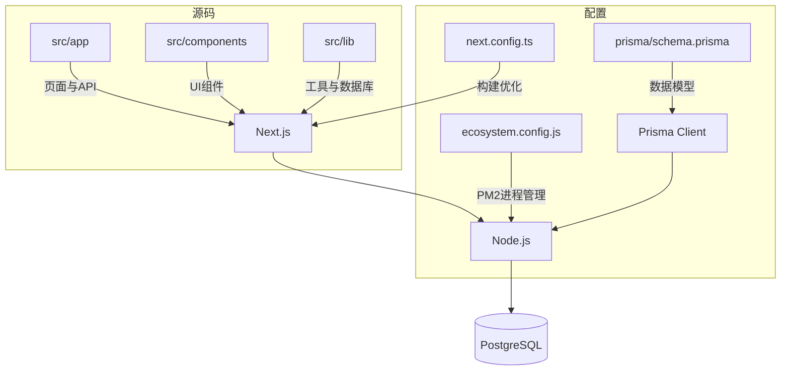
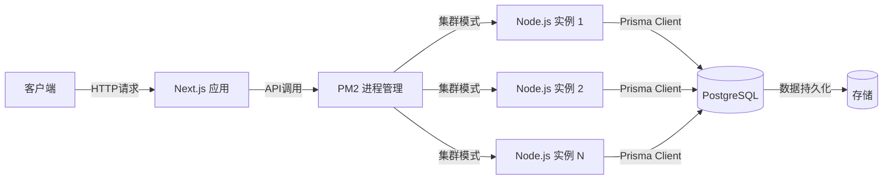
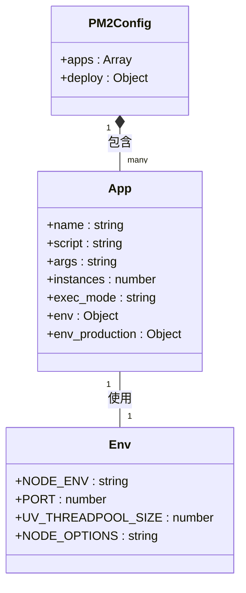
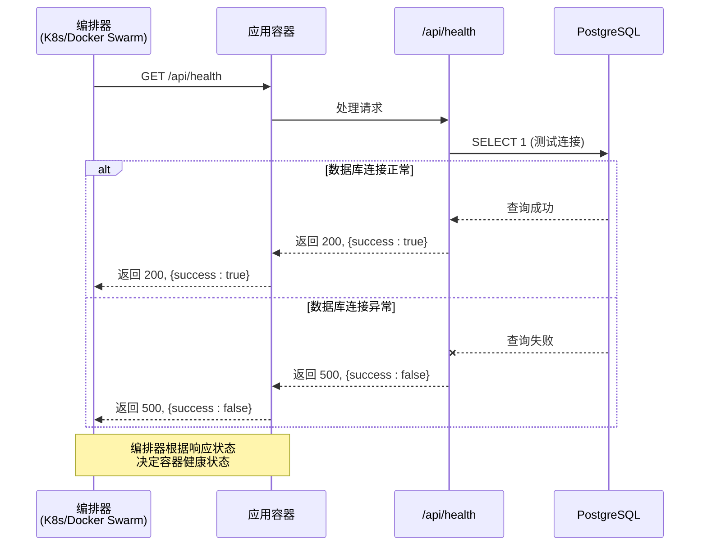
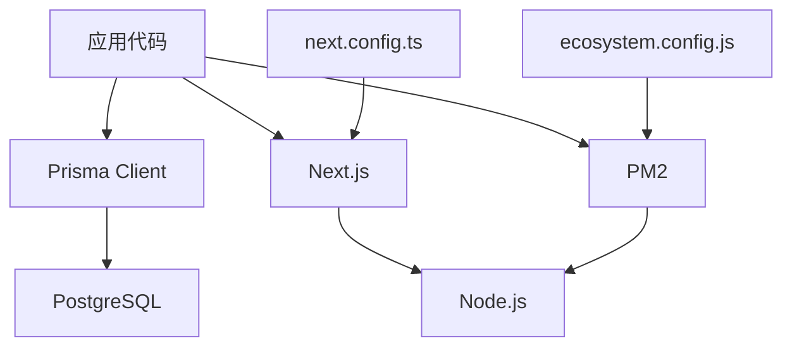

# 容器化部署

<cite>
**本文档中引用的文件**  
- [ecosystem.config.js](file://ecosystem.config.js)
- [src/app/api/health/route.ts](file://src/app/api/health/route.ts)
- [prisma/schema.prisma](file://prisma/schema.prisma)
- [next.config.ts](file://next.config.ts)
- [src/lib/prisma.ts](file://src/lib/prisma.ts)
- [package.json](file://package.json)
- [README.md](file://README.md)
</cite>

## 目录
1. [简介](#简介)
2. [项目结构](#项目结构)
3. [核心组件](#核心组件)
4. [架构概述](#架构概述)
5. [详细组件分析](#详细组件分析)
6. [依赖分析](#依赖分析)
7. [性能考虑](#性能考虑)
8. [故障排除指南](#故障排除指南)
9. [结论](#结论)

## 简介
本文档旨在为“数字化作品互动展示平台”提供完整的基于 Docker 的容器化部署指南。该平台是一个现代化的数字作品展示系统，基于 Next.js 15 和 Prisma 构建，支持用户上传、浏览和互动功能。文档将详细阐述如何通过多阶段 Docker 构建流程创建轻量级生产镜像，利用 docker-compose 实现服务编排，并集成 PM2 进程管理器以确保高可用性运行。同时，文档涵盖镜像构建、容器启动、卷挂载、网络配置的最佳实践，并包含健康检查机制以支持 Kubernetes 或 Docker Swarm 等编排平台。

## 项目结构
项目采用标准的 Next.js 13+ App Router 结构，核心代码位于 `src/` 目录下。`app/` 目录包含页面和 API 路由，`components/` 包含可复用的 UI 组件，`lib/` 包含工具函数和数据库连接。后端数据层由 Prisma ORM 管理，其模式定义在 `prisma/schema.prisma` 中。项目根目录下的配置文件（如 `ecosystem.config.js`, `next.config.ts`）对部署和性能至关重要。

**Diagram sources**
- [src/app](file://src/app)
- [prisma/schema.prisma](file://prisma/schema.prisma)
- [ecosystem.config.js](file://ecosystem.config.js)
- [next.config.ts](file://next.config.ts)

**Section sources**
- [README.md](file://README.md#L0-L243)

## 核心组件
本项目的核心组件包括基于 Next.js 的全栈应用、Prisma 管理的 PostgreSQL 数据库以及用于进程管理的 PM2。前端采用 React 18 和 TypeScript，结合 Tailwind CSS 实现响应式设计。后端逻辑通过 Next.js API Routes 实现，使用 NextAuth.js 处理身份认证。数据持久化通过 Prisma ORM 与 PostgreSQL 数据库交互。PM2 被用于在生产环境中以集群模式运行 Node.js 应用，实现负载均衡和高可用性。

**Section sources**
- [README.md](file://README.md#L0-L243)
- [package.json](file://package.json)

## 架构概述
系统采用前后端一体化的架构，由 Next.js 框架统一处理服务端渲染和 API 请求。客户端发起请求后，由 Next.js 服务器处理，对于数据操作，通过 Prisma Client 连接到 PostgreSQL 数据库。PM2 作为进程守护程序，管理多个 Node.js 实例，实现 CPU 核心的充分利用。整个系统设计为可容器化，通过 Docker 将应用及其依赖打包成独立的镜像，并通过 docker-compose 编排应用、数据库和可选的缓存服务。

**Diagram sources**
- [ecosystem.config.js](file://ecosystem.config.js#L0-L127)
- [src/lib/prisma.ts](file://src/lib/prisma.ts#L0-L50)

## 详细组件分析

### PM2 进程管理分析
PM2 配置文件 `ecosystem.config.js` 是实现应用高可用性的关键。它定义了生产环境和开发环境的启动配置。在生产环境中，应用以集群模式 (`exec_mode: 'cluster'`) 运行 4 个实例，充分利用多核 CPU 进行负载均衡。每个实例的内存上限设置为 3GB (`max_memory_restart: '3G'`)，并配置了相应的 Node.js 参数 (`--max-old-space-size=3072`)。PM2 还集成了性能监控和日志聚合功能，便于运维。

**Diagram sources**
- [ecosystem.config.js](file://ecosystem.config.js#L0-L127)

**Section sources**
- [ecosystem.config.js](file://ecosystem.config.js#L0-L127)

### 健康检查 API 分析
`/api/health` 接口是容器化部署中健康检查的核心。该 API 通过执行一个简单的数据库查询 (`SELECT 1`) 来验证应用与数据库的连接状态。如果查询成功，返回 HTTP 200 状态码和 `{ success: true }`；如果失败，则返回 HTTP 500 状态码和 `{ success: false }`。此端点可被 Docker、Kubernetes 或 Docker Swarm 定期调用，以判断容器是否健康，从而决定是否重启或从服务发现中移除。

**Diagram sources**
- [src/app/api/health/route.ts](file://src/app/api/health/route.ts#L0-L25)

**Section sources**
- [src/app/api/health/route.ts](file://src/app/api/health/route.ts#L0-L25)

### Prisma 数据库连接分析
`src/lib/prisma.ts` 文件中的数据库连接逻辑经过了生产环境优化。它通过 `getDatabaseUrl()` 函数动态构建数据库连接字符串，设置了针对 8 核服务器优化的连接池参数，如 `connection_limit=20`（连接数）和 `idle_timeout=600`（空闲超时）。这确保了在高并发场景下数据库连接的稳定性和效率。同时，代码实现了优雅关闭 (`gracefulShutdown`)，确保在容器停止时能正确释放数据库连接。

**Section sources**
- [src/lib/prisma.ts](file://src/lib/prisma.ts#L0-L50)

## 依赖分析
项目的主要依赖关系清晰。应用代码 (`src/`) 依赖于 `prisma` 客户端进行数据操作，`prisma` 客户端又依赖于外部的 PostgreSQL 数据库。构建和运行时依赖于 Node.js 环境。PM2 作为运行时依赖，管理 Node.js 进程。`next.config.ts` 中的配置影响了构建过程和最终的运行时行为，如图片优化和安全头设置。

**Diagram sources**
- [package.json](file://package.json)
- [prisma/schema.prisma](file://prisma/schema.prisma)
- [ecosystem.config.js](file://ecosystem.config.js)

**Section sources**
- [package.json](file://package.json)
- [prisma/schema.prisma](file://prisma/schema.prisma)

## 性能考虑
项目的性能优化贯穿于多个层面。在代码层面，`next.config.ts` 启用了 `removeConsole` 以在生产环境中移除 `console.log`，减少日志开销。在数据库层面，`prisma.ts` 中的连接池配置优化了数据库交互。在运行时层面，PM2 的集群模式实现了 CPU 负载均衡。此外，`next.config.ts` 中的 `images` 配置和 `headers` 设置了 HTTP 缓存策略，显著提升了静态资源的加载速度。

## 故障排除指南
- **容器启动失败**: 检查 `ecosystem.config.js` 中的 `args` 配置是否正确，确保 `npm start` 能在容器内执行。查看容器日志 (`docker logs`) 以获取具体错误信息。
- **数据库连接失败**: 确认 `DATABASE_URL` 环境变量在容器内正确设置，且数据库服务已启动并可从应用容器访问。检查 `prisma.ts` 中的连接超时设置。
- **健康检查失败**: 确保 `/api/health` 端点可访问，并且应用能成功连接到数据库。检查防火墙或网络策略是否阻止了健康检查探针。
- **PM2 进程未启动**: 确认容器的启动命令是 `pm2-runtime start ecosystem.config.js --env production`，而不是直接运行 `npm start`。

**Section sources**
- [ecosystem.config.js](file://ecosystem.config.js#L0-L127)
- [src/app/api/health/route.ts](file://src/app/api/health/route.ts#L0-L25)
- [src/lib/prisma.ts](file://src/lib/prisma.ts#L0-L50)

## 结论
通过结合 Docker 多阶段构建、docker-compose 服务编排和 PM2 进程管理，可以为“数字化作品互动展示平台”构建一个高效、稳定且易于维护的容器化部署方案。该方案不仅实现了应用的轻量化和环境一致性，还通过健康检查和集群模式确保了生产环境的高可用性。遵循本文档中的最佳实践，可以有效提升应用的部署效率和运维水平。