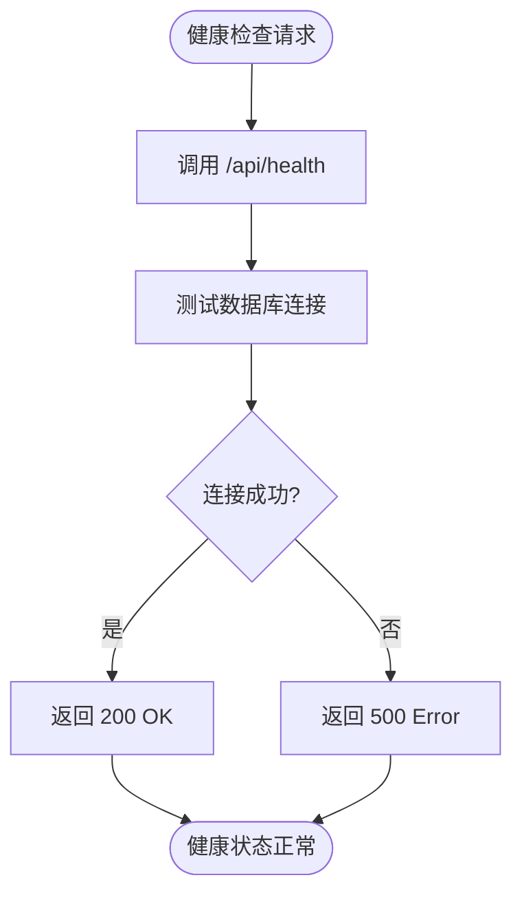
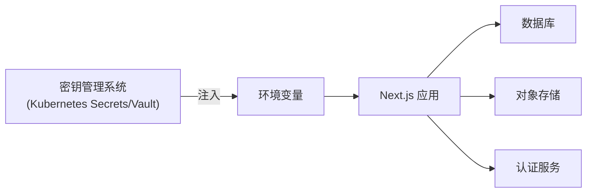
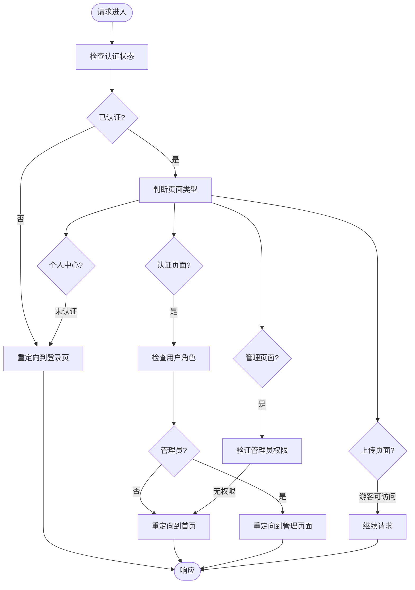

# 部署最佳实践

<cite>
**本文档引用文件**  
- [ecosystem.config.js](file://ecosystem.config.js)
- [middleware.ts](file://middleware.ts)
- [next.config.ts](file://next.config.ts)
- [src/app/api/health/route.ts](file://src/app/api/health/route.ts)
- [src/lib/performance-monitor.ts](file://src/lib/performance-monitor.ts)
- [src/app/api/platform-config/route.ts](file://src/app/api/platform-config/route.ts)
- [scripts/optimize-server.sh](file://scripts/optimize-server.sh)
</cite>

## 目录
1. [简介](#简介)
2. [镜像构建与标签管理](#镜像构建与标签管理)
3. [容器运行参数配置](#容器运行参数配置)
4. [健康检查机制](#健康检查机制)
5. [环境变量与敏感信息管理](#环境变量与敏感信息管理)
6. [静态资源缓存策略](#静态资源缓存策略)
7. [中间件兼容性处理](#中间件兼容性处理)
8. [Kubernetes 与 Docker Swarm 集成建议](#kubernetes-与-docker-swarm-集成建议)
9. [完整部署脚本示例](#完整部署脚本示例)
10. [CI/CD 集成思路](#cicd-集成思路)

## 简介
本文档总结了数字化作品互动展示平台的容器化部署综合最佳实践。基于项目实际架构，涵盖从镜像构建、容器运行、健康检查到集群编排的全流程部署策略。重点分析了 Next.js 应用在容器环境中的特殊需求，包括中间件行为、静态资源缓存、性能监控和安全配置，提供可直接落地的部署方案。

## 镜像构建与标签管理
在构建容器镜像时，应遵循最小化原则，使用多阶段构建以减小最终镜像体积。建议使用语义化版本标签（如 `v1.2.0`）和环境标签（如 `latest`、`staging`、`production`）进行管理。

```Dockerfile
# 示例 Dockerfile 片段
FROM node:18-alpine AS builder
WORKDIR /app
COPY package*.json ./
RUN npm ci --only=production
COPY . .
RUN npm run build

FROM node:18-alpine AS runner
WORKDIR /app
COPY --from=builder /app/.next ./.next
COPY --from=builder /app/public ./public
COPY --from=builder /app/package.json ./package.json
USER node
EXPOSE 3000
ENV NODE_ENV=production
CMD ["npm", "start"]
```

**Section sources**
- [package.json](file://package.json#L1-L20)
- [next.config.ts](file://next.config.ts#L1-L10)

## 容器运行参数配置
运行容器时应合理配置关键参数，确保服务稳定性和资源利用率。参考 `ecosystem.config.js` 中的 PM2 配置，建议使用以下参数：

```bash
docker run -d \
  --name yunqi-platform \
  -p 3000:3000 \
  --restart unless-stopped \
  --memory=3g \
  --cpus=2 \
  -e NODE_ENV=production \
  -e PORT=3000 \
  -e DATABASE_URL=postgresql://user:pass@db:5432/yunqi \
  yunqi-platform:v1.2.0
```

- `-d`：后台运行容器
- `-p 3000:3000`：端口映射
- `--restart unless-stopped`：容器异常退出时自动重启
- `--memory=3g`：限制内存使用，防止 OOM
- `--cpus=2`：限制 CPU 资源

**Section sources**
- [ecosystem.config.js](file://ecosystem.config.js#L0-L48)
- [package.json](file://package.json#L10-L15)

## 健康检查机制
健康检查是确保服务可用性的关键。本项目提供了 `/api/health` 接口用于健康检查，应配置容器级和编排级双重健康检查。

```dockerfile
HEALTHCHECK --interval=30s --timeout=10s --start-period=30s --retries=3 \
  CMD curl -f http://localhost:3000/api/health || exit 1
```

或在 Docker Compose 中配置：

```yaml
healthcheck:
  test: ["CMD", "curl", "-f", "http://localhost:3000/api/health"]
  interval: 30s
  timeout: 10s
  retries: 3
  start_period: 30s
```

该健康检查会验证应用服务和数据库连接状态，确保服务完全就绪。



**Diagram sources**
- [src/app/api/health/route.ts](file://src/app/api/health/route.ts#L0-L25)
- [ecosystem.config.js](file://ecosystem.config.js#L0-L48)

**Section sources**
- [src/app/api/health/route.ts](file://src/app/api/health/route.ts#L0-L25)
- [ecosystem.config.js](file://ecosystem.config.js#L0-L48)

## 环境变量与敏感信息管理
环境变量是配置应用行为的关键，必须安全传递。敏感信息如数据库凭证、API 密钥等应通过环境变量注入，避免硬编码。

### 环境变量配置
```env
NODE_ENV=production
PORT=3000
DATABASE_URL=postgresql://user:pass@db:5432/yunqi
NEXTAUTH_SECRET=your-secret-here
REDIS_URL=redis://redis:6379
```

### 敏感信息隔离策略
1. **使用 .env 文件**：在开发环境中使用 `.env.local`，并确保其在 `.gitignore` 中
2. **容器环境变量**：在 `docker run` 或编排文件中通过 `-e` 参数传递
3. **密钥管理服务**：在生产环境中使用 Kubernetes Secrets 或 Hashicorp Vault
4. **运行时注入**：通过 init 容器或 sidecar 容器注入敏感配置



**Diagram sources**
- [src/lib/auth.ts](file://src/lib/auth.ts#L0-L72)
- [prisma/schema.prisma](file://prisma/schema.prisma#L1-L20)

**Section sources**
- [ecosystem.config.js](file://ecosystem.config.js#L0-L48)
- [src/lib/auth.ts](file://src/lib/auth.ts#L0-L72)

## 静态资源缓存策略
基于 `next.config.ts` 中的配置，实施分层缓存策略以提升性能：

```typescript
// next.config.ts 缓存配置
headers: [
  {
    source: '/_next/static/:path*',
    headers: [
      { key: 'Cache-Control', value: 'public, max-age=31536000, immutable' }
    ]
  },
  {
    source: '/images/:path*',
    headers: [
      { key: 'Cache-Control', value: 'public, max-age=2592000' }
    ]
  },
  {
    source: '/api/:path*',
    headers: [
      { key: 'Cache-Control', value: 'no-cache' }
    ]
  }
]
```

### 缓存策略分级
| 资源类型 | 缓存策略 | 说明 |
|---------|---------|------|
| 静态资源 | `max-age=31536000, immutable` | 构建时哈希文件名，永久缓存 |
| 图片资源 | `max-age=2592000` | 30天缓存，支持CDN刷新 |
| API 接口 | `no-cache` | 禁用缓存，确保数据实时性 |
| 页面内容 | `s-maxage=3600` | 1小时CDN缓存，支持stale-while-revalidate |

**Section sources**
- [next.config.ts](file://next.config.ts#L45-L102)
- [src/app/api/health/route.ts](file://src/app/api/health/route.ts#L0-L25)

## 中间件兼容性处理
Next.js 中间件在容器环境中需特别注意路径匹配和权限控制。本项目 `middleware.ts` 实现了基于角色的访问控制：



**Diagram sources**
- [middleware.ts](file://middleware.ts#L0-L51)

**Section sources**
- [middleware.ts](file://middleware.ts#L0-L51)
- [src/lib/auth.ts](file://src/lib/auth.ts#L0-L72)

## Kubernetes 与 Docker Swarm 集成建议
### Kubernetes 部署建议
1. **Deployment 配置**：设置合理的资源请求和限制
2. **Service 配置**：使用 ClusterIP 或 LoadBalancer 类型
3. **Ingress 配置**：配置路径路由和 TLS 终止
4. **Liveness/Readiness Probe**：对接 `/api/health` 接口
5. **Horizontal Pod Autoscaler**：基于 CPU/内存使用率自动扩缩容

### Docker Swarm 部署建议
1. **Service 部署**：使用 `--mode replicated` 和 `--replicas` 控制实例数
2. **Config/Secret 管理**：使用 Swarm 的 config 和 secret 功能
3. **Overlay 网络**：配置跨主机通信网络
4. **滚动更新**：配置 `--update-delay` 和 `--update-parallelism`

```bash
# Docker Swarm 部署示例
docker service create \
  --name yunqi-web \
  --replicas 4 \
  --publish 3000:3000 \
  --env NODE_ENV=production \
  --config source=app-config,target=/app/.env \
  --secret source=db-password,target=/run/secrets/db-password \
  --update-delay 10s \
  --update-parallelism 1 \
  yunqi-platform:v1.2.0
```

**Section sources**
- [ecosystem.config.js](file://ecosystem.config.js#L0-L48)
- [next.config.ts](file://next.config.ts#L1-L10)

## 完整部署脚本示例
```bash
#!/bin/bash

# 生产环境部署脚本
set -e

echo "🚀 开始部署 yunqi-platform..."

# 1. 构建镜像
echo "🏗️ 构建 Docker 镜像..."
docker build -t yunqi-platform:$(git rev-parse --short HEAD) .

# 2. 推送镜像
echo "📤 推送镜像到仓库..."
docker tag yunqi-platform:$(git rev-parse --short HEAD) registry.yunqi.com/yunqi-platform:$(git rev-parse --short HEAD)
docker push registry.yunqi.com/yunqi-platform:$(git rev-parse --short HEAD)

# 3. 部署到 Kubernetes
echo "☸️ 部署到 Kubernetes..."
cat << EOF | kubectl apply -f -
apiVersion: apps/v1
kind: Deployment
metadata:
  name: yunqi-platform
spec:
  replicas: 4
  selector:
    matchLabels:
      app: yunqi-platform
  template:
    metadata:
      labels:
        app: yunqi-platform
    spec:
      containers:
      - name: web
        image: registry.yunqi.com/yunqi-platform:$(git rev-parse --short HEAD)
        ports:
        - containerPort: 3000
        envFrom:
        - configMapRef:
            name: yunqi-config
        - secretRef:
            name: yunqi-secrets
        resources:
          requests:
            memory: "2Gi"
            cpu: "500m"
          limits:
            memory: "3Gi"
            cpu: "1000m"
        livenessProbe:
          httpGet:
            path: /api/health
            port: 3000
          initialDelaySeconds: 30
          periodSeconds: 30
        readinessProbe:
          httpGet:
            path: /api/health
            port: 3000
          initialDelaySeconds: 10
          periodSeconds: 10
EOF

echo "✅ 部署完成！"
```

**Section sources**
- [scripts/optimize-server.sh](file://scripts/optimize-server.sh#L0-L66)
- [ecosystem.config.js](file://ecosystem.config.js#L0-L48)

## CI/CD 集成思路
### CI/CD 流程设计


### 关键集成点
1. **GitHub Actions/GitLab CI**：触发构建和测试
2. **Trivy/Clair**：镜像安全扫描
3. **Argo CD/Flux**：GitOps 风格的持续部署
4. **Prometheus/Grafana**：部署后性能监控
5. **Slack/钉钉**：部署状态通知

**Section sources**
- [ecosystem.config.js](file://ecosystem.config.js#L96-L127)
- [package.json](file://package.json#L1-L20)
- [next.config.ts](file://next.config.ts#L1-L10)