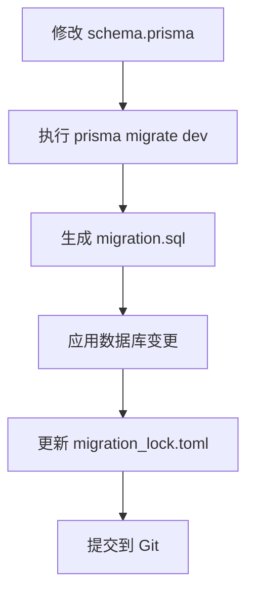
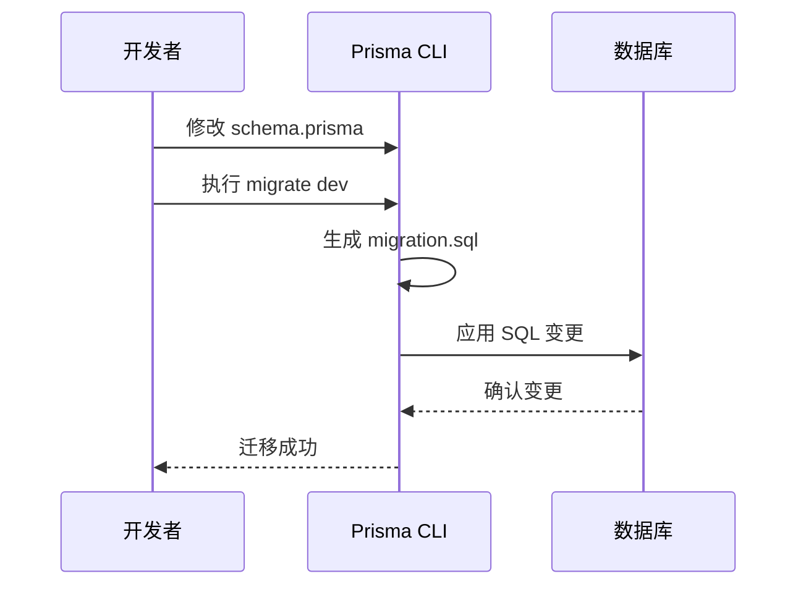
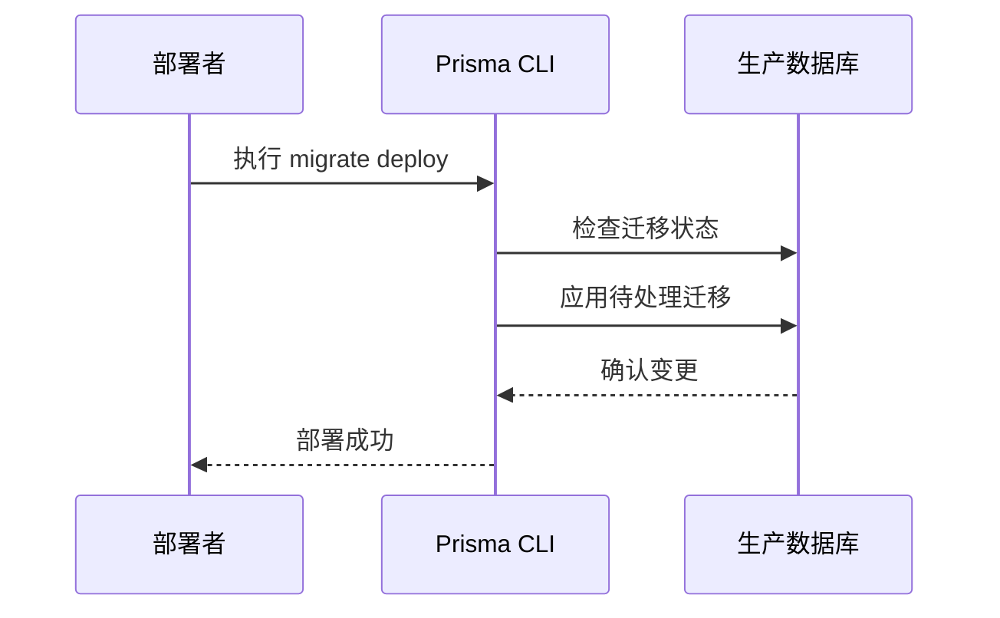

# 应用数据库迁移

<cite>
**本文档引用文件**  
- [prisma/migrations/migration_lock.toml](file://prisma/migrations/migration_lock.toml)
- [prisma/migrations/20250831084947_add_featured_field/migration.sql](file://prisma/migrations/20250831084947_add_featured_field/migration.sql)
- [prisma/migrations/20250905143157_add_online_counter_config/migration.sql](file://prisma/migrations/20250905143157_add_online_counter_config/migration.sql)
- [prisma/migrations/20250905150839_add_platform_config/migration.sql](file://prisma/migrations/20250905150839_add_platform_config/migration.sql)
- [prisma/migrations/20250917050212_add_missing_fields/migration.sql](file://prisma/migrations/20250917050212_add_missing_fields/migration.sql)
- [prisma/schema.prisma](file://prisma/schema.prisma)
- [package.json](file://package.json)
- [prisma/seed.ts](file://prisma/seed.ts)
</cite>

## 目录
1. [引言](#引言)
2. [迁移文件结构与版本控制](#迁移文件结构与版本控制)
3. [迁移命名与时间戳含义](#迁移命名与时间戳含义)
4. [开发环境迁移流程](#开发环境迁移流程)
5. [生产环境部署流程](#生产环境部署流程)
6. [package.json 脚本调用](#packagejson-脚本调用)
7. [团队协作与迁移同步](#团队协作与迁移同步)
8. [常见问题与解决方案](#常见问题与解决方案)
9. [错误迁移回滚建议](#错误迁移回滚建议)
10. [总结](#总结)

## 引言
Prisma Migrate 是 Prisma ORM 提供的数据库迁移工具，用于安全地管理数据库模式变更。通过版本控制的 SQL 脚本，开发者可以在开发和生产环境中一致地应用数据库变更。本文档详细说明如何在本项目中使用 Prisma Migrate 进行数据库迁移，涵盖从本地开发到生产部署的完整流程。

## 迁移文件结构与版本控制
项目中的数据库迁移脚本存储在 `prisma/migrations` 目录下，每个迁移对应一个以时间戳命名的子目录，目录内包含 `migration.sql` 文件。该目录通过 Git 进行版本控制，确保所有团队成员共享相同的数据库模式变更历史。

`prisma/migrations/migration_lock.toml` 文件用于锁定迁移系统的提供者，防止不同环境下的迁移行为不一致。该文件必须提交到版本控制系统中。

**迁移目录结构示例：**
```
prisma/
└── migrations/
    ├── 20250831084947_add_featured_field/
    │   └── migration.sql
    ├── 20250905143157_add_online_counter_config/
    │   └── migration.sql
    ├── 20250905150839_add_platform_config/
    │   └── migration.sql
    ├── 20250917050212_add_missing_fields/
    │   └── migration.sql
    └── migration_lock.toml
```

**迁移文件版本控制机制：**
- 每次执行 `prisma migrate dev` 时，Prisma 会根据 `schema.prisma` 的变更生成新的迁移文件。
- 生成的迁移文件包含创建表、修改字段、添加约束等 SQL 语句。
- 所有迁移文件按时间戳排序，确保变更按顺序应用。
- `migration_lock.toml` 文件记录当前使用的数据库提供者（如 PostgreSQL），防止迁移冲突。

**迁移文件版本控制机制**
- 每次执行 `prisma migrate dev` 时，Prisma 会根据 `schema.prisma` 的变更生成新的迁移文件。
- 生成的迁移文件包含创建表、修改字段、添加约束等 SQL 语句。
- 所有迁移文件按时间戳排序，确保变更按顺序应用。
- `migration_lock.toml` 文件记录当前使用的数据库提供者（如 PostgreSQL），防止迁移冲突。



**图示来源**
- [prisma/migrations/migration_lock.toml](file://prisma/migrations/migration_lock.toml)
- [prisma/schema.prisma](file://prisma/schema.prisma)

**本节来源**
- [prisma/migrations/migration_lock.toml](file://prisma/migrations/migration_lock.toml)
- [prisma/schema.prisma](file://prisma/schema.prisma)

## 迁移命名与时间戳含义
每个迁移目录的名称以 14 位数字开头，表示迁移创建的精确时间戳。例如：
- `20250831084947_add_featured_field`：表示该迁移于 2025 年 8 月 31 日 08:49:47 创建，用于添加作品的精选字段。
- `20250905143157_add_online_counter_config`：表示该迁移于 2025 年 9 月 5 日 14:31:57 创建，用于添加在线人数计数器配置。
- `20250905150839_add_platform_config`：表示该迁移于 2025 年 9 月 5 日 15:08:39 创建，用于添加平台配置。
- `20250917050212_add_missing_fields`：表示该迁移于 2025 年 9 月 17 日 05:02:12 创建，用于添加缺失的字段。

时间戳的格式为 `YYYYMMDDHHmmss`，确保迁移文件的唯一性和顺序性。后续部分为描述性名称，说明迁移的目的。

**本节来源**
- [prisma/migrations/20250831084947_add_featured_field/migration.sql](file://prisma/migrations/20250831084947_add_featured_field/migration.sql)
- [prisma/migrations/20250905143157_add_online_counter_config/migration.sql](file://prisma/migrations/20250905143157_add_online_counter_config/migration.sql)
- [prisma/migrations/20250905150839_add_platform_config/migration.sql](file://prisma/migrations/20250905150839_add_platform_config/migration.sql)
- [prisma/migrations/20250917050212_add_missing_fields/migration.sql](file://prisma/migrations/20250917050212_add_missing_fields/migration.sql)

## 开发环境迁移流程
在本地开发环境中，使用 `prisma migrate dev` 命令进行数据库迁移。该命令会：
1. 检查 `schema.prisma` 的变更。
2. 生成新的迁移文件（如果需要）。
3. 将变更应用到本地数据库。
4. 更新 Prisma Client。

**开发迁移流程：**
1. 修改 `prisma/schema.prisma` 文件，定义新的数据模型或修改现有模型。
2. 运行 `npm run db:generate` 生成 Prisma Client。
3. 运行 `npx prisma migrate dev --name <migration-name>` 创建并应用迁移。
4. 验证数据库变更是否正确应用。



**图示来源**
- [prisma/schema.prisma](file://prisma/schema.prisma)

**本节来源**
- [prisma/schema.prisma](file://prisma/schema.prisma)

## 生产环境部署流程
在生产环境中，使用 `prisma migrate deploy` 命令进行无交互式部署。该命令会：
1. 检查数据库状态。
2. 应用所有待处理的迁移。
3. 不生成新的迁移文件。

**生产部署流程：**
1. 确保所有迁移文件已提交到 Git 并部署到生产环境。
2. 运行 `npx prisma migrate deploy` 应用所有待处理的迁移。
3. 验证数据库状态是否与预期一致。



**图示来源**
- [prisma/schema.prisma](file://prisma/schema.prisma)

**本节来源**
- [prisma/schema.prisma](file://prisma/schema.prisma)

## package.json 脚本调用
项目中的 `package.json` 文件定义了多个与数据库相关的脚本，简化迁移操作。

**package.json 脚本：**
```json
"scripts": {
  "dev": "next dev",
  "build": "next build",
  "start": "next start",
  "lint": "next lint",
  "db:push": "prisma db push",
  "db:studio": "prisma studio",
  "db:generate": "prisma generate",
  "db:seed": "tsx prisma/seed.ts"
}
```

**脚本调用方式：**
- `npm run db:generate`：生成 Prisma Client。
- `npm run db:studio`：启动 Prisma Studio，可视化查看和编辑数据库。
- `npm run db:seed`：运行种子数据脚本，初始化数据库内容。
- `npx prisma migrate dev --name add_new_field`：创建并应用新的开发迁移。
- `npx prisma migrate deploy`：在生产环境部署迁移。

**本节来源**
- [package.json](file://package.json)
- [prisma/seed.ts](file://prisma/seed.ts)

## 团队协作与迁移同步
在团队协作中，同步迁移文件至关重要。所有开发者必须确保：
1. 每次拉取代码后，检查是否有新的迁移文件。
2. 在本地运行 `prisma migrate dev` 应用新迁移。
3. 避免同时修改 `schema.prisma` 导致迁移冲突。

**团队协作最佳实践：**
- 在功能分支中创建迁移，合并到主分支前确保迁移已测试。
- 避免在迁移中包含数据变更（如 INSERT、UPDATE），除非必要。
- 使用 `prisma format` 格式化 `schema.prisma` 文件，保持一致性。

**本节来源**
- [prisma/schema.prisma](file://prisma/schema.prisma)

## 常见问题与解决方案
### 迁移冲突
当多个开发者同时创建迁移时，可能出现冲突。解决方案：
1. 拉取最新代码。
2. 合并迁移文件（如果可能）。
3. 重新生成迁移。

### 数据库连接失败
确保 `DATABASE_URL` 环境变量正确配置，并检查网络连接。

### 迁移文件损坏
如果迁移文件损坏，可从备份恢复或重新生成。

**本节来源**
- [prisma/schema.prisma](file://prisma/schema.prisma)

## 错误迁移回滚建议
Prisma Migrate 不直接支持回滚，但可通过以下方式处理错误迁移：
1. 创建新的迁移文件，撤销错误变更。
2. 使用数据库备份恢复到之前的状态。
3. 手动执行 SQL 语句修复数据。

**回滚流程：**
1. 识别错误迁移的影响。
2. 创建修复迁移（如删除错误字段）。
3. 应用修复迁移。
4. 验证数据完整性。

**本节来源**
- [prisma/schema.prisma](file://prisma/schema.prisma)

## 总结
Prisma Migrate 提供了一套完整的数据库迁移解决方案，通过版本控制的 SQL 脚本确保开发和生产环境的一致性。开发者应遵循规范的流程，使用 `prisma migrate dev` 进行本地开发，使用 `prisma migrate deploy` 进行生产部署，并通过 `package.json` 脚本简化操作。团队协作中需注意迁移同步，避免冲突。对于错误迁移，建议通过创建修复迁移或使用备份进行回滚。