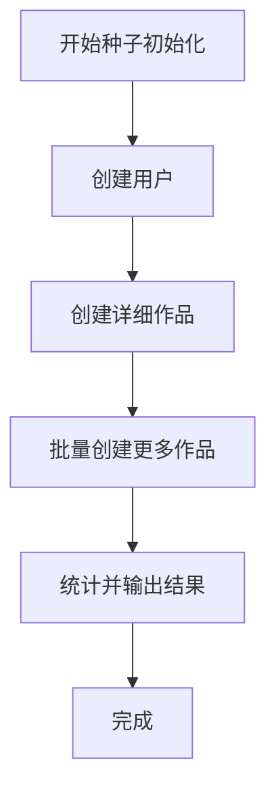
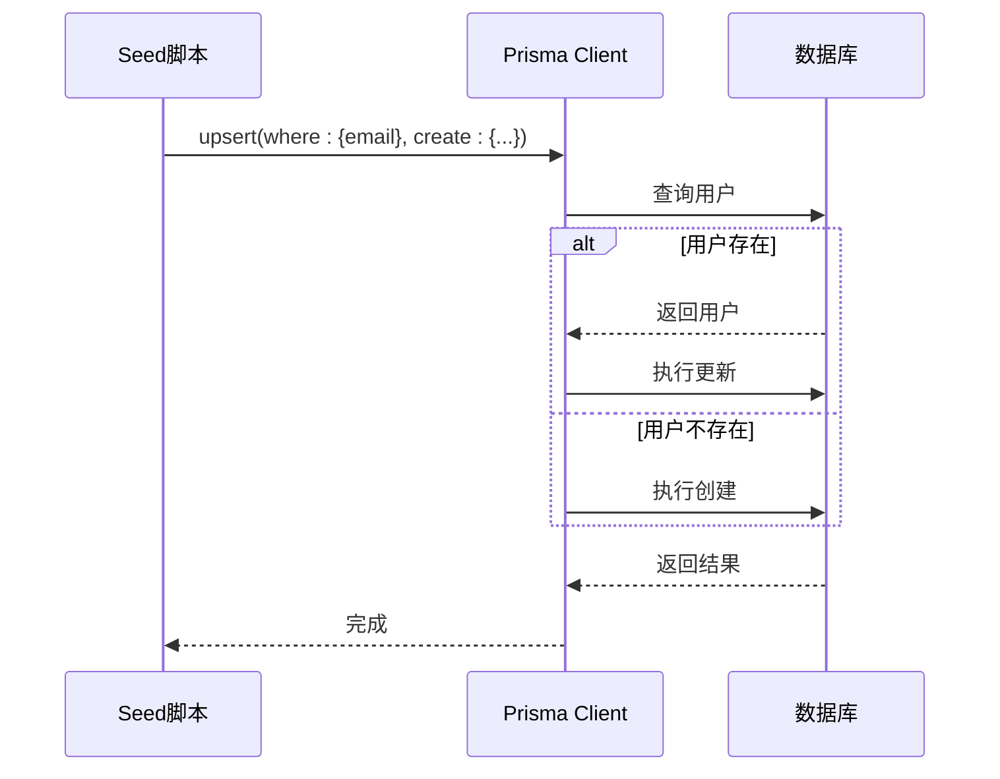
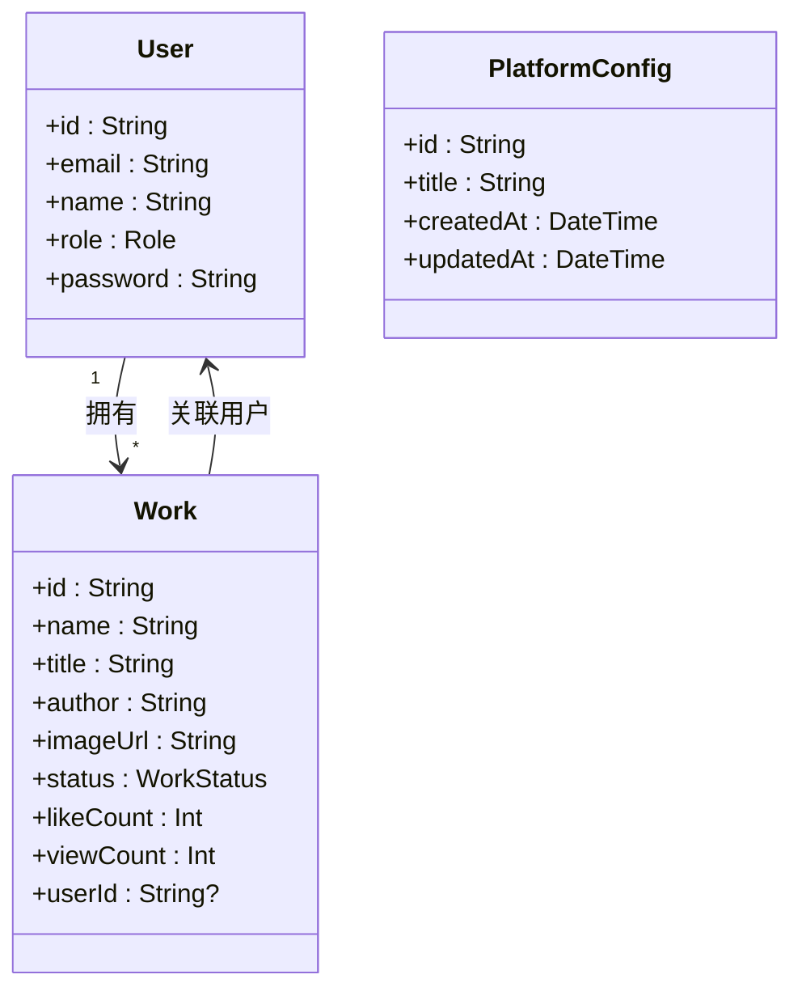

# 数据初始化（Seed）

<cite>
**本文档引用的文件**  
- [prisma/seed.ts](file://prisma/seed.ts)
- [prisma/schema.prisma](file://prisma/schema.prisma)
- [package.json](file://package.json)
- [src/lib/prisma.ts](file://src/lib/prisma.ts)
- [src/app/api/platform-config/route.ts](file://src/app/api/platform-config/route.ts)
</cite>

## 目录
1. [简介](#简介)
2. [Prisma Seed 脚本详解](#prisma-seed-脚本详解)
3. [数据填充逻辑分析](#数据填充逻辑分析)
4. [执行流程与命令](#执行流程与命令)
5. [与数据库迁移的顺序关系](#与数据库迁移的顺序关系)
6. [CI/CD 与生产环境实践](#cicd-与生产环境实践)
7. [总结](#总结)

## 简介
本指南详细说明如何通过 Prisma Seed 脚本初始化系统的基础数据。`seed.ts` 脚本用于在数据库中填充管理员角色、默认平台配置、初始用户权限等关键数据，确保系统在首次部署或重置时具备可用的初始状态。该脚本与 Prisma 的数据库迁移机制协同工作，是自动化部署流程中的重要一环。

## Prisma Seed 脚本详解
`prisma/seed.ts` 文件是 Prisma 数据种子脚本的主入口，负责初始化数据库中的核心业务数据。脚本使用 TypeScript 编写，通过 Prisma Client 与数据库交互。

脚本首先导入必要的依赖，包括 `PrismaClient` 和用于密码哈希的 `bcryptjs`。然后创建一个全局的 `prisma` 实例，用于执行数据库操作。

**图表来源**
- [prisma/seed.ts](file://prisma/seed.ts#L1-L318)

**章节来源**
- [prisma/seed.ts](file://prisma/seed.ts#L1-L318)

## 数据填充逻辑分析
种子脚本的核心逻辑在 `main` 函数中实现，主要分为三个部分：用户创建、作品创建和统计输出。

### 用户数据填充
脚本首先定义了一个包含多个用户的数组，其中包括管理员和普通用户。每个用户对象包含邮箱、姓名、角色和明文密码。脚本遍历该数组，使用 `bcrypt.hash` 对密码进行哈希处理，然后调用 `prisma.user.upsert` 方法。该方法会根据邮箱查找用户，如果存在则更新信息，否则创建新用户。这确保了脚本可以安全地重复执行而不会产生重复数据。

**图表来源**
- [prisma/seed.ts](file://prisma/seed.ts#L20-L55)

**章节来源**
- [prisma/seed.ts](file://prisma/seed.ts#L20-L55)

### 作品与系统配置数据填充
在用户创建完成后，脚本会创建一系列详细的作品数据。这些作品与特定用户关联，通过 `createdUsers.find()` 方法根据邮箱查找对应的用户ID。作品数据包括标题、描述、作者、图片URL、状态（已通过、待审核、已拒绝）以及点赞和浏览数。

脚本还通过 `prisma.platformConfig.findFirst()` 和 `prisma.platformConfig.create()` 确保 `PlatformConfig` 表中存在一条默认记录。根据 `prisma/schema.prisma` 中的定义，`PlatformConfig` 模型包含一个 `title` 字段，其默认值为 "Qoder和通义灵码 AI Coding 作品秀"。`src/app/api/platform-config/route.ts` 中的 `GET` 接口也实现了相同的逻辑：如果配置不存在，则创建默认配置。

**图表来源**
- [prisma/schema.prisma](file://prisma/schema.prisma#L1-L168)
- [prisma/seed.ts](file://prisma/seed.ts#L57-L280)
- [src/app/api/platform-config/route.ts](file://src/app/api/platform-config/route.ts#L15-L35)

**章节来源**
- [prisma/schema.prisma](file://prisma/schema.prisma#L1-L168)
- [prisma/seed.ts](file://prisma/seed.ts#L57-L280)

## 执行流程与命令
要运行种子脚本，使用 `npx prisma db seed` 命令。该命令会读取 `package.json` 文件中 `prisma.seed` 字段的配置，执行 `tsx prisma/seed.ts`。`tsx` 是一个允许直接运行 TypeScript 文件的工具。

执行流程如下：
1.  脚本启动，输出初始化开始信息。
2.  创建或更新预定义的用户账号。
3.  创建预定义的详细作品。
4.  批量创建更多随机作品以填充数据库。
5.  统计并输出最终的用户和作品数量。
6.  输出测试账号信息，便于开发和测试。

## 与数据库迁移的顺序关系
数据种子的执行必须在数据库迁移（Migration）之后进行。迁移负责创建数据库表结构，而种子脚本则负责在已创建的表中填充数据。如果顺序颠倒，种子脚本将因表不存在而失败。

正确的部署顺序是：
1.  `npx prisma migrate deploy`：将数据库模式应用到目标数据库。
2.  `npx prisma db seed`：在已迁移的数据库上运行种子脚本。

`package.json` 中的脚本配置（`"db:seed": "tsx prisma/seed.ts"`）和 `prisma/schema.prisma` 中定义的模型共同确保了这一流程的正确性。

## CI/CD 与生产环境实践
在 CI/CD 和生产部署中，自动化执行种子脚本是确保环境一致性的关键。

**实践建议：**
- **幂等性设计**：`seed.ts` 使用 `upsert` 操作，保证了脚本的幂等性，可以安全地在不同环境中重复执行。
- **环境区分**：在生产环境中，应谨慎使用种子脚本，避免覆盖生产数据。通常只在全新部署或数据重置时使用。
- **自动化集成**：在 CI/CD 流水线中，将 `prisma migrate deploy` 和 `prisma db seed` 作为部署步骤串联执行。
- **依赖管理**：确保 `tsx` 和 `prisma` CLI 已安装，这是运行种子脚本的前提。
- **错误处理**：脚本包含 `try-catch` 块和 `finally` 子句，确保在发生错误时能断开数据库连接，避免连接泄漏。

## 总结
`seed.ts` 脚本是系统数据初始化的核心工具，它通过结构化的逻辑填充了 `User`、`Work` 和 `PlatformConfig` 等关键模型的数据。通过 `npx prisma db seed` 命令，开发者可以轻松地为开发、测试和生产环境准备一致的初始数据。遵循“先迁移后播种”的原则，并将其集成到 CI/CD 流程中，能够极大地提升部署的可靠性和效率。