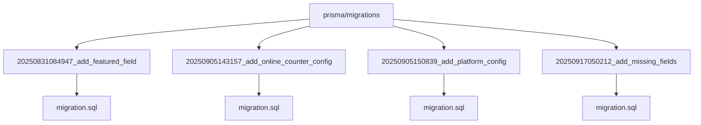
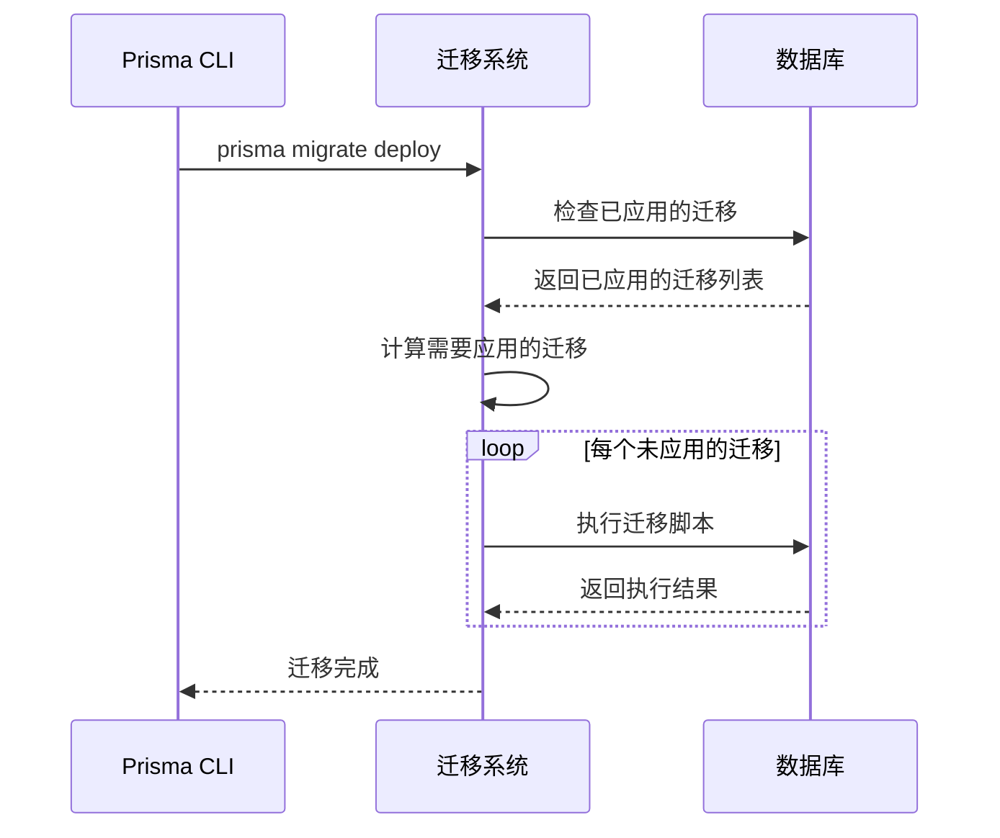
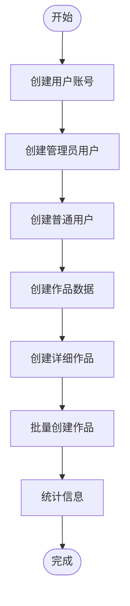
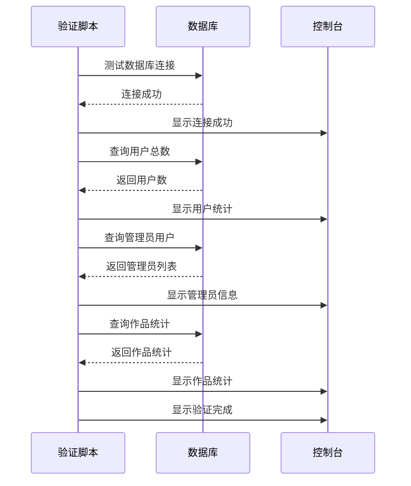
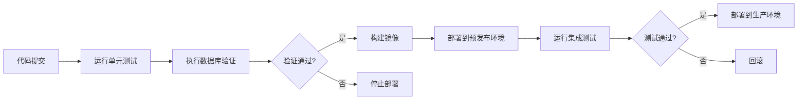

# 数据库迁移与初始化

<cite>
**本文档引用的文件**   
- [seed.ts](file://prisma/seed.ts)
- [migration.sql](file://prisma/migrations/20250831084947_add_featured_field/migration.sql)
- [migration.sql](file://prisma/migrations/20250905143157_add_online_counter_config/migration.sql)
- [migration.sql](file://prisma/migrations/20250905150839_add_platform_config/migration.sql)
- [migration.sql](file://prisma/migrations/20250917050212_add_missing_fields/migration.sql)
- [verify-database.ts](file://verify-database.ts)
- [prisma.ts](file://src/lib/prisma.ts)
- [package.json](file://package.json)
</cite>

## 目录
1. [引言](#引言)
2. [数据库迁移机制](#数据库迁移机制)
3. [迁移部署流程](#迁移部署流程)
4. [数据初始化](#数据初始化)
5. [数据库验证](#数据库验证)
6. [CI/CD集成建议](#cicd集成建议)
7. [最佳实践](#最佳实践)

## 引言
本文档详细说明了如何在生产环境中安全执行 Prisma 数据库迁移，包括迁移脚本的版本控制、数据种子的执行方法以及数据库连接测试脚本的使用。文档还提供了在 CI/CD 流程中集成迁移验证的建议，以防止部署时出现 schema 不一致问题。

## 数据库迁移机制

Prisma 迁移系统通过 `prisma/migrations` 目录下的 SQL 脚本实现数据库 schema 的版本控制。每个迁移脚本都有一个时间戳前缀，确保迁移按正确顺序执行。

**图示来源**
- [20250831084947_add_featured_field/migration.sql](file://prisma/migrations/20250831084947_add_featured_field/migration.sql)
- [20250905143157_add_online_counter_config/migration.sql](file://prisma/migrations/20250905143157_add_online_counter_config/migration.sql)
- [20250905150839_add_platform_config/migration.sql](file://prisma/migrations/20250905150839_add_platform_config/migration.sql)
- [20250917050212_add_missing_fields/migration.sql](file://prisma/migrations/20250917050212_add_missing_fields/migration.sql)

**本节来源**
- [prisma/migrations](file://prisma/migrations)

## 迁移部署流程

使用 `prisma migrate deploy` 命令在生产环境中应用数据库迁移。该命令会按时间戳顺序执行所有未应用的迁移脚本。

**图示来源**
- [package.json](file://package.json#L10-L15)

**本节来源**
- [package.json](file://package.json#L10-L15)

## 数据初始化

数据种子脚本 `prisma/seed.ts` 用于初始化基础数据，包括管理员角色和默认配置。

**图示来源**
- [seed.ts](file://prisma/seed.ts#L15-L300)

**本节来源**
- [seed.ts](file://prisma/seed.ts#L1-L318)

## 数据库验证

`verify-database.ts` 脚本用于测试数据库连接并验证数据完整性。

**图示来源**
- [verify-database.ts](file://verify-database.ts#L5-L125)

**本节来源**
- [verify-database.ts](file://verify-database.ts#L1-L125)

## CI/CD集成建议

在 CI/CD 流程中集成迁移验证，确保部署时 schema 一致性。

**图示来源**
- [package.json](file://package.json#L10-L15)
- [verify-database.ts](file://verify-database.ts#L1-L125)

**本节来源**
- [package.json](file://package.json#L10-L15)
- [verify-database.ts](file://verify-database.ts#L1-L125)

## 最佳实践

### 生产环境迁移
- 在部署前先在预发布环境测试迁移
- 备份数据库后再执行迁移
- 监控迁移过程中的错误

### 数据种子管理
- 种子数据应包含所有必需的基础数据
- 避免在种子数据中包含敏感信息
- 定期更新种子数据以反映最新需求

### 数据库验证
- 在每次部署后自动运行验证脚本
- 将验证结果集成到监控系统
- 设置验证失败的告警机制

**本节来源**
- [seed.ts](file://prisma/seed.ts#L1-L318)
- [verify-database.ts](file://verify-database.ts#L1-L125)
- [prisma.ts](file://src/lib/prisma.ts#L1-L50)