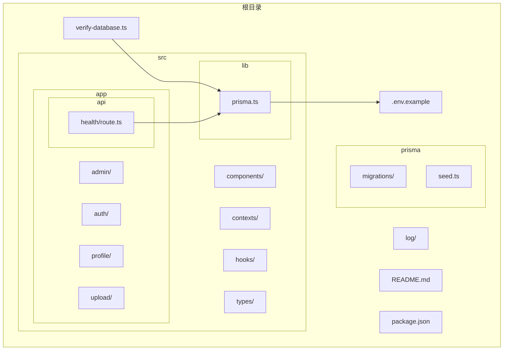
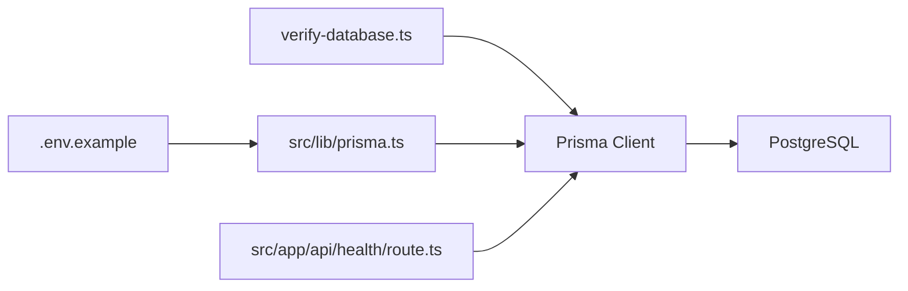
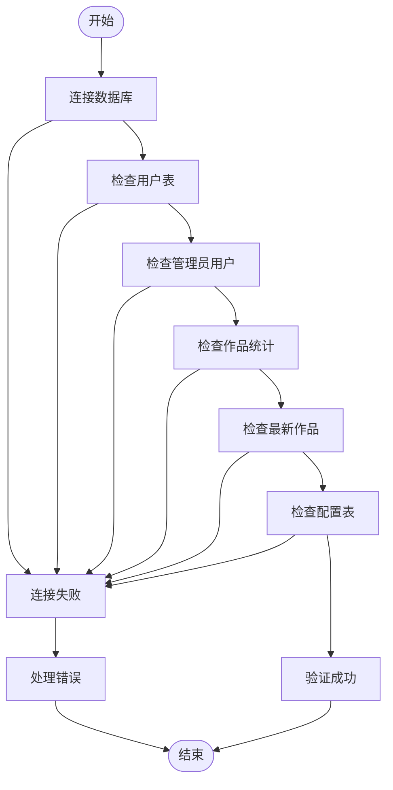
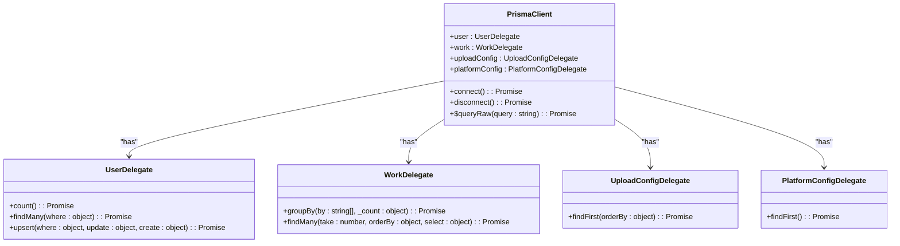

# 数据库连接与验证

<cite>
**本文档引用的文件**  
- [verify-database.ts](file://verify-database.ts)
- [src/lib/prisma.ts](file://src/lib/prisma.ts)
- [src/app/api/health/route.ts](file://src/app/api/health/route.ts)
- [.env.example](file://.env.example)
- [package.json](file://package.json)
</cite>

## 目录
1. [简介](#简介)
2. [项目结构](#项目结构)
3. [核心组件](#核心组件)
4. [架构概述](#架构概述)
5. [详细组件分析](#详细组件分析)
6. [依赖分析](#依赖分析)
7. [性能考虑](#性能考虑)
8. [故障排除指南](#故障排除指南)
9. [结论](#结论)

## 简介
本文档旨在详细介绍 `verify-database.ts` 脚本的用途和使用方法，该脚本用于在部署前验证数据库连接和 schema 一致性。通过 Prisma Client 连接数据库并执行一系列查询，确保应用在启动前数据库服务可用且数据结构正确。结合 `src/lib/prisma.ts` 中的客户端初始化逻辑，解释连接配置来源（如环境变量 `DATABASE_URL`）及其验证机制。

## 项目结构
项目结构清晰，主要分为以下几个部分：
- `prisma/`：包含数据库迁移和种子数据。
- `src/`：包含应用的主要代码，包括 API 路由、组件、上下文、钩子、库和类型定义。
- `log/`：包含日志文件。
- 其他根目录文件如 `README.md`、`package.json` 等。



**Diagram sources**
- [verify-database.ts](file://verify-database.ts)
- [src/lib/prisma.ts](file://src/lib/prisma.ts)
- [.env.example](file://.env.example)

**Section sources**
- [verify-database.ts](file://verify-database.ts)
- [src/lib/prisma.ts](file://src/lib/prisma.ts)
- [.env.example](file://.env.example)

## 核心组件
`verify-database.ts` 脚本是数据库连接验证的核心组件，通过 Prisma Client 执行一系列查询来验证数据库连接和数据一致性。

**Section sources**
- [verify-database.ts](file://verify-database.ts)

## 架构概述
系统架构基于 Next.js 15 和 Prisma ORM，使用 PostgreSQL 作为数据库。`verify-database.ts` 脚本通过 Prisma Client 连接数据库，执行查询以验证连接和数据结构。



**Diagram sources**
- [verify-database.ts](file://verify-database.ts)
- [src/lib/prisma.ts](file://src/lib/prisma.ts)
- [src/app/api/health/route.ts](file://src/app/api/health/route.ts)
- [.env.example](file://.env.example)

## 详细组件分析
### verify-database.ts 分析
`verify-database.ts` 脚本的主要功能是验证数据库连接和数据一致性。它通过以下步骤进行验证：

1. **连接数据库**：使用 `prisma.$connect()` 方法连接数据库。
2. **检查用户表**：查询用户表中的记录数。
3. **检查管理员用户**：查询管理员用户的信息。
4. **检查作品数据**：查询作品表的统计信息。
5. **检查最新作品**：查询最新的5个作品。
6. **检查配置表**：查询上传配置和平台配置。



**Diagram sources**
- [verify-database.ts](file://verify-database.ts)

**Section sources**
- [verify-database.ts](file://verify-database.ts)

### src/lib/prisma.ts 分析
`src/lib/prisma.ts` 文件负责初始化 Prisma Client，并配置数据库连接参数。它从环境变量 `DATABASE_URL` 中读取数据库连接字符串，并设置连接池参数以优化性能。



**Diagram sources**
- [src/lib/prisma.ts](file://src/lib/prisma.ts)

**Section sources**
- [src/lib/prisma.ts](file://src/lib/prisma.ts)

## 依赖分析
`verify-database.ts` 脚本依赖于 `@prisma/client` 和 `src/lib/prisma.ts` 中的 Prisma Client 实例。`src/lib/prisma.ts` 依赖于环境变量 `DATABASE_URL` 来配置数据库连接。

```mermaid
graph LR
A[verify-database.ts] --> B[@prisma/client]
A --> C[src/lib/prisma.ts]
C --> D[DATABASE_URL]
```

**Diagram sources**
- [verify-database.ts](file://verify-database.ts)
- [src/lib/prisma.ts](file://src/lib/prisma.ts)
- [.env.example](file://.env.example)

**Section sources**
- [verify-database.ts](file://verify-database.ts)
- [src/lib/prisma.ts](file://src/lib/prisma.ts)
- [.env.example](file://.env.example)

## 性能考虑
`src/lib/prisma.ts` 中的连接池参数针对8核16GB服务器进行了优化，设置了合理的连接限制、超时时间和空闲连接超时时间，以确保在高并发情况下数据库连接的稳定性和性能。

## 故障排除指南
### 常见问题
- **数据库连接失败**：检查 `DATABASE_URL` 环境变量配置，确保数据库服务正在运行。
- **表不存在**：运行数据库迁移命令 `npx prisma migrate dev`。
- **管理员用户未创建**：使用 `--create-admin` 参数运行 `verify-database.ts` 脚本。

**Section sources**
- [verify-database.ts](file://verify-database.ts)
- [src/lib/prisma.ts](file://src/lib/prisma.ts)
- [.env.example](file://.env.example)

## 结论
`verify-database.ts` 脚本是确保数据库连接和数据一致性的重要工具。通过结合 `src/lib/prisma.ts` 中的客户端初始化逻辑，可以有效防止因数据库连接失败或 schema 不匹配导致的应用崩溃。建议在每次部署前运行此脚本作为健康检查步骤。