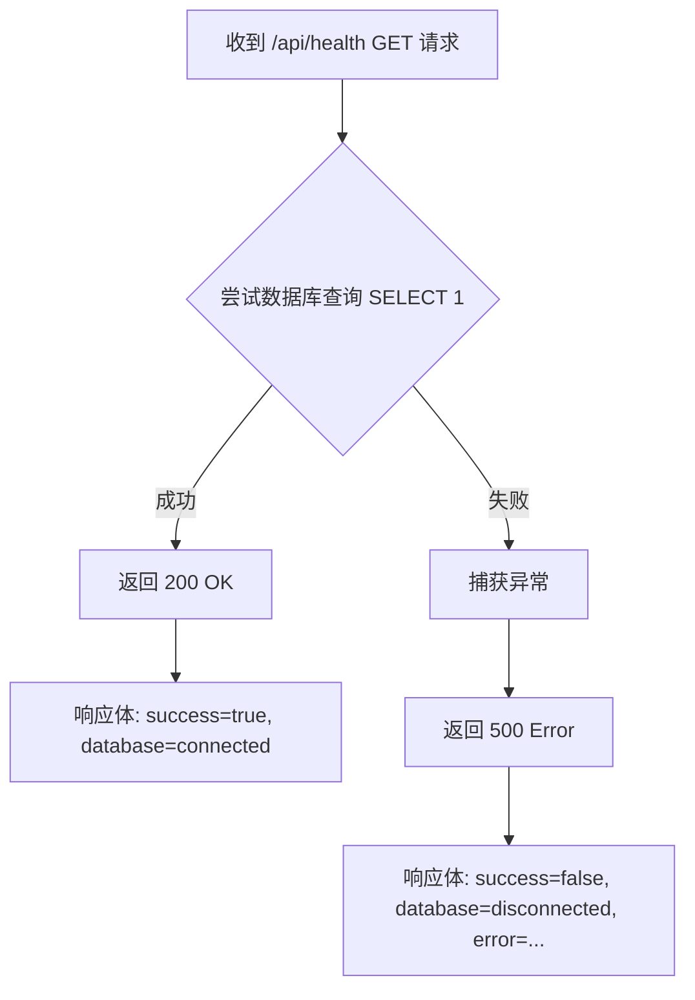
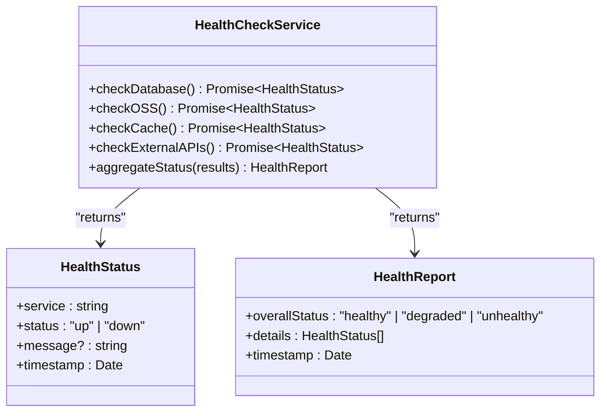

# 健康检查端点

<cite>
**本文档中引用的文件**  
- [route.ts](file://src/app/api/health/route.ts)
- [prisma.ts](file://src/lib/prisma.ts)
- [oss.ts](file://src/lib/oss.ts)
</cite>

## 目录
1. [简介](#简介)
2. [响应格式说明](#响应格式说明)
3. [实现代码分析](#实现代码分析)
4. [扩展建议：增加依赖项健康检查](#扩展建议：增加依赖项健康检查)
5. [测试与使用示例](#测试与使用示例)
6. [在负载均衡器与CI/CD中的应用](#在负载均衡器与ci/cd中的应用)
7. [当前局限性与可扩展方向](#当前局限性与可扩展方向)

## 简介
`/api/health` 是本系统提供的健康检查端点，用于 Kubernetes 或云服务环境中的存活探针（Liveness Probe）和就绪探针（Readiness Probe）。该接口通过检测核心服务的运行状态，帮助容器编排系统判断应用实例是否正常运行或是否已准备好接收流量。

当前实现主要检查 API 服务本身及数据库连接状态，返回结构化 JSON 响应，便于自动化系统解析。文档将深入解析其逻辑实现，并提出增强建议以支持更多外部依赖项的健康检查。

**Section sources**
- [route.ts](file://src/app/api/health/route.ts)

## 响应格式说明
该健康检查接口返回标准的 JSON 格式数据，HTTP 状态码根据服务状态动态调整：

- **服务正常**：返回 `200 OK` 状态码
- **服务异常**：返回 `500 Internal Server Error` 状态码

响应体包含以下字段：

| 字段名 | 类型 | 说明 |
|--------|------|------|
| success | boolean | 检查是否成功 |
| message | string | 状态描述信息 |
| timestamp | string (ISO 8601) | 当前时间戳 |
| database | string | 数据库连接状态（"connected" 或 "disconnected"） |
| error | string (可选) | 错误信息（仅在失败时返回） |

成功响应示例：
```json
{
  "success": true,
  "message": "API服务正常",
  "timestamp": "2025-09-20T10:00:00.000Z",
  "database": "connected"
}
```

失败响应示例：
```json
{
  "success": false,
  "message": "API服务异常",
  "timestamp": "2025-09-20T10:00:00.000Z",
  "database": "disconnected",
  "error": "connect ECONNREFUSED 127.0.0.1:5432"
}
```

**Section sources**
- [route.ts](file://src/app/api/health/route.ts#L15-L30)

## 实现代码分析
健康检查的核心逻辑位于 `src/app/api/health/route.ts` 文件中，其主要流程如下：

1. 接收 GET 请求
2. 尝试执行一条轻量级数据库查询 `SELECT 1`
3. 若查询成功，返回 200 及健康状态
4. 若查询失败，捕获异常并返回 500 及错误详情

该实现利用 Prisma ORM 的 `$queryRaw` 方法直接执行 SQL 查询，确保数据库连接池处于活跃状态。同时，通过 `try-catch` 结构优雅处理连接异常，避免服务崩溃。

数据库连接配置在 `src/lib/prisma.ts` 中进行了优化，设置了合理的连接池参数（如连接限制、超时时间等），以适应生产环境的高并发需求。



**Diagram sources**
- [route.ts](file://src/app/api/health/route.ts#L1-L25)
- [prisma.ts](file://src/lib/prisma.ts#L10-L30)

**Section sources**
- [route.ts](file://src/app/api/health/route.ts#L1-L25)
- [prisma.ts](file://src/lib/prisma.ts#L1-L50)

## 扩展建议：增加依赖项健康检查
为提升健康检查的全面性，建议扩展该接口以检测更多关键依赖项的连通性。以下是可集成的检查项：

### 1. OSS 存储服务检查
系统已集成阿里云 OSS 服务（见 `src/lib/oss.ts`），可通过调用 `objectExists` 或 `listObjects` 方法验证存储服务的可用性。

建议扩展逻辑：
- 调用 `objectExists('health-check.txt')` 检查预设健康检查文件是否存在
- 若返回 `true`，标记 OSS 状态为 "connected"
- 若超时或报错，标记为 "disconnected"

### 2. 增强的数据库检查
当前仅执行 `SELECT 1`，可进一步：
- 检查特定业务表是否存在
- 验证读写能力（执行简单 INSERT/DELETE）

### 3. 缓存服务检查（如 Redis）
若未来引入缓存层，应添加对 Redis 的连接测试。

### 4. 外部 API 依赖检查
若系统依赖第三方服务（如认证、短信等），应在就绪探针中验证其可达性。



**Diagram sources**
- [oss.ts](file://src/lib/oss.ts#L150-L160)
- [prisma.ts](file://src/lib/prisma.ts#L1-L50)

## 测试与使用示例
可通过 `curl` 命令直接测试健康检查接口：

```bash
# 测试健康状态
curl -i http://localhost:3000/api/health

# 预期成功响应
HTTP/1.1 200 OK
Content-Type: application/json

{"success":true,"message":"API服务正常","timestamp":"2025-09-20T10:00:00.000Z","database":"connected"}

# 模拟数据库故障后测试
curl -i http://localhost:3000/api/health

# 预期失败响应
HTTP/1.1 500 Internal Server Error
Content-Type: application/json

{"success":false,"message":"API服务异常","timestamp":"2025-09-20T10:00:00.000Z","database":"disconnected","error":"connect ECONNREFUSED"}
```

**Section sources**
- [route.ts](file://src/app/api/health/route.ts)

## 在负载均衡器与CI/CD中的应用
### 负载均衡器配置
在 Nginx 或云负载均衡器中，可配置 `/api/health` 作为健康检查路径：

```nginx
location /api/health {
    access_log off;
    internal; # 可选：限制外部访问
}
```

Kubernetes 中的探针配置示例：
```yaml
livenessProbe:
  httpGet:
    path: /api/health
    port: 3000
  initialDelaySeconds: 30
  periodSeconds: 10

readinessProbe:
  httpGet:
    path: /api/health
    port: 3000
  initialDelaySeconds: 10
  periodSeconds: 5
```

### CI/CD 流程集成
在部署流水线中，可在发布后自动调用健康检查接口验证服务状态：

```bash
# 部署后等待服务启动
sleep 15

# 轮询健康检查接口
for i in {1..10}; do
  if curl -s http://localhost:3000/api/health | grep -q '"success":true'; then
    echo "服务健康，部署成功"
    exit 0
  fi
  sleep 5
done

echo "服务未就绪，部署失败"
exit 1
```

**Section sources**
- [route.ts](file://src/app/api/health/route.ts)

## 当前局限性与可扩展方向
### 当前局限性
1. **检查范围有限**：仅检测数据库连接，未覆盖 OSS 等关键依赖
2. **无分级健康状态**：无法区分“部分降级”与“完全不可用”
3. **缺少性能指标**：未返回响应时间、资源使用率等指标
4. **无缓存机制**：频繁调用可能增加数据库负担

### 可扩展方向
1. **实现分层健康检查**：
   - Liveness：仅检查进程存活
   - Readiness：检查所有依赖项
   - Startup：初始化期间专用探针

2. **引入健康检查聚合服务**：将各组件检查解耦，统一汇总状态。

3. **支持可配置检查项**：通过环境变量动态启用/禁用特定检查。

4. **添加指标暴露**：集成 Prometheus，暴露 `health_check_duration_seconds` 等指标。

5. **实现缓存机制**：对健康检查结果进行短时缓存，减少后端压力。

通过以上改进，可使健康检查机制更加健壮，更好地支持云原生环境下的自动化运维需求。

**Section sources**
- [route.ts](file://src/app/api/health/route.ts)
- [oss.ts](file://src/lib/oss.ts)
- [prisma.ts](file://src/lib/prisma.ts)