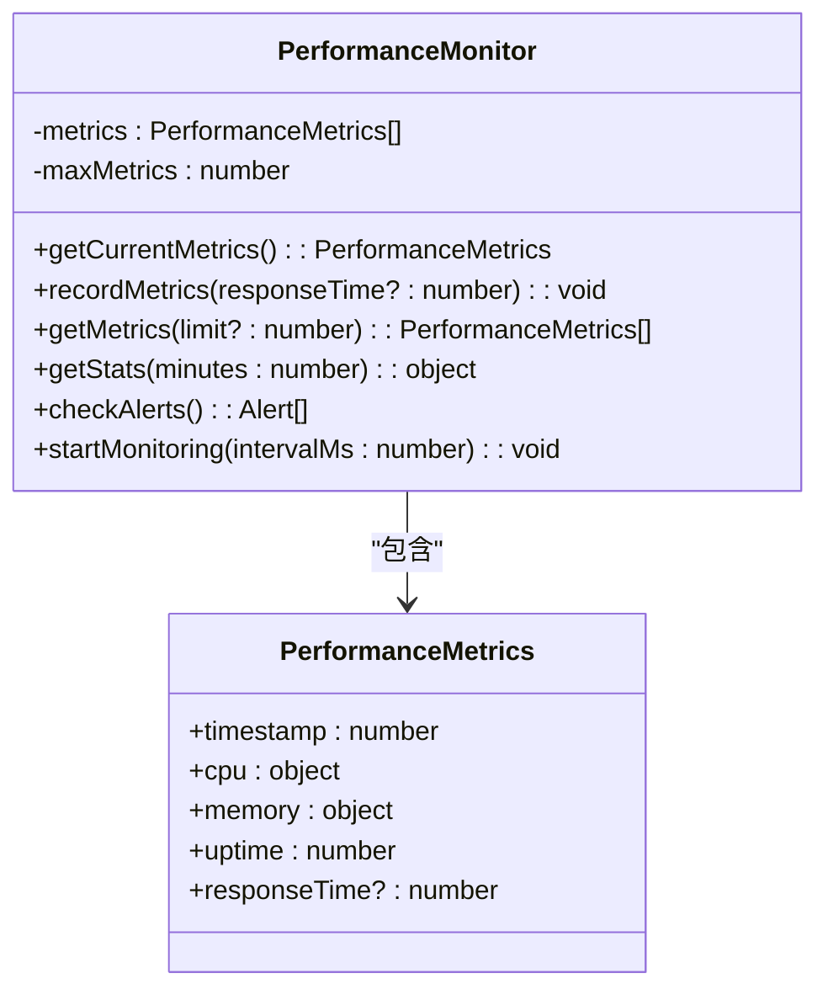
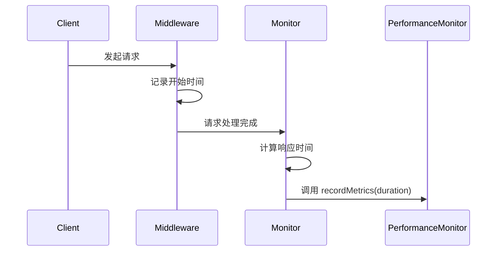
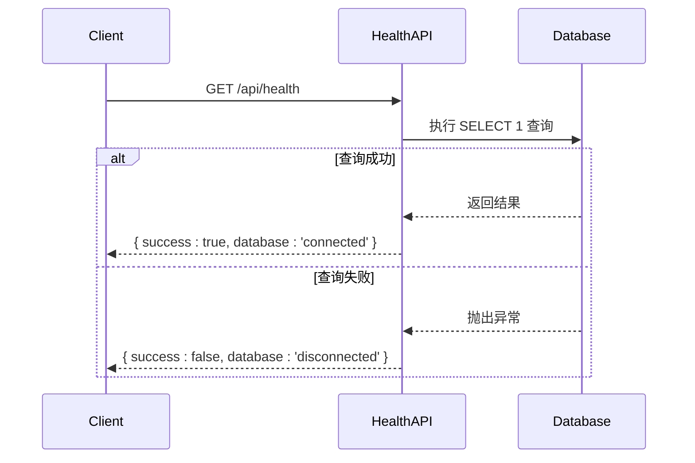

# 关键指标监控与告警

<cite>
**本文档引用文件**  
- [ecosystem.config.js](file://ecosystem.config.js)
- [performance-monitor.ts](file://src/lib/performance-monitor.ts)
- [performance/route.ts](file://src/app/api/admin/performance/route.ts)
- [health/route.ts](file://src/app/api/health/route.ts)
</cite>

## 目录
1. [简介](#简介)
2. [系统性能指标采集](#系统性能指标采集)
3. [API 响应延迟与错误率监控](#api-响应延迟与错误率监控)
4. [数据库连接与文件上传监控](#数据库连接与文件上传监控)
5. [PM2 与 Prometheus 集成方案](#pm2-与-prometheus-集成方案)
6. [健康检查与指标入口扩展](#健康检查与指标入口扩展)
7. [Grafana 仪表盘配置建议](#grafana-仪表盘配置建议)
8. [告警规则配置](#告警规则配置)
9. [总结](#总结)

## 简介
本系统通过内置性能监控模块和 PM2 进程管理工具，实现了对关键性能指标的全面采集与告警。核心监控指标包括：API 响应延迟、服务器 CPU 与内存使用率、请求错误率、服务健康状态等。系统采用基于单例模式的 `PerformanceMonitor` 类进行指标记录，并通过管理员专用 API 端点暴露监控数据，支持实时查看与历史分析。

**Section sources**
- [performance-monitor.ts](file://src/lib/performance-monitor.ts#L1-L220)
- [ecosystem.config.js](file://ecosystem.config.js#L1-L127)

## 系统性能指标采集

系统通过 `PerformanceMonitor` 类实现对服务器资源的持续监控，采集以下关键指标：

- **CPU 使用率**：基于 `os.cpus()` 计算平均使用率
- **内存使用情况**：包括系统内存与 Node.js 堆内存
- **负载平均值**：反映系统整体负载压力
- **进程运行时间**：`process.uptime()`
- **API 响应时间**：通过中间件记录每个请求的处理耗时

该监控器以单例模式运行，定期（默认 30 秒）自动记录系统状态，并保留最近 1000 条历史记录用于统计分析。



**Diagram sources**
- [performance-monitor.ts](file://src/lib/performance-monitor.ts#L22-L202)

**Section sources**
- [performance-monitor.ts](file://src/lib/performance-monitor.ts#L1-L220)

## API 响应延迟与错误率监控

### 响应延迟监控
通过 `performanceMiddleware` 中间件，在请求开始时记录时间戳，并在响应完成时计算耗时，自动记录到性能监控器中：



**Diagram sources**
- [performance-monitor.ts](file://src/lib/performance-monitor.ts#L193-L220)

### 错误率监控
系统通过以下方式监控错误率：
- **5xx 错误**：由 API 路由中的 `try-catch` 捕获并记录
- **4xx 错误**：在参数校验、权限检查等逻辑中返回并可统计

虽然当前未直接暴露错误计数指标，但可通过日志分析或扩展 `PerformanceMonitor` 来实现错误率统计。

**Section sources**
- [performance-monitor.ts](file://src/lib/performance-monitor.ts#L193-L220)

## 数据库连接与文件上传监控

### 数据库连接监控
通过 `/api/health` 健康检查端点，系统定期执行 SQL 查询 `SELECT 1` 来验证数据库连接状态：



**Diagram sources**
- [health/route.ts](file://src/app/api/health/route.ts#L1-L25)

### 文件上传吞吐量监控
文件上传功能受配置控制，相关指标包括：
- 上传开关状态 (`isEnabled`)
- 上传时间窗口 (`startTime`, `endTime`)
- 用户上传数量限制 (`maxUploadsPerUser`)
- 文件大小限制 (`maxFileSize`)
- 支持格式 (`allowedFormats`)

这些配置可通过管理员接口获取，结合日志可分析上传吞吐量趋势。

**Section sources**
- [upload/route.ts](file://src/app/api/upload/route.ts#L39-L76)
- [upload-config/route.ts](file://src/app/api/admin/upload-config/route.ts)

## PM2 与 Prometheus 集成方案

### PM2 内置监控
项目已配置 `ecosystem.config.js` 启用 PM2 内置监控功能：

```javascript
module.exports = {
  apps: [
    {
      name: 'yunqi-platform',
      // ...其他配置
      pmx: true,
      monitoring: true,
      // ...日志与性能配置
    }
  ]
};
```

通过 `pm2 monit` 命令可实时查看 CPU、内存、HTTP 请求率等指标。

### Prometheus 集成建议
虽然当前未直接集成 `prom-client`，但可通过以下方式扩展：

1. **创建指标暴露端点**：在 `/api/metrics` 中导出 Prometheus 格式数据
2. **定义指标类型**：
   - `counter`：请求总数、错误数
   - `gauge`：当前在线用户、内存使用
   - `histogram`：API 响应时间分布

3. **示例集成代码**：
```ts
// 伪代码：Prometheus 集成建议
import { Counter, Gauge, Histogram } from 'prom-client';

const requestCounter = new Counter({ name: 'http_requests_total', help: 'Total HTTP requests' });
const responseTimeHistogram = new Histogram({ name: 'http_response_time_ms', help: 'Response time in ms' });
```

**Section sources**
- [ecosystem.config.js](file://ecosystem.config.js#L1-L127)

## 健康检查与指标入口扩展

### 健康检查端点
`/api/health` 提供基础服务健康状态检查，返回数据库连接状态和服务可达性。

### 扩展为指标收集入口
`/api/admin/performance` 管理员端点已实现丰富的性能指标暴露功能：

- **权限控制**：仅管理员可访问
- **指标类型**：
  - 当前系统状态 (`current`)
  - 近期统计 (`stats`)
  - 告警信息 (`alerts`)
  - 服务器信息 (`serverInfo`)
- **参数支持**：
  - `minutes`：统计时间窗口
  - `history=true`：返回最近 100 条历史记录

此端点可作为 Prometheus 或其他监控系统的数据抓取目标。

```mermaid
flowchart TD
A[监控系统] --> B[/api/admin/performance]
B --> C{权限验证}
C --> |未登录| D[返回401]
C --> |非管理员| E[返回403]
C --> |管理员| F[返回性能指标]
F --> G[当前指标]
F --> H[统计信息]
F --> I[告警列表]
F --> J[历史数据]
```

**Diagram sources**
- [performance/route.ts](file://src/app/api/admin/performance/route.ts#L1-L123)

**Section sources**
- [performance/route.ts](file://src/app/api/admin/performance/route.ts#L1-L123)
- [health/route.ts](file://src/app/api/health/route.ts#L1-L25)

## Grafana 仪表盘配置建议

建议创建以下 Grafana 仪表盘面板：

| 面板名称 | 数据源 | 可视化类型 | 关键指标 |
|---------|-------|-----------|---------|
| 服务器资源 | Prometheus/自定义API | 折线图 | CPU使用率、内存使用率、负载 |
| API性能 | 自定义API | 柱状图+折线图 | 平均响应时间、最大响应时间 |
| 请求统计 | 日志或API | 时间序列 | 请求总数、错误率 |
| 服务状态 | Health API | 状态灯 | 数据库连接状态、服务可用性 |
| 上传分析 | 业务API | 条形图 | 上传数量趋势、文件大小分布 |

**Section sources**
- [performance-monitor.ts](file://src/lib/performance-monitor.ts#L1-L220)
- [performance/route.ts](file://src/app/api/admin/performance/route.ts#L1-L123)

## 告警规则配置

### 内置告警机制
`PerformanceMonitor.checkAlerts()` 方法已实现基于阈值的告警判断：

- **CPU 使用率**：
  - >90%：严重告警
  - >70%：警告
- **内存使用率**：
  - >90%：严重告警
  - >80%：警告
- **系统负载**：
  - >2×CPU核数：严重告警
  - >1.5×CPU核数：警告

### 外部告警集成
建议通过以下方式配置外部告警：

#### 阿里云监控
1. 创建自定义监控任务，定期调用 `/api/admin/performance`
2. 设置告警规则：
   - 指标：`data.stats.avgCpuUsage`
   - 阈值：>85%
   - 告警方式：短信、邮件、Webhook

#### Prometheus Alertmanager
```yaml
groups:
- name: service-alerts
  rules:
  - alert: HighCpuUsage
    expr: avg_cup_usage > 85
    for: 5m
    labels:
      severity: warning
    annotations:
      summary: "CPU使用率过高"
      description: "服务CPU使用率持续5分钟超过85%"

  - alert: HighMemoryUsage
    expr: avg_memory_usage > 85
    for: 5m
    labels:
      severity: warning
    annotations:
      summary: "内存使用率过高"
      description: "服务内存使用率持续5分钟超过85%"
```

**Section sources**
- [performance-monitor.ts](file://src/lib/performance-monitor.ts#L145-L194)

## 总结
本系统已建立较为完善的性能监控体系，通过 `PerformanceMonitor` 单例类实现对服务器资源和 API 响应时间的采集，并通过管理员 API 端点暴露指标。结合 PM2 的进程监控能力，可实现对服务状态的全面掌握。建议进一步集成 Prometheus 客户端，将指标标准化并接入 Grafana 可视化平台，同时配置 Alertmanager 或阿里云监控实现自动化告警，全面提升系统可观测性与稳定性。

**Section sources**
- [performance-monitor.ts](file://src/lib/performance-monitor.ts#L1-L220)
- [ecosystem.config.js](file://ecosystem.config.js#L1-L127)
- [performance/route.ts](file://src/app/api/admin/performance/route.ts#L1-L123)