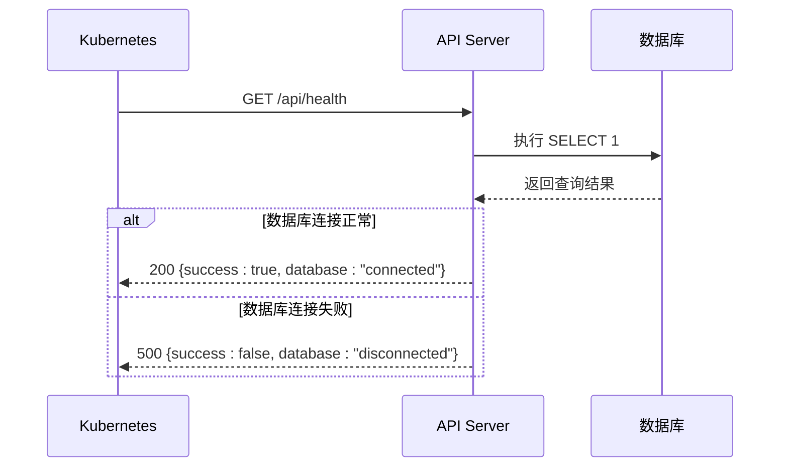
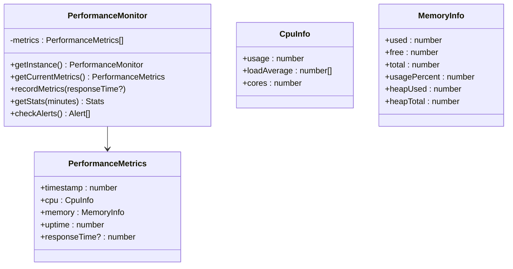

# 日志收集与监控告警

<cite>
**本文档引用文件**   
- [ecosystem.config.js](file://ecosystem.config.js)
- [src/app/api/health/route.ts](file://src/app/api/health/route.ts)
- [src/lib/performance-monitor.ts](file://src/lib/performance-monitor.ts)
</cite>

## 目录
1. [简介](#简介)
2. [PM2 日志配置与管理](#pm2-日志配置与管理)
3. [结构化日志集成](#结构化日志集成)
4. [/api/health 健康检查端点](#apihealth-健康检查端点)
5. [关键指标监控体系](#关键指标监控体系)
6. [Prometheus + Grafana 监控集成](#prometheus--grafana-监控集成)
7. [告警策略与通知机制](#告警策略与通知机制)

## 简介
本文档旨在建立生产环境下的日志收集与监控告警体系，指导如何通过 PM2 配置日志轮转、错误捕获和进程监控。文档涵盖结构化日志输出、健康检查端点设计、性能指标采集以及与主流监控平台（如 Prometheus、Grafana、ELK 或阿里云日志服务）的集成方案，确保系统具备可观测性、可维护性和高可用性。

## PM2 日志配置与管理

项目已配置 `ecosystem.config.js` 文件用于管理 PM2 进程守护，其中包含详细的日志收集与轮转策略。生产环境应用实例会自动将标准输出和错误输出分别写入指定日志文件，并支持 JSON 格式化输出，便于后续日志系统解析。

日志配置项说明：
- `log_file`: 综合日志文件路径，记录所有输出
- `out_file`: 标准输出日志路径
- `error_file`: 错误日志路径
- `log_date_format`: 时间戳格式为 ISO 8601 兼容格式
- `merge_logs`: 启用多实例日志合并
- `log_type`: 设置为 `json`，输出结构化日志

此外，PM2 提供了进程级监控能力（`pmx: true, monitoring: true`），可实时查看 CPU、内存使用情况，并支持基于内存限制的自动重启机制（`max_memory_restart: '3G'`）。

```mermaid
flowchart TD
A[Node.js 应用] --> B{PM2 进程管理器}
B --> C["./logs/combined.log (JSON)"]
B --> D["./logs/out.log"]
B --> E["./logs/error.log"]
C --> F[日志采集系统<br/>(ELK / 阿里云日志服务)]
D --> G[运维审计]
E --> H[错误告警触发]
```

**Diagram sources**
- [ecosystem.config.js](file://ecosystem.config.js#L30-L40)

**Section sources**
- [ecosystem.config.js](file://ecosystem.config.js#L0-L127)

## 结构化日志集成

虽然当前项目未显式引入 Pino 或 Winston 等第三方日志库，但通过 PM2 的 `log_type: 'json'` 配置，已实现基础的结构化日志输出。建议在后续开发中集成如 `pino` 或 `winston` 库，以增强日志的可读性与可分析性。

推荐集成方案：
1. 安装 pino：`npm install pino`
2. 创建日志实例：
   ```ts
   import pino from 'pino';
   const logger = pino({ level: 'info', transport: { target: 'pino/file' } });
   ```
3. 替换 `console.log/error` 调用为 `logger.info/error`
4. 输出格式将自动为 JSON，包含时间戳、级别、消息及上下文信息

结构化日志示例：
```json
{
  "level": 50,
  "time": "2025-09-20T10:00:00Z",
  "msg": "数据库连接失败",
  "error": "Connection timeout"
}
```

此格式可被 ELK Stack 或阿里云 SLS 直接采集并建立索引，支持高效查询与可视化分析。

## /api/health 健康检查端点

系统提供 `/api/health` 接口用于健康检查和存活探针（Liveness Probe），位于 `src/app/api/health/route.ts`。该接口不仅检查 API 服务状态，还主动测试数据库连接，确保整个服务栈处于可用状态。

功能特点：
- **GET 请求响应**：返回 JSON 格式的健康状态
- **数据库连通性检测**：执行 `SELECT 1` 查询验证数据库连接
- **状态码区分**：
  - 200：服务正常
  - 500：服务异常（如数据库断开）
- **响应内容包含**：
  - `success`: 布尔值表示健康状态
  - `message`: 状态描述
  - `timestamp`: 时间戳
  - `database`: 数据库连接状态

该端点可用于 Kubernetes 存活探针或云服务器健康检查，实现自动故障恢复。



**Diagram sources**
- [src/app/api/health/route.ts](file://src/app/api/health/route.ts#L0-L25)

**Section sources**
- [src/app/api/health/route.ts](file://src/app/api/health/route.ts#L0-L25)

## 关键指标监控体系

项目内置性能监控模块 `performance-monitor.ts`，用于采集关键运行指标，包括：
- **API 响应时间**：通过中间件记录每个请求处理耗时
- **CPU 使用率**：基于系统负载与核心数计算
- **内存使用率**：包括系统内存与 Node.js 堆内存
- **数据库连接状态**：由健康检查接口间接反映
- **进程 Uptime**：服务持续运行时间

性能监控通过单例模式全局管理，定期采样并存储历史数据，支持统计分析与趋势预测。



**Diagram sources**
- [src/lib/performance-monitor.ts](file://src/lib/performance-monitor.ts#L0-L220)

**Section sources**
- [src/lib/performance-monitor.ts](file://src/lib/performance-monitor.ts#L0-L220)

## Prometheus + Grafana 监控集成

建议将现有性能监控数据暴露为 Prometheus 可采集的格式。可通过以下步骤实现：

1. **添加 `/metrics` 端点**：
   - 使用 `prom-client` 库创建计数器、直方图等指标
   - 暴露 API 响应时间、请求计数、错误率等

2. **集成示例代码**：
   ```ts
   import client from 'prom-client';
   const httpRequestDuration = new client.Histogram({
     name: 'http_request_duration_seconds',
     help: 'API 请求耗时分布',
     labelNames: ['method', 'route', 'status_code'],
     buckets: [0.1, 0.3, 0.5, 1, 2, 5]
   });
   ```

3. **在中间件中记录指标**：
   - 使用 `performanceMonitor` 记录响应时间
   - 同时上报至 Prometheus 客户端

4. **Grafana 面板建议**：
   - API 响应时间 P95/P99
   - 每秒请求数（QPS）
   - 错误率趋势图
   - CPU 与内存使用率仪表盘

通过 Prometheus 抓取 `/metrics` 端点，结合 Grafana 实现可视化监控大屏。

## 告警策略与通知机制

基于 `performance-monitor.ts` 中的 `checkAlerts()` 方法，系统已定义基础的告警规则：

| 指标 | 警告阈值 | 严重阈值 |
|------|----------|----------|
| CPU 使用率 | >70% | >90% |
| 内存使用率 | >80% | >90% |
| 系统负载 | >1.5×核心数 | >2×核心数 |

建议扩展告警能力：
- **集成通知渠道**：企业微信、钉钉、邮件、短信
- **使用 Alertmanager**：实现告警去重、分组、静默
- **设置告警规则**：
  - 连续 3 次健康检查失败 → 触发服务异常告警
  - API 平均响应时间 >1s（5分钟均值）→ 延迟告警
  - 错误率 >5%（10分钟窗口）→ 错误率飙升告警

告警流程应遵循：检测 → 通知 → 自动恢复尝试 → 人工介入。

```mermaid
flowchart LR
A[指标采集] --> B{是否超过阈值?}
B --> |是| C[生成告警事件]
C --> D[发送通知<br/>(钉钉/邮件)]
D --> E[等待确认]
E --> F{是否自动恢复?}
F --> |是| G[关闭告警]
F --> |否| H[升级至值班人员]
```

**Diagram sources**
- [src/lib/performance-monitor.ts](file://src/lib/performance-monitor.ts#L108-L194)

**Section sources**
- [src/lib/performance-monitor.ts](file://src/lib/performance-monitor.ts#L108-L194)