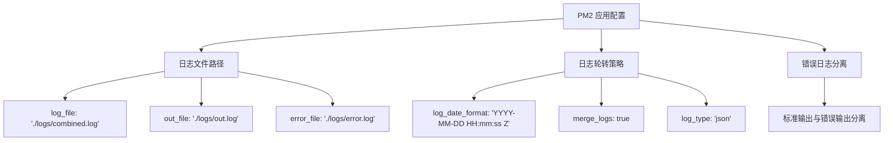
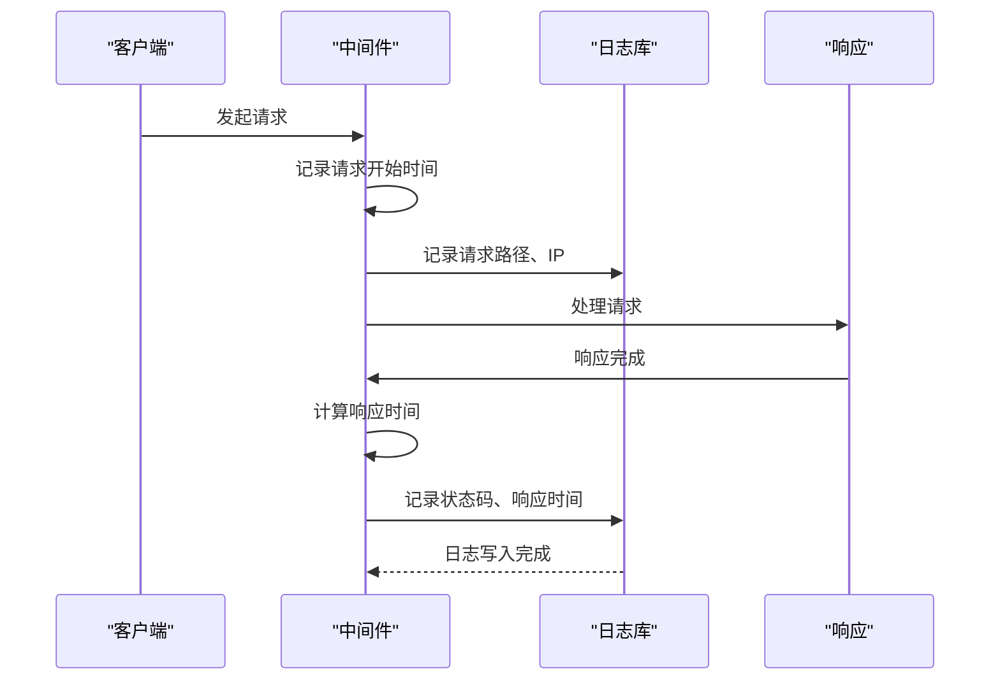
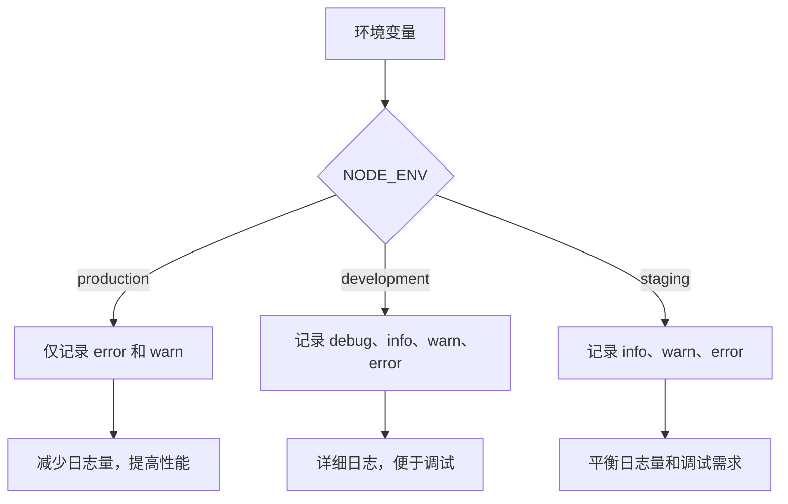
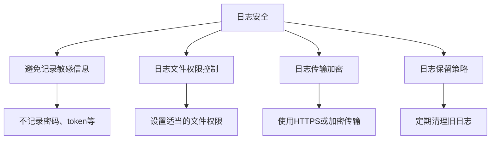

# 日志配置与收集

<cite>
**本文档引用的文件**  
- [ecosystem.config.js](file://ecosystem.config.js)
- [middleware.ts](file://middleware.ts)
- [performance-monitor.ts](file://src/lib/performance-monitor.ts)
</cite>

## 目录
1. [简介](#简介)
2. [PM2 日志配置](#pm2-日志配置)
3. [Next.js 中间件中的结构化日志](#nextjs-中间件中的结构化日志)
4. [日志级别管理](#日志级别管理)
5. [日志安全注意事项](#日志安全注意事项)
6. [总结](#总结)

## 简介
本文档详细说明如何通过 PM2 的 `ecosystem.config.js` 配置日志文件路径、日志轮转策略和错误日志分离。同时，解释如何在 Next.js 中间件中集成结构化日志库（如 pino 或 winston），实现请求日志的结构化输出（JSON 格式），便于与 ELK 或阿里云日志服务对接。提供代码示例展示如何记录请求路径、IP、状态码和响应时间，并指导如何设置日志级别以适应不同环境。

## PM2 日志配置

在 `ecosystem.config.js` 中，PM2 提供了丰富的日志配置选项，包括日志文件路径、日志轮转策略和错误日志分离。

**Diagram sources**  
- [ecosystem.config.js](file://ecosystem.config.js#L0-L127)

**Section sources**  
- [ecosystem.config.js](file://ecosystem.config.js#L0-L127)

### 日志文件路径
在 `ecosystem.config.js` 中，通过以下配置项指定日志文件路径：
- `log_file`: 综合日志文件路径
- `out_file`: 标准输出日志文件路径
- `error_file`: 错误输出日志文件路径

### 日志轮转策略
PM2 支持日志轮转，通过以下配置实现：
- `log_date_format`: 设置日志时间格式
- `merge_logs`: 是否合并所有实例日志
- `log_type`: 日志格式（支持 json 格式）

### 错误日志分离
通过将标准输出和错误输出分别写入不同文件，实现错误日志的分离，便于问题排查。

## Next.js 中间件中的结构化日志

虽然当前项目中未直接集成 pino 或 winston，但可以通过中间件实现结构化日志记录。

**Diagram sources**  
- [middleware.ts](file://middleware.ts#L0-L50)
- [performance-monitor.ts](file://src/lib/performance-monitor.ts#L193-L220)

**Section sources**  
- [middleware.ts](file://middleware.ts#L0-L50)
- [performance-monitor.ts](file://src/lib/performance-monitor.ts#L193-L220)

### 结构化日志实现
通过自定义中间件，可以记录以下信息：
- 请求路径
- 客户端 IP
- 状态码
- 响应时间

### JSON 格式输出
将日志以 JSON 格式输出，便于与 ELK 或阿里云日志服务对接，实现日志的集中管理和分析。

## 日志级别管理

通过环境变量控制日志级别，适应不同环境的需求。

**Diagram sources**  
- [ecosystem.config.js](file://ecosystem.config.js#L0-L127)

**Section sources**  
- [ecosystem.config.js](file://ecosystem.config.js#L0-L127)

### 环境适配
在 `ecosystem.config.js` 中，通过 `env_production`、`env_development` 等配置项，为不同环境设置不同的日志级别。

## 日志安全注意事项

在日志记录过程中，需注意以下安全事项：

**Diagram sources**  
- [middleware.ts](file://middleware.ts#L0-L50)

**Section sources**  
- [middleware.ts](file://middleware.ts#L0-L50)

### 敏感信息保护
确保不将用户密码、认证 token、个人身份信息等敏感数据写入日志文件。

### 文件权限
设置日志文件的适当权限，防止未授权访问。

## 总结
通过合理配置 PM2 的日志系统和在 Next.js 中间件中实现结构化日志记录，可以构建一个高效、安全的日志收集系统。结合适当的日志级别管理和安全措施，能够满足生产环境的监控需求，同时保护用户隐私和系统安全。