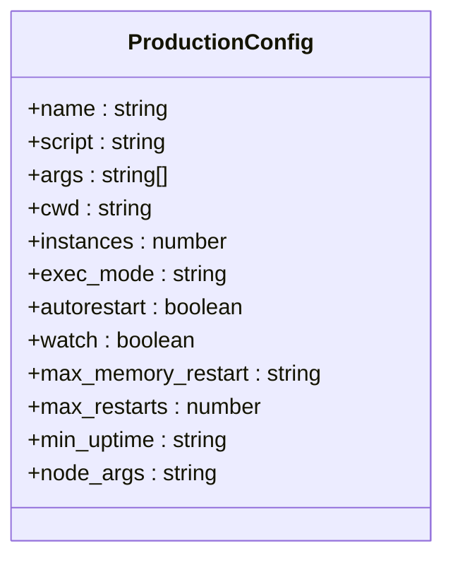
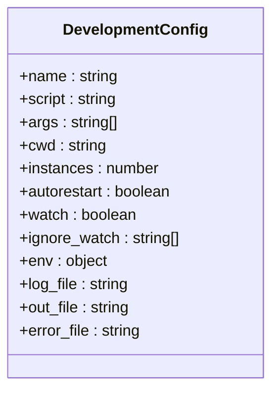
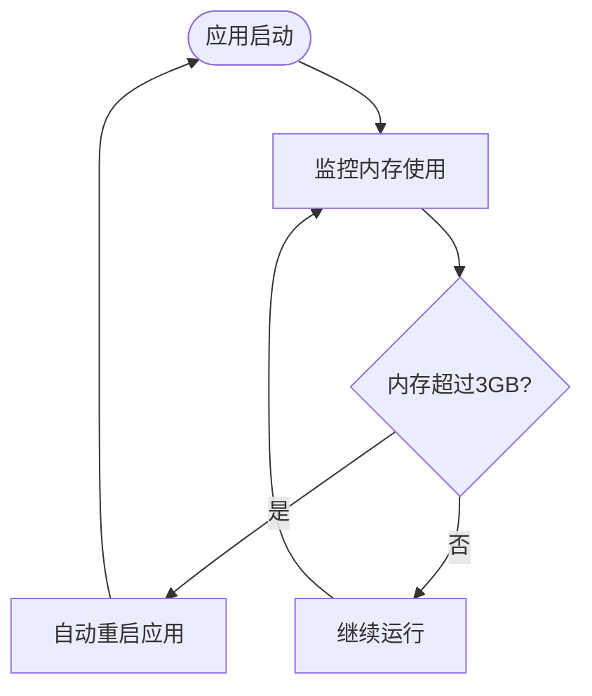
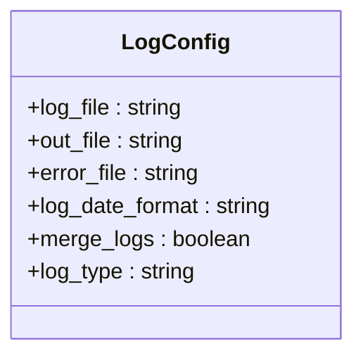
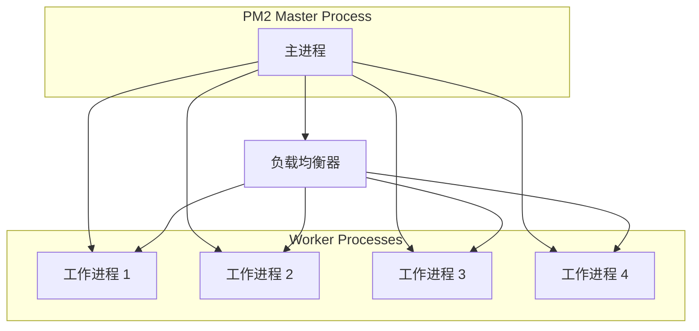
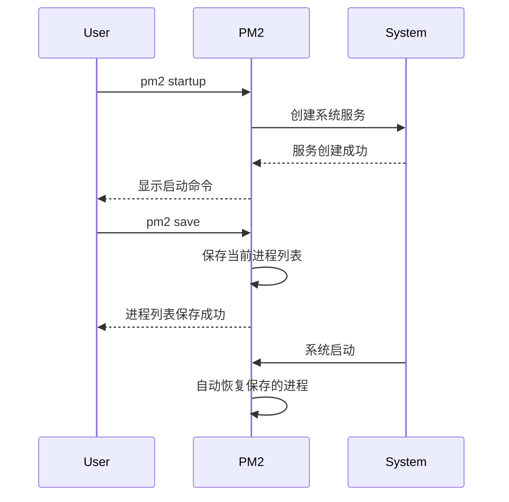
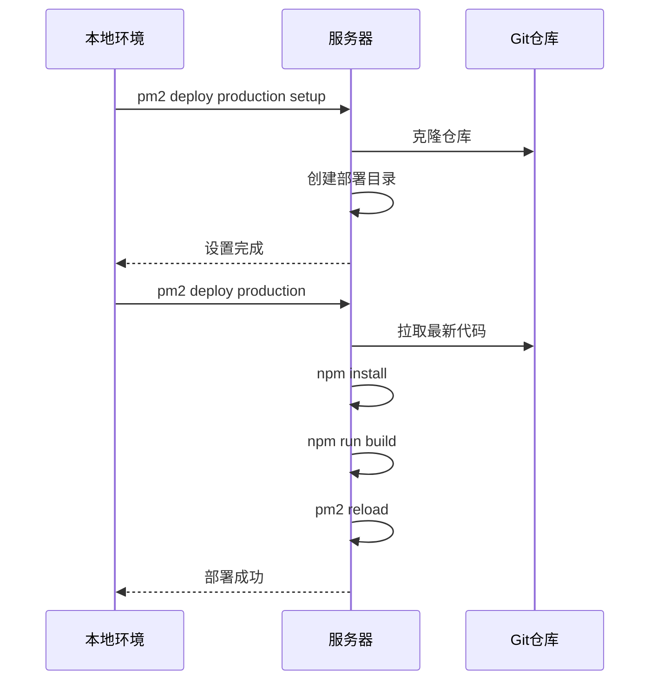

# PM2 进程管理

<cite>
**本文档引用文件**   
- [ecosystem.config.js](file://ecosystem.config.js)
- [package.json](file://package.json)
- [scripts/optimize-server.sh](file://scripts/optimize-server.sh)
</cite>

## 目录
1. [简介](#简介)
2. [生产环境配置](#生产环境配置)
3. [开发环境配置](#开发环境配置)
4. [自动重启与内存管理](#自动重启与内存管理)
5. [日志配置](#日志配置)
6. [集群模式配置](#集群模式配置)
7. [常用PM2命令](#常用pm2命令)
8. [开机自启与进程保存](#开机自启与进程保存)
9. [部署配置](#部署配置)

## 简介
PM2 是一个先进的 Node.js 进程管理器，用于在生产环境中管理 Next.js 应用程序。通过 `ecosystem.config.js` 配置文件，可以实现应用程序的高可用性、性能优化和自动化管理。本文档详细说明了如何配置和使用 PM2 来管理数字化作品互动展示平台。

**Section sources**
- [ecosystem.config.js](file://ecosystem.config.js#L0-L127)

## 生产环境配置
生产环境配置针对 16GB 内存服务器进行了优化，使用 4 个实例，每个实例分配 3GB 内存，总计 12GB，为系统保留 4GB 内存。

**Diagram sources**
- [ecosystem.config.js](file://ecosystem.config.js#L1-L48)

**Section sources**
- [ecosystem.config.js](file://ecosystem.config.js#L1-L48)

## 开发环境配置
开发环境配置用于本地开发，使用单个实例并启用文件监听功能，当代码更改时自动重启应用。

**Diagram sources**
- [ecosystem.config.js](file://ecosystem.config.js#L49-L94)

**Section sources**
- [ecosystem.config.js](file://ecosystem.config.js#L49-L94)

## 自动重启与内存管理
PM2 提供了强大的自动重启机制，可以根据内存使用情况自动重启进程，防止内存泄漏导致的服务中断。

**Diagram sources**
- [ecosystem.config.js](file://ecosystem.config.js#L10-L15)

**Section sources**
- [ecosystem.config.js](file://ecosystem.config.js#L10-L15)

## 日志配置
日志配置包括日志文件路径设置和日志日期格式化，便于问题排查和系统监控。

**Diagram sources**
- [ecosystem.config.js](file://ecosystem.config.js#L30-L37)

**Section sources**
- [ecosystem.config.js](file://ecosystem.config.js#L30-L37)

## 集群模式配置
集群模式通过 `instances` 和 `exec_mode` 配置项实现，充分利用多核 CPU 的性能优势。

**Diagram sources**
- [ecosystem.config.js](file://ecosystem.config.js#L6-L7)

**Section sources**
- [ecosystem.config.js](file://ecosystem.config.js#L6-L7)

## 常用PM2命令
以下为常用的 PM2 命令，用于管理应用程序的生命周期。

**Diagram sources**
- [ecosystem.config.js](file://ecosystem.config.js#L96-L127)

**Section sources**
- [ecosystem.config.js](file://ecosystem.config.js#L96-L127)

## 开机自启与进程保存
通过 `pm2 startup` 和 `pm2 save` 命令可以配置开机自启和保存当前进程列表，确保服务的高可用性。

**Diagram sources**
- [ecosystem.config.js](file://ecosystem.config.js#L120-L123)
- [scripts/optimize-server.sh](file://scripts/optimize-server.sh#L45-L46)

**Section sources**
- [ecosystem.config.js](file://ecosystem.config.js#L120-L123)
- [scripts/optimize-server.sh](file://scripts/optimize-server.sh#L45-L46)

## 部署配置
部署配置提供了自动化部署的脚本，简化了生产环境的部署流程。

**Diagram sources**
- [ecosystem.config.js](file://ecosystem.config.js#L95-L108)

**Section sources**
- [ecosystem.config.js](file://ecosystem.config.js#L95-L108)