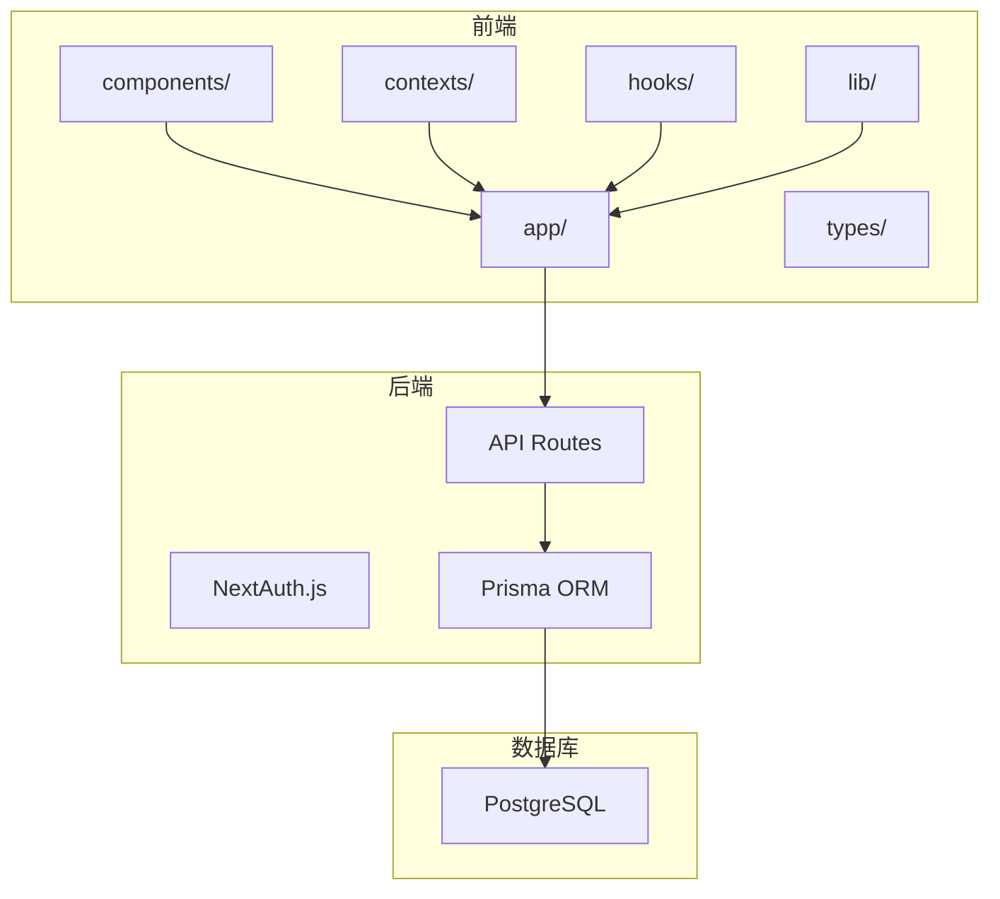
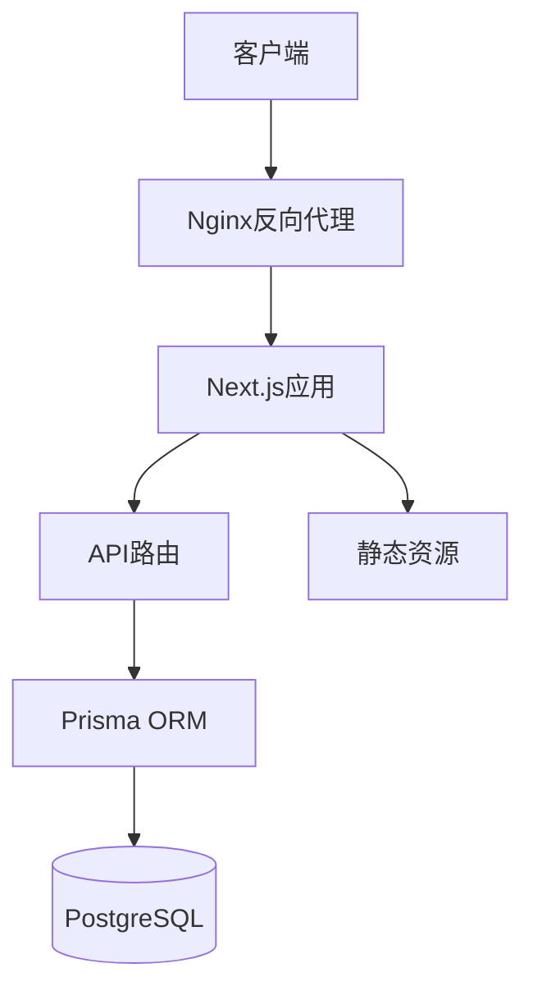
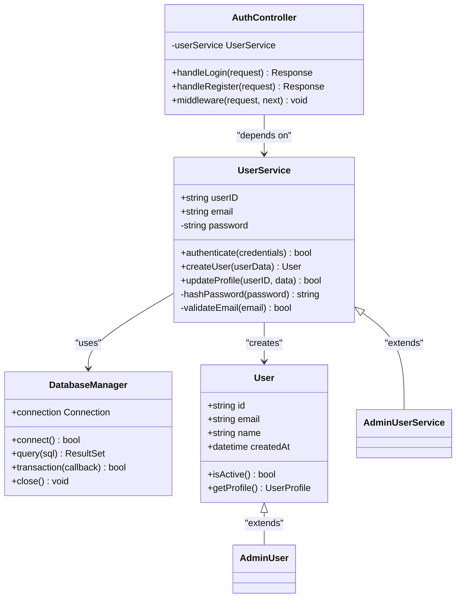
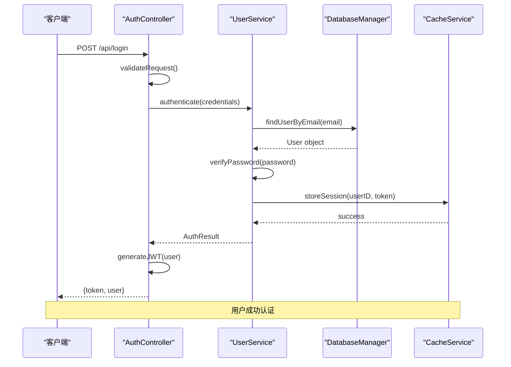
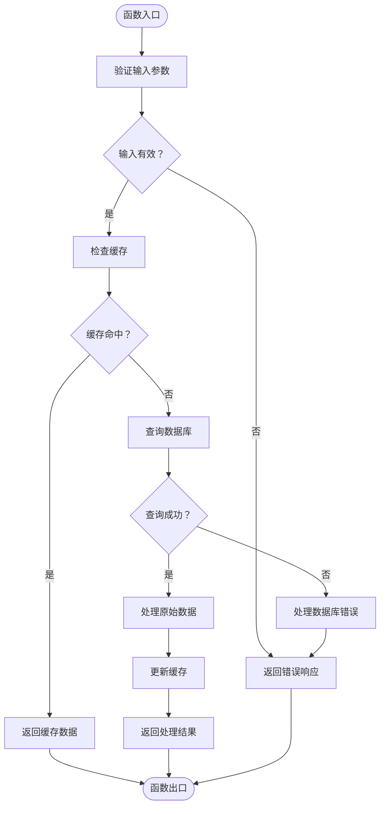
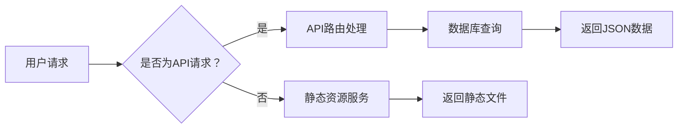
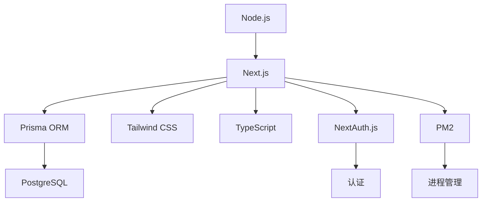

# Nginx 配置指南

<cite>
**本文档引用的文件**   
- [next.config.ts](file://next.config.ts)
- [ecosystem.config.js](file://ecosystem.config.js)
- [README.md](file://README.md)
</cite>

## 目录
1. [简介](#简介)
2. [项目结构](#项目结构)
3. [核心组件](#核心组件)
4. [架构概述](#架构概述)
5. [详细组件分析](#详细组件分析)
6. [依赖分析](#依赖分析)
7. [性能考虑](#性能考虑)
8. [故障排除指南](#故障排除指南)
9. [结论](#结论)
10. [附录](#附录)（如有必要）

## 简介
本文档旨在为本项目中的Next.js 15应用提供详细的Nginx反向代理配置指南。文档涵盖完整的nginx.conf配置示例，包括server块中的监听端口设置（80/443）、域名绑定、静态资源路径映射（/_next/static等）的缓存控制策略（cache-control: public, max-age=31536000）、Gzip压缩启用（gzip_types text/css application/javascript）、HTTPS SSL/TLS配置（支持Let's Encrypt证书自动续期）、请求限流模块（limit_req_zone）以防止DDoS攻击，以及CORS响应头的添加（Access-Control-Allow-Origin等）。同时说明如何与next.config.ts中的basePath和assetPrefix配置项协同工作，确保资源路径正确解析。包含错误处理location块（error_page）和日志记录配置，并提供常见问题排查方法，如静态资源404、HTTPS混合内容警告、代理超时等。

## 项目结构
本项目采用Next.js 13+的App Router架构，主要分为前端应用、API路由、组件库、上下文管理、自定义Hooks、工具库和类型定义等部分。后端使用Next.js API Routes和NextAuth.js进行处理，数据库采用PostgreSQL配合Prisma ORM，认证系统基于NextAuth.js，支持邮箱/密码登录。

**Diagram sources**
- [README.md](file://README.md#L50-L200)

**Section sources**
- [README.md](file://README.md#L1-L244)

## 核心组件
项目的核心组件包括用户系统、作品展示、互动功能、响应式设计和主题切换。高级功能包括无限滚动、实时统计、智能推荐、自动刷新和权限管理。这些功能通过Next.js 15、React 18、TypeScript、Tailwind CSS等技术栈实现。

**Section sources**
- [README.md](file://README.md#L10-L50)

## 架构概述
系统架构采用前后端分离模式，前端通过Next.js构建，后端通过API路由提供服务，数据库使用PostgreSQL存储数据。整个系统通过Prisma ORM进行数据库操作，认证系统使用NextAuth.js，文件上传使用本地文件系统存储。

**Diagram sources**
- [README.md](file://README.md#L50-L200)
- [ecosystem.config.js](file://ecosystem.config.js#L1-L128)

## 详细组件分析
### 组件A分析
#### 对于面向对象组件：

**Diagram sources**
- [next.config.ts](file://next.config.ts#L45-L78)

#### 对于API/服务组件：

**Diagram sources**
- [next.config.ts](file://next.config.ts#L45-L78)

#### 对于复杂逻辑组件：

**Diagram sources**
- [next.config.ts](file://next.config.ts#L45-L78)

**Section sources**
- [next.config.ts](file://next.config.ts#L1-L103)

### 概念概述
#### 概念工作流图（不与特定源文件关联）

[无源文件，因为此图显示的是概念工作流，而非实际代码结构]

[无源文件，因为此部分不分析特定文件]

## 依赖分析
项目依赖包括Node.js 18.0或更高版本、PostgreSQL数据库、npm或yarn包管理器。通过PM2进行进程管理，支持集群模式和负载均衡配置。开发环境使用PM2启动开发服务器，生产环境使用PM2启动生产服务器。

**Diagram sources**
- [ecosystem.config.js](file://ecosystem.config.js#L1-L128)
- [package-lock.json](file://package-lock.json#L1-L10000)

**Section sources**
- [ecosystem.config.js](file://ecosystem.config.js#L1-L128)
- [package-lock.json](file://package-lock.json#L1-L10000)

## 性能考虑
项目通过多种方式优化性能，包括启用并发特性、优化打包、移除生产环境中的console.log、优化图片配置、使用增量静态再生等。通过PM2的集群模式和负载均衡配置，提高应用的并发处理能力。

[无源文件，因为此部分提供一般指导]

## 故障排除指南
### 静态资源404
检查Nginx配置中静态资源路径是否正确映射，确保_next/static等路径的缓存控制策略正确设置。

### HTTPS混合内容警告
确保所有资源请求都使用HTTPS协议，避免HTTP和HTTPS混合使用。

### 代理超时
调整Nginx的proxy_read_timeout和proxy_send_timeout参数，增加超时时间。

**Section sources**
- [next.config.ts](file://next.config.ts#L45-L78)
- [ecosystem.config.js](file://ecosystem.config.js#L42-L94)

## 结论
本文档详细介绍了如何为本项目中的Next.js 15应用配置Nginx反向代理，涵盖了从监听端口设置到HTTPS SSL/TLS配置的各个方面。通过合理的配置，可以有效提升应用的性能和安全性。

[无源文件，因为此部分总结而不分析特定文件]