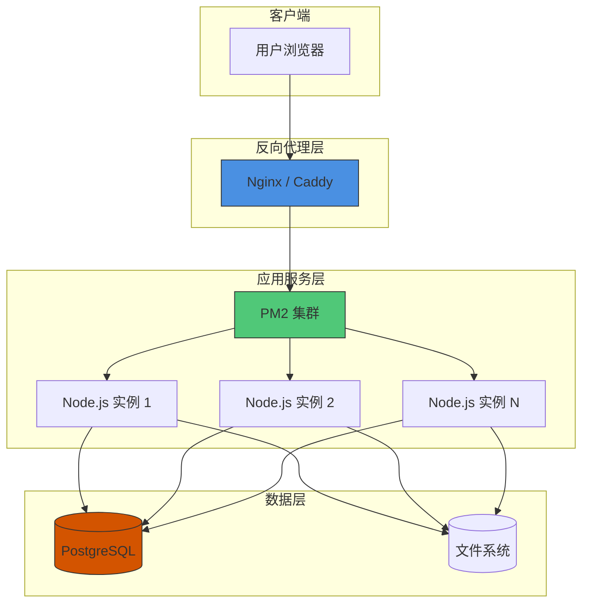
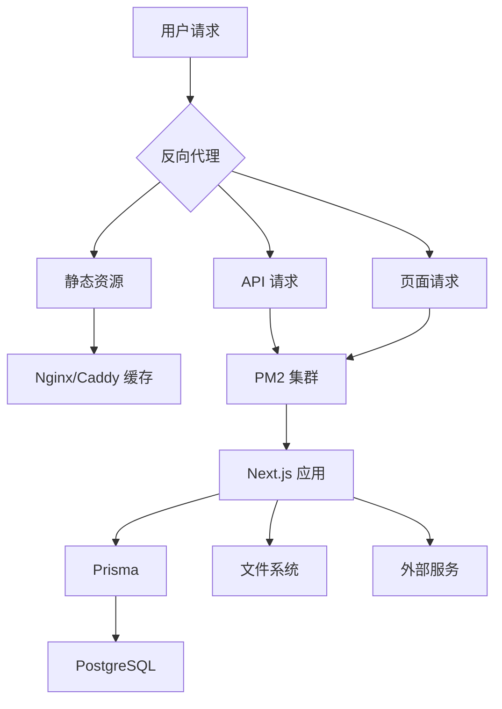
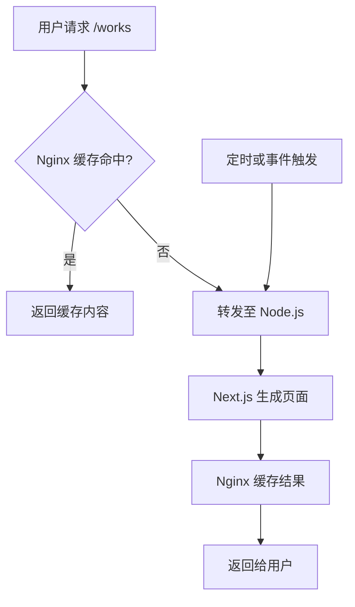
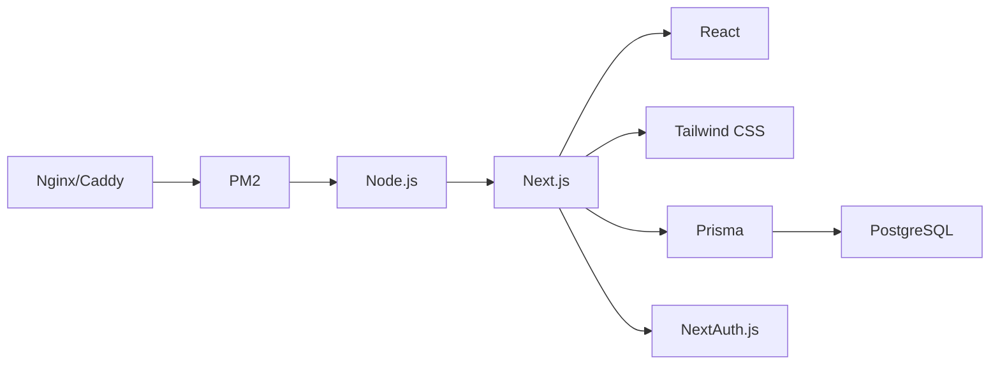

# 反向代理配置

<cite>
**本文档引用文件**  
- [next.config.ts](file://next.config.ts)
- [ecosystem.config.js](file://ecosystem.config.js)
- [middleware.ts](file://middleware.ts)
- [layout.tsx](file://src/app/layout.tsx)
</cite>

## 目录
1. [引言](#引言)
2. [项目结构](#项目结构)
3. [核心组件](#核心组件)
4. [架构概览](#架构概览)
5. [详细组件分析](#详细组件分析)
6. [依赖分析](#依赖分析)
7. [性能考量](#性能考量)
8. [故障排除指南](#故障排除指南)
9. [结论](#结论)

## 引言
本文档旨在为基于 Next.js 的“数字化作品互动展示平台”提供反向代理服务器配置指南，重点介绍 Nginx 和 Caddy 两种主流方案在实际部署中的应用。通过合理配置反向代理层，可显著提升系统性能、安全性与可维护性。文档将结合项目实际配置（如 `next.config.ts` 中的缓存策略）与反向代理协同工作方式，提供完整的 Nginx 配置示例和 Caddyfile 示例，帮助开发者实现高效、安全的生产环境部署。

## 项目结构
本项目采用 Next.js 15 的 App Router 架构，结合 Prisma 进行数据库操作，整体结构清晰，前后端一体化。反向代理作为外部请求的第一入口，负责将流量正确转发至后端 Node.js 服务（通过 PM2 集群管理），并处理 SSL 终止、静态资源缓存、请求限流等关键任务。



**图示来源**  
- [ecosystem.config.js](file://ecosystem.config.js#L0-L48)
- [next.config.ts](file://next.config.ts#L0-L50)

**本节来源**  
- [ecosystem.config.js](file://ecosystem.config.js#L0-L127)
- [next.config.ts](file://next.config.ts#L0-L102)

## 核心组件
项目的核心组件包括基于 App Router 的页面路由、NextAuth.js 实现的认证系统、Prisma 管理的数据模型以及通过 `next.config.ts` 定义的性能优化策略。反向代理的配置必须与这些组件协同工作，例如，`next.config.ts` 中定义的 `headers` 会与 Nginx/Caddy 的响应头合并，共同构建最终的 HTTP 响应。

**本节来源**  
- [next.config.ts](file://next.config.ts#L0-L102)
- [middleware.ts](file://middleware.ts#L0-L50)
- [src/app/layout.tsx](file://src/app/layout.tsx#L0-L32)

## 架构概览
系统的整体架构遵循典型的前后端分离模式，但由 Next.js 统一托管。反向代理位于最外层，承担着负载均衡、SSL 终止、安全防护和性能优化的职责。其后是 PM2 管理的 Node.js 应用集群，负责处理动态请求和服务器端渲染。数据库和文件系统则作为持久化存储层。



**图示来源**  
- [ecosystem.config.js](file://ecosystem.config.js#L0-L48)
- [next.config.ts](file://next.config.ts#L45-L78)

## 详细组件分析

### 反向代理与 next.config.ts 协同分析
`next.config.ts` 文件中通过 `async headers()` 方法定义了精细的 HTTP 响应头策略，这些策略与反向代理的配置相辅相成。

#### 缓存策略协同
`next.config.ts` 定义了不同路径的缓存策略：
- `/_next/static/`: `max-age=31536000, immutable` (一年，不可变)
- `/images/`: `max-age=86400` (一天)
- 其他页面: `max-age=3600, stale-while-revalidate=86400` (一小时新鲜，一天可陈旧)

反向代理（如 Nginx）应配置 `proxy_cache` 来缓存这些响应，特别是对于动态页面，利用 `stale-while-revalidate` 可以在后台更新缓存的同时，立即返回陈旧但可用的响应，极大提升用户体验。



**图示来源**  
- [next.config.ts](file://next.config.ts#L45-L78)

#### CORS 跨域头设置
`next.config.ts` 明确设置了 API 路由的 CORS 策略，允许 `https://yunqi.nfeyre.top` 的跨域请求。反向代理通常不需要再设置 CORS，因为最终响应头由 Next.js 应用决定。但如果反向代理需要处理预检请求（OPTIONS），应确保其正确转发。

**本节来源**  
- [next.config.ts](file://next.config.ts#L45-L78)

### Nginx 配置示例
以下是一个完整的 Nginx 配置，适用于本项目。

```nginx
# /etc/nginx/sites-available/yunqi-platform
server {
    listen 80;
    server_name yunqi.nfeyre.top;
    # 重定向 HTTP 到 HTTPS
    return 301 https://$server_name$request_uri;
}

server {
    listen 443 ssl http2;
    server_name yunqi.nfeyre.top;

    # SSL 证书配置 (Let's Encrypt)
    ssl_certificate /etc/letsencrypt/live/yunqi.nfeyre.top/fullchain.pem;
    ssl_certificate_key /etc/letsencrypt/live/yunqi.nfeyre.top/privkey.pem;
    include /etc/letsencrypt/options-ssl-nginx.conf;
    ssl_dhparam /etc/letsencrypt/ssl-dhparams.pem;

    # 启用 Gzip 压缩
    gzip on;
    gzip_vary on;
    gzip_min_length 1024;
    gzip_types text/plain text/css text/xml text/javascript application/javascript application/xml+rss application/json;

    # 静态资源缓存
    location ~* \.(js|css|png|jpg|jpeg|gif|ico|svg|webp|avif)$ {
        expires 1y;
        add_header Cache-Control "public, immutable";
        add_header X-Content-Type-Options "nosniff";
        # 指向 Next.js 构建后的静态资源目录
        root /var/www/yunqi-platform/.next;
    }

    # API 请求限流
    # 限制每个IP每秒10个请求，突发50个
    limit_req_zone $binary_remote_addr zone=api:10m rate=10r/s;
    location /api/ {
        limit_req zone=api burst=50 nodelay;
        # 转发到 PM2 集群
        proxy_pass http://127.0.0.1:3000;
        proxy_http_version 1.1;
        proxy_set_header Upgrade $http_upgrade;
        proxy_set_header Connection 'upgrade';
        proxy_set_header Host $host;
        proxy_set_header X-Real-IP $remote_addr;
        proxy_set_header X-Forwarded-For $proxy_add_x_forwarded_for;
        proxy_set_header X-Forwarded-Proto $scheme;
        proxy_cache_bypass $http_upgrade;
    }

    # 默认请求 (Next.js 应用)
    location / {
        proxy_pass http://127.0.0.1:3000;
        proxy_http_version 1.1;
        proxy_set_header Upgrade $http_upgrade;
        proxy_set_header Connection 'upgrade';
        proxy_set_header Host $host;
        proxy_set_header X-Real-IP $remote_addr;
        proxy_set_header X-Forwarded-For $proxy_add_x_forwarded_for;
        proxy_set_header X-Forwarded-Proto $scheme;
        proxy_cache_bypass $http_upgrade;
        # 开启代理缓存 (可选)
        # proxy_cache my_cache;
        # proxy_cache_valid 200 1h;
    }

    # 安全头
    add_header X-Frame-Options "DENY" always;
    add_header X-Content-Type-Options "nosniff" always;
    add_header X-Permitted-Cross-Domain-Policies "none" always;
    add_header Referrer-Policy "no-referrer-when-downgrade" always;
    add_header Content-Security-Policy "default-src 'self'; script-src 'self' 'unsafe-inline'; style-src 'self' 'unsafe-inline'; img-src 'self' data: https:; font-src 'self';" always;
}
```

**本节来源**  
- [next.config.ts](file://next.config.ts#L45-L78)
- [ecosystem.config.js](file://ecosystem.config.js#L0-L48)

### Caddy 配置示例
Caddy 以其简洁的配置和自动 HTTPS 而闻名。

```caddyfile
# Caddyfile
yunqi.nfeyre.top {
    # 自动获取和续期 Let's Encrypt 证书
    tls {
        # 可指定邮箱
        # email your-email@example.com
    }

    # 启用 Gzip
    encode zstd gzip

    # 静态资源缓存
    @static {
        path *.js *.css *.png *.jpg *.jpeg *.gif *.ico *.svg *.webp *.avif
    }
    handle @static {
        file_server
        header Cache-Control "public, max-age=31536000, immutable"
        header X-Content-Type-Options "nosniff"
    }

    # API 请求限流
    @api path /api/*
    ratelimit @api 10 10s 50

    # 反向代理到 Next.js 应用
    reverse_proxy http://127.0.0.1:3000 {
        # 传递真实 IP
        header_up X-Real-IP {remote_host}
        header_up X-Forwarded-For {remote_host}
        header_up X-Forwarded-Proto {scheme}
    }

    # 安全头
    header {
        X-Frame-Options "DENY"
        X-Content-Type-Options "nosniff"
        X-Permitted-Cross-Domain-Policies "none"
        Referrer-Policy "no-referrer-when-downgrade"
        Content-Security-Policy "default-src 'self'; script-src 'self' 'unsafe-inline'; style-src 'self' 'unsafe-inline'; img-src 'self' data: https:; font-src 'self';"
    }
}
```

**本节来源**  
- [next.config.ts](file://next.config.ts#L45-L78)
- [ecosystem.config.js](file://ecosystem.config.js#L0-L48)

## 依赖分析
项目的主要依赖关系清晰。前端框架 Next.js 依赖于 React 和 Tailwind CSS，后端逻辑通过 API Routes 与 Prisma 交互，Prisma 再与 PostgreSQL 数据库通信。PM2 作为进程管理器，确保 Node.js 应用的高可用性。反向代理（Nginx/Caddy）独立于应用运行，但依赖于应用暴露的端口（如 3000）进行通信。



**图示来源**  
- [package.json](file://package.json)
- [ecosystem.config.js](file://ecosystem.config.js#L0-L48)

**本节来源**  
- [ecosystem.config.js](file://ecosystem.config.js#L0-L127)
- [package.json](file://package.json)

## 性能考量
反向代理在性能优化中扮演着关键角色：
- **Gzip 压缩**：显著减少传输数据量。
- **静态资源缓存**：直接由 Nginx/Caddy 提供，减轻应用服务器负担。
- **代理缓存**：缓存动态页面响应，减少 Node.js 的渲染压力。
- **负载均衡**：Nginx 可以将请求分发到多个 PM2 实例，实现水平扩展。
- **连接复用**：HTTP/2 支持多路复用，减少延迟。

**本节来源**  
- [next.config.ts](file://next.config.ts#L0-L102)
- [ecosystem.config.js](file://ecosystem.config.js#L0-L48)

## 故障排除指南
- **502 Bad Gateway**：检查 PM2 服务是否正常运行 (`pm2 status`)，确认 Node.js 应用监听的端口与 Nginx/Caddy 配置一致。
- **SSL 证书问题**：使用 `openssl s_client -connect yunqi.nfeyre.top:443` 检查证书链。Caddy 通常能自动解决。
- **CORS 错误**：首先检查 `next.config.ts` 中的 `headers` 配置是否正确，确保 `Access-Control-Allow-Origin` 匹配请求来源。
- **静态资源 404**：确认 Nginx 的 `root` 或 Caddy 的 `file_server` 路径指向正确的 `.next` 构建目录。

**本节来源**  
- [next.config.ts](file://next.config.ts#L45-L78)
- [ecosystem.config.js](file://ecosystem.config.js#L0-L127)

## 结论
通过合理配置 Nginx 或 Caddy 作为反向代理，可以为 Next.js 应用提供强大的性能优化和安全防护能力。Nginx 配置灵活，功能强大，适合复杂场景；Caddy 配置简洁，自动 HTTPS，适合快速部署。无论选择哪种方案，都应与 `next.config.ts` 中的配置协同工作，共同构建一个高效、稳定、安全的生产环境。