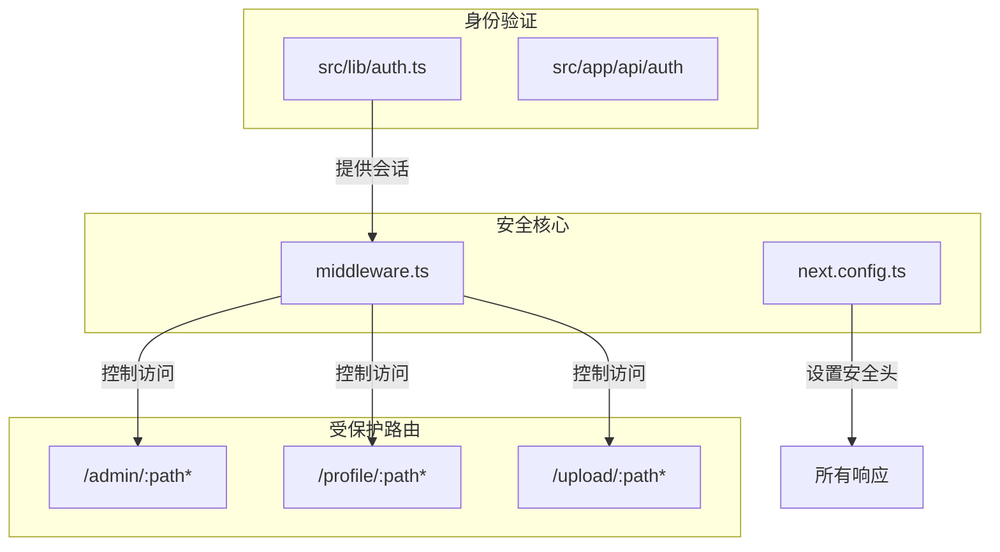
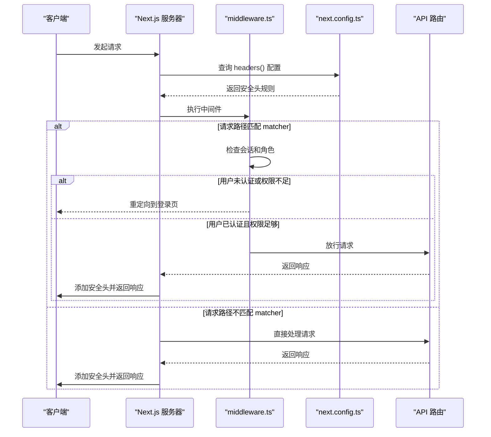
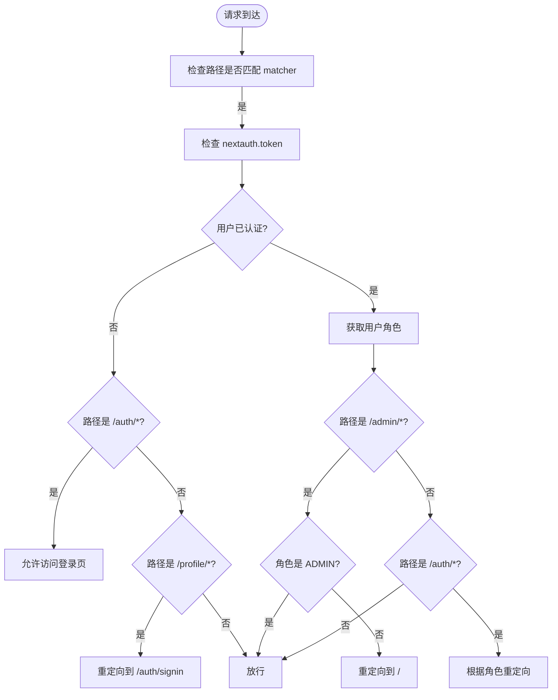
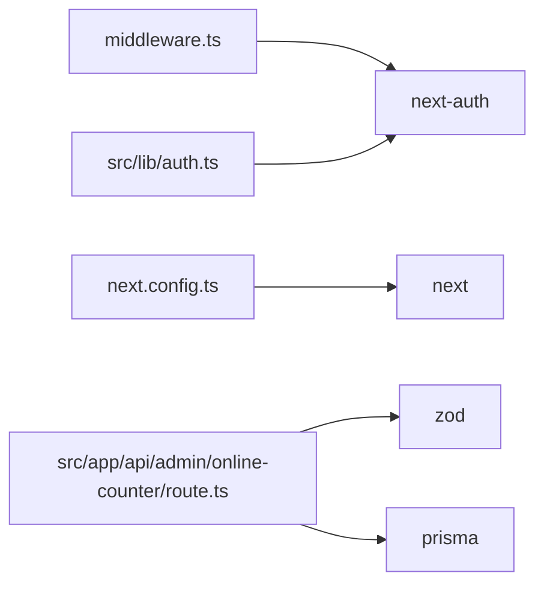

# 安全策略与路由控制

<cite>
**本文档引用的文件**
- [middleware.ts](file://middleware.ts)
- [next.config.ts](file://next.config.ts)
- [src/lib/auth.ts](file://src/lib/auth.ts)
- [src/app/api/admin/online-counter/route.ts](file://src/app/api/admin/online-counter/route.ts)
- [src/app/api/online-counter/route.ts](file://src/app/api/online-counter/route.ts)
- [src/测试脚本登陆方式.md](file://src/测试脚本登陆方式.md)
</cite>

## 目录
1. [简介](#简介)
2. [项目结构](#项目结构)
3. [核心组件](#核心组件)
4. [架构概述](#架构概述)
5. [详细组件分析](#详细组件分析)
6. [依赖分析](#依赖分析)
7. [性能考虑](#性能考虑)
8. [故障排除指南](#故障排除指南)
9. [结论](#结论)

## 简介
本文档深入解析数字化作品互动展示平台的安全策略与路由中间件机制。重点分析 `middleware.ts` 在生产环境中的执行逻辑，涵盖身份验证、访问控制、请求头安全加固、路径重写和区域化路由控制等关键安全功能。结合 `next.config.ts` 配置，阐明中间件在构建时与运行时的行为差异，并提供防止 CSRF、XSS 和速率限制的最佳实践建议，确保安全规则在反向代理与应用层之间协同工作。

## 项目结构
项目采用 Next.js App Router 架构，核心安全逻辑集中在根目录的 `middleware.ts` 和 `next.config.ts` 文件中。身份验证基于 `next-auth` 实现，权限控制通过角色（ADMIN、MARKETER）进行区分。API 路由位于 `src/app/api` 目录下，受中间件保护。

**Diagram sources**
- [middleware.ts](file://middleware.ts)
- [next.config.ts](file://next.config.ts)

**Section sources**
- [middleware.ts](file://middleware.ts)
- [next.config.ts](file://next.config.ts)

## 核心组件
`middleware.ts` 是整个应用的安全网关，利用 `next-auth/middleware` 的 `withAuth` 函数，对匹配 `matcher` 配置的路径进行统一的身份验证和访问控制。它根据用户的登录状态和角色（`token?.role`）决定是否重定向或放行请求。`next.config.ts` 则负责在构建时定义全局 HTTP 安全头，为所有响应注入安全策略。

**Section sources**
- [middleware.ts](file://middleware.ts#L1-L50)
- [next.config.ts](file://next.config.ts#L1-L102)

## 架构概述
系统的安全架构分为运行时中间件和构建时配置两层。运行时，`middleware.ts` 拦截请求，执行身份验证和细粒度的路由控制。构建时，`next.config.ts` 的 `headers()` 函数生成安全头规则，这些规则在应用启动时被 Next.js 服务器加载，对所有匹配路径的响应自动添加。

**Diagram sources**
- [middleware.ts](file://middleware.ts)
- [next.config.ts](file://next.config.ts)

## 详细组件分析

### 身份验证与访问控制分析
`middleware.ts` 的核心逻辑是基于 `req.nextauth.token` 中的用户信息进行决策。它实现了多角色的访问控制：
- **认证拦截**：对 `/auth` 路径，已登录用户会被根据角色重定向到 `/admin` 或 `/`。
- **管理员保护**：`/admin` 路径强制要求用户登录且角色为 `ADMIN`。
- **个人中心保护**：`/profile` 路径要求用户登录。
- **游客上传**：`/upload` 路径允许游客访问（代码中被注释，但逻辑存在）。

该中间件通过 `NextResponse.redirect` 和 `NextResponse.next` 精确控制请求流向。

**Diagram sources**
- [middleware.ts](file://middleware.ts#L1-L50)

**Section sources**
- [middleware.ts](file://middleware.ts#L1-L50)
- [src/lib/auth.ts](file://src/lib/auth.ts#L1-L72)

### 请求头安全加固分析
`next.config.ts` 中的 `headers()` 函数为不同资源类型设置了严格的安全头，构成了应用的纵深防御。
- **API 安全**：`/api/:path*` 设置了 `Access-Control-Allow-Origin` 以限制跨域，并通过 `X-Frame-Options: DENY` 防止点击劫持。
- **静态资源安全**：`/_next/static/:path*` 和 `/images/:path*` 设置了 `X-Content-Type-Options: nosniff` 防止MIME类型嗅探，`Strict-Transport-Security` 强制HTTPS。
- **通用页面安全**：对所有非API、非静态资源的页面，统一设置 `X-Frame-Options: DENY` 和缓存策略。

这些头信息在服务器响应时自动注入，无需在每个API中重复设置。

**Section sources**
- [next.config.ts](file://next.config.ts#L45-L102)

### CSRF 与 XSS 防护实践
虽然 `middleware.ts` 本身不直接处理 CSRF，但 `next-auth` 框架内置了 CSRF 保护。从 `src/测试脚本登陆方式.md` 可以看出，完整的登录流程需要先获取 CSRF token (`/api/auth/csrf`)，然后在登录请求中携带该 token。这有效防止了跨站请求伪造攻击。

对于 XSS，项目通过以下方式缓解：
1.  **CSP 策略**：`next.config.ts` 中 `images` 配置的 `contentSecurityPolicy` 虽然设置为 `script-src 'none'`，但这是一个潜在的配置错误，可能过于严格。正确的做法是在 `next.config.ts` 中为 HTML 页面设置更合理的 CSP。
2.  **输入验证**：API 路由（如 `online-counter`）使用 `zod` 进行严格的输入验证，防止恶意数据注入。
3.  **安全头**：`X-Content-Type-Options: nosniff` 和 `X-Frame-Options: DENY` 也间接帮助防御XSS。

**Section sources**
- [next.config.ts](file://next.config.ts#L45-L102)
- [src/测试脚本登陆方式.md](file://src/测试脚本登陆方式.md#L20-L71)
- [src/app/api/online-counter/route.ts](file://src/app/api/online-counter/route.ts#L0-L38)

## 依赖分析
项目安全功能依赖于多个关键包：
- **next-auth**: 提供核心的身份验证、会话管理和 CSRF 保护。
- **prisma**: 作为数据库 ORM，其查询方法（如 `findUnique`）需防范注入，但 Prisma 本身是安全的。
- **zod**: 在 API 层进行数据验证，是防止无效或恶意输入的第一道防线。

**Diagram sources**
- [middleware.ts](file://middleware.ts)
- [next.config.ts](file://next.config.ts)
- [src/lib/auth.ts](file://src/lib/auth.ts)
- [src/app/api/admin/online-counter/route.ts](file://src/app/api/admin/online-counter/route.ts)

**Section sources**
- [package.json](file://package.json)

## 性能考虑
安全措施对性能有轻微影响，但项目已进行优化：
- **中间件开销**：`middleware.ts` 的逻辑简单，主要进行路径匹配和会话检查，性能开销极低。
- **构建时头注入**：`next.config.ts` 的 `headers()` 在构建时解析，运行时只是简单的规则匹配，效率很高。
- **缓存策略**：`next.config.ts` 对静态资源和图片设置了长时间的 `Cache-Control`，减少了服务器负载和响应时间。

## 故障排除指南
1.  **中间件不生效**：检查 `middleware.ts` 的 `config.matcher` 是否正确匹配了需要保护的路径。
2.  **CSRF 错误**：确保客户端在登录前调用 `/api/auth/csrf` 获取 token，并在登录请求中正确传递。检查 `NEXTAUTH_SECRET` 环境变量是否设置且一致。
3.  **安全头未出现**：确认 `next.config.ts` 的 `headers()` 函数返回的规则 `source` 匹配了请求路径。检查是否有反向代理覆盖了这些头。
4.  **角色权限错误**：检查 `src/lib/auth.ts` 中 `jwt` 回调是否正确地将 `user.role` 写入了 token。确认数据库中的用户角色字段正确。

**Section sources**
- [middleware.ts](file://middleware.ts)
- [next.config.ts](file://next.config.ts)
- [src/lib/auth.ts](file://src/lib/auth.ts#L1-L72)
- [src/测试脚本登陆方式.md](file://src/测试脚本登陆方式.md)

## 结论
该项目通过 `middleware.ts` 和 `next.config.ts` 的协同工作，建立了一个分层的安全体系。`middleware.ts` 负责运行时的动态访问控制，而 `next.config.ts` 提供了构建时的静态安全加固。这种组合有效实现了身份验证、权限管理、请求头安全和基础的 CSRF/XSS 防护。建议进一步审查 CSP 配置，并考虑在 API 层增加速率限制中间件以增强安全性。