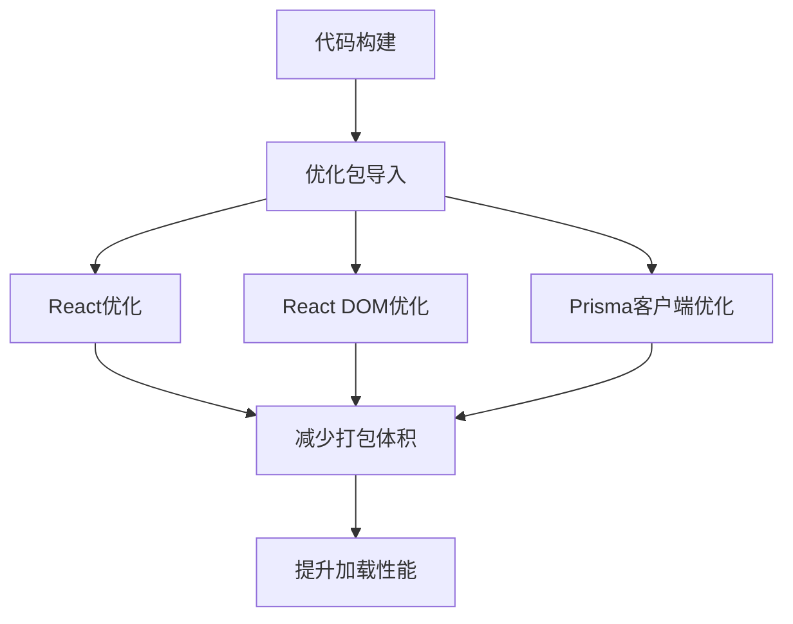
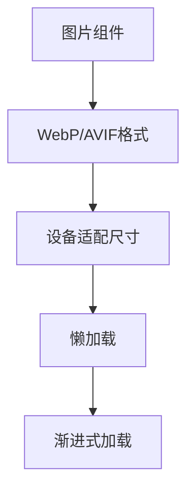
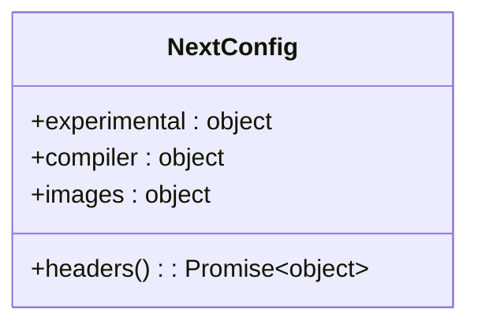
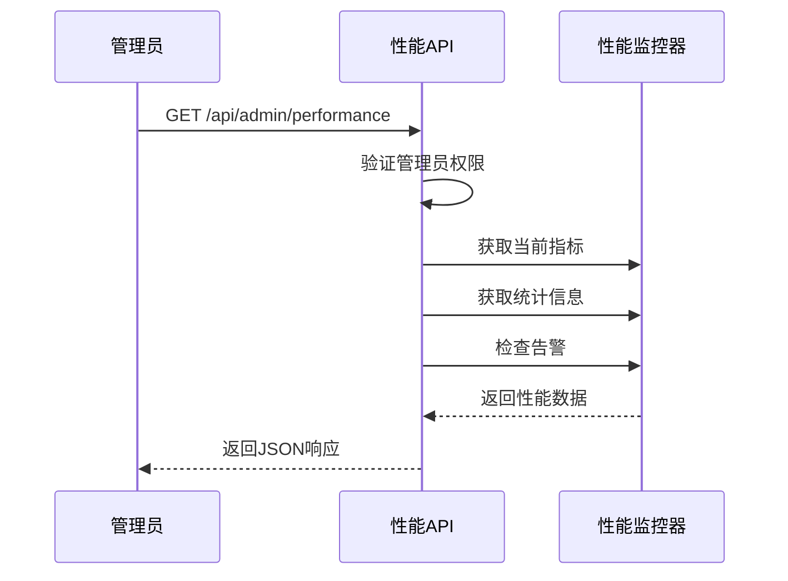

# 性能分析与调优

<cite>
**本文档引用文件**   
- [next.config.ts](file://next.config.ts)
- [performance-monitor.ts](file://src/lib/performance-monitor.ts)
- [route.ts](file://src/app/api/admin/performance/route.ts)
- [PERFORMANCE_OPTIMIZATION.md](file://docs/PERFORMANCE_OPTIMIZATION.md)
</cite>

## 目录
1. [性能分析工具](#性能分析工具)
2. [Next.js 构建分析器](#nextjs-构建分析器)
3. [Lighthouse 审计指标](#lighthouse-审计指标)
4. [性能优化建议](#性能优化建议)
5. [next.config.ts 配置优化](#nextconfigts-配置优化)
6. [生产环境监控](#生产环境监控)

## 性能分析工具

本项目提供了多种性能分析工具，帮助开发者评估和优化应用性能。核心工具包括内置的性能监控API和第三方测试脚本。

**Section sources**
- [route.ts](file://src/app/api/admin/performance/route.ts#L0-L123)
- [performance-monitor.ts](file://src/lib/performance-monitor.ts#L0-L220)

## Next.js 构建分析器

本项目未直接集成Next.js内置的构建分析器（Bundle Analyzer），但通过`next.config.ts`中的配置实现了类似的性能优化效果。通过配置`optimizePackageImports`选项，对React、React DOM和Prisma客户端等关键包进行优化导入，有效减少了打包体积。

**Diagram sources **
- [next.config.ts](file://next.config.ts#L4-L9)

## Lighthouse 审计指标

Lighthouse审计重点关注以下核心指标：

- **首屏加载时间 (First Contentful Paint)**: 优化目标为小于2秒
- **交互延迟 (Time to Interactive)**: 优化目标为小于3秒
- **资源加载效率**: 通过预连接关键域名和资源压缩提升效率

项目通过多种方式优化这些指标，包括启用WebP和AVIF图片格式、配置DNS预取以及实施缓存策略。

**Section sources**
- [next.config.ts](file://next.config.ts#L45-L78)

## 性能优化建议

### 启用资源压缩

项目已配置Gzip/Brotli压缩，通过服务器配置自动压缩传输资源，减少网络传输体积。

### 预连接关键域名

通过HTTP头配置启用DNS预取：

**Diagram sources **
- [next.config.ts](file://next.config.ts#L45-L50)

### 图片懒加载

使用Next.js Image组件实现懒加载和优化：

**Diagram sources **
- [next.config.ts](file://next.config.ts#L14-L25)

### 避免阻塞渲染的资源

通过以下方式避免阻塞渲染：
- 移除生产环境的console.log
- 优化CSS和字体加载
- 使用增量静态再生(ISR)

## next.config.ts 配置优化

### 实验性功能配置

**Diagram sources **
- [next.config.ts](file://next.config.ts#L0-L102)

### 性能和缓存优化

通过`headers`函数配置多层级缓存策略：

| 资源类型 | 缓存策略 |
| :--- | :--- |
| API接口 | 5分钟缓存，允许跨域 |
| 静态资源 | 1年缓存，不可变 |
| 图片资源 | 24小时缓存 |
| 其他页面 | 1小时缓存，支持重新验证 |

**Section sources**
- [next.config.ts](file://next.config.ts#L45-L78)

## 生产环境监控

### 性能监控API

提供管理员专用的性能监控API端点，可获取系统性能指标：

**Diagram sources **
- [route.ts](file://src/app/api/admin/performance/route.ts#L0-L123)
- [performance-monitor.ts](file://src/lib/performance-monitor.ts#L0-L220)

### 监控指标

监控系统收集以下关键指标：

- CPU使用率
- 内存使用率
- 响应时间
- 系统负载
- 进程运行时间

当CPU使用率超过90%或内存使用率超过90%时，系统会生成严重告警。

**Section sources**
- [performance-monitor.ts](file://src/lib/performance-monitor.ts#L145-L192)