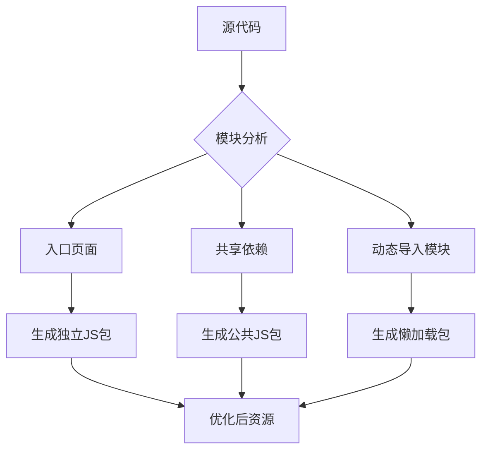
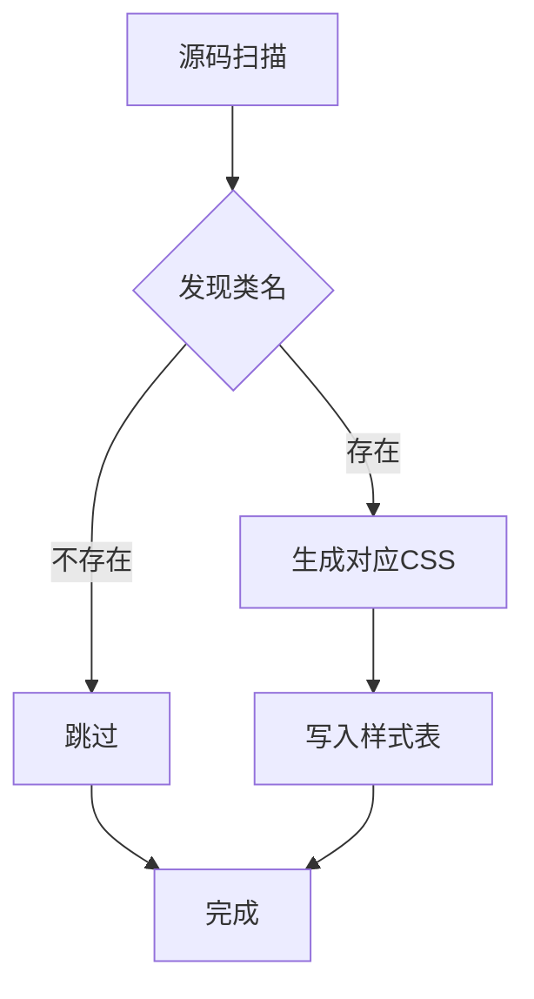
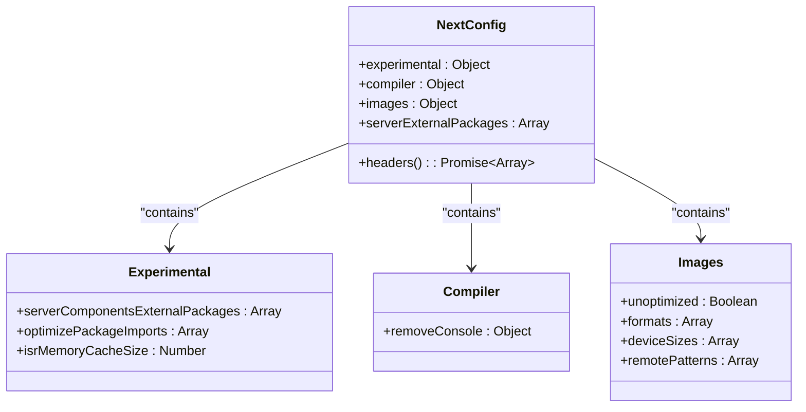
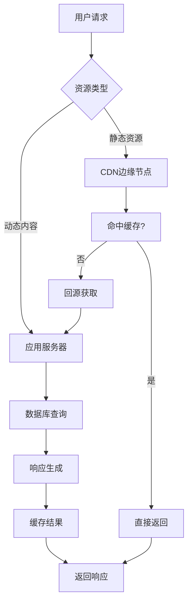

# 构建与优化

<cite>
**Referenced Files in This Document**   
- [next.config.ts](file://next.config.ts)
- [tailwind.config.js](file://tailwind.config.js)
- [src/lib/image-url.ts](file://src/lib/image-url.ts)
</cite>

## 目录
1. [构建流程概述](#构建流程概述)
2. [代码分割与 Tree Shaking](#代码分割与-tree-shaking)
3. [图像优化机制](#图像优化机制)
4. [Tailwind CSS JIT 编译](#tailwind-css-jit-编译)
5. [核心配置项解析](#核心配置项解析)
6. [静态生成与服务器渲染](#静态生成与服务器渲染)
7. [性能分析方法](#性能分析方法)
8. [加载性能优化](#加载性能优化)

## 构建流程概述

项目采用 `next build` 命令执行生产级构建，该过程通过 Next.js 内置的 Webpack 和 Babel 工具链实现资源优化。构建流程包含代码转换、依赖分析、资源压缩和静态文件生成等关键步骤。

在构建过程中，系统会自动识别应用中的页面组件并进行预编译，同时对第三方依赖进行优化处理。最终输出位于 `.next` 目录下的生产就绪资源，包括 HTML 文件、JavaScript 包、CSS 样式表和静态资产。

**Section sources**
- [next.config.ts](file://next.config.ts#L0-L102)

## 代码分割与 Tree Shaking

Next.js 自动实现代码分割（Code Splitting），将应用拆分为多个按需加载的 JavaScript 包。每个页面及其依赖被独立打包，确保用户仅下载当前访问页面所需的代码。

Tree Shaking 机制通过静态分析消除未使用的代码路径。结合 ES6 模块语法，构建工具能够准确识别导入/导出关系，移除死代码以减小包体积。此优化显著提升初始加载性能。



**Diagram sources**
- [next.config.ts](file://next.config.ts#L0-L102)

**Section sources**
- [next.config.ts](file://next.config.ts#L0-L102)

## 图像优化机制

图像优化通过 `src/lib/image-url.ts` 文件实现统一处理逻辑。该模块提供多种 URL 格式的智能解析和构造功能，支持本地路径、OSS 存储和 Cloudinary 等外部服务。

构建时，所有图像资源经过以下优化流程：
1. 格式转换为 WebP 或 AVIF
2. 多尺寸适配（基于 deviceSizes 配置）
3. CDN 友好型 URL 生成
4. 缓存策略注入

```mermaid
flowchart LR
A[原始图片URL] --> B{URL类型判断}
B --> |本地路径| C[/images/...]
B --> |OSS存储| D[https://bucket.endpoint/...]
B --> |Cloudinary| E[https://res.cloudinary.com/...]
B --> |其他外部| F[直接返回]
C --> G[相对路径处理]
D --> H[标准化HTTPS]
E --> H
F --> H
G --> I[优化后URL]
H --> I
```

**Diagram sources**
- [src/lib/image-url.ts](file://src/lib/image-url.ts#L0-L95)

**Section sources**
- [src/lib/image-url.ts](file://src/lib/image-url.ts#L0-L95)
- [next.config.ts](file://next.config.ts#L20-L35)

## Tailwind CSS JIT 编译

Tailwind CSS 采用即时编译（JIT）模式，在构建过程中动态生成所需样式规则。通过扫描源码中的类名使用情况，仅生成实际用到的 CSS，避免传统方式产生的庞大样式表。

配置中定义了自定义动画效果，如无限滚动字幕：
- 正向滚动：`animation: marquee 30s linear infinite`
- 反向滚动：`animation: marquee-reverse 30s linear infinite reverse`

这种按需生成的机制大幅减少了 CSS 文件体积，同时保持开发时的灵活性。



**Diagram sources**
- [tailwind.config.js](file://tailwind.config.js#L0-L25)

**Section sources**
- [tailwind.config.js](file://tailwind.config.js#L0-L25)

## 核心配置项解析

`next.config.ts` 文件包含多项关键构建配置：

### 输出目标与环境变量
- **环境变量前缀**：NEXT_PUBLIC_ 开头的变量会被暴露给浏览器端
- **外部包处理**：bcryptjs、ali-oss、sharp 等包被标记为 serverExternalPackages
- **实验性特性**：启用 serverComponentsExternalPackages 提升服务端组件兼容性

### 性能优化配置
- **包导入优化**：optimizePackageImports 加速常用库的加载
- **ISR 内存缓存**：设置 50MB 的增量静态再生缓存空间
- **控制台清理**：生产环境下自动移除 console.log 调用



**Diagram sources**
- [next.config.ts](file://next.config.ts#L0-L102)

**Section sources**
- [next.config.ts](file://next.config.ts#L0-L102)

## 静态生成与服务器渲染

项目混合使用静态生成（SSG）和服务器端渲染（SSR）策略：

### 静态生成 (SSG)
- 适用于内容不频繁变化的页面
- 在构建时预渲染为 HTML
- 支持增量静态再生（ISR）更新内容
- 配置 `isrMemoryCacheSize` 控制内存缓存大小

### 服务器端渲染 (SSR)
- 用于需要实时数据的页面
- 每次请求时动态生成 HTML
- API 路由 `/api/*` 默认采用 SSR
- 结合身份验证状态个性化内容

缓存策略根据不同资源类型精细化配置：
- 静态资源：一年不可变缓存
- 图片资源：24小时至30天可变缓存
- 页面内容：1小时基础缓存+86400秒再验证窗口

**Section sources**
- [next.config.ts](file://next.config.ts#L0-L102)
- [src/app/api/online-counter/route.ts](file://src/app/api/online-counter/route.ts#L0-L38)

## 性能分析方法

虽然项目未集成 Webpack Bundle Analyzer，但可通过以下方式实施性能分析：

1. **构建报告分析**：监控 `next build` 输出的包大小统计
2. **Lighthouse 审计**：使用 Chrome DevTools 进行全面性能评估
3. **自定义指标跟踪**：通过 Performance API 记录关键渲染时间点
4. **网络面板分析**：检查资源加载顺序和传输大小

建议手动集成可视化分析工具来深入洞察包组成，识别潜在的优化机会。

**Section sources**
- [next.config.ts](file://next.config.ts#L0-L102)

## 加载性能优化

### 字体预加载
通过 `_document.tsx` 或 `<link rel="preload">` 实现关键字体资源预加载，减少文本渲染阻塞时间。

### 资源懒加载
- 图像组件使用原生 `loading="lazy"` 属性
- 非首屏模块采用动态导入 `import()` 语法
- 无限滚动组件按需加载后续内容

### CDN 集成方案
通过多层缓存策略实现高效的内容分发：
1. **边缘缓存**：CDN 节点缓存静态资源
2. **浏览器缓存**：设置合理的 Cache-Control 策略
3. **内存缓存**：服务端维护高频数据的内存副本

部署配置中包含完整的 CI/CD 流程，支持自动化构建、测试和发布到生产环境。



**Diagram sources**
- [next.config.ts](file://next.config.ts#L45-L102)
- [ecosystem.config.js](file://ecosystem.config.js#L43-L94)

**Section sources**
- [next.config.ts](file://next.config.ts#L45-L102)
- [ecosystem.config.js](file://ecosystem.config.js#L43-L94)