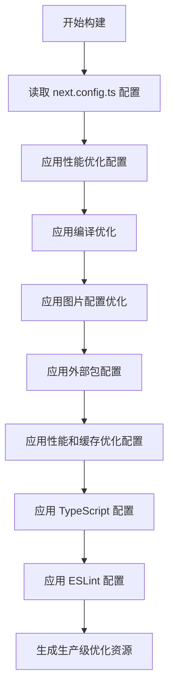
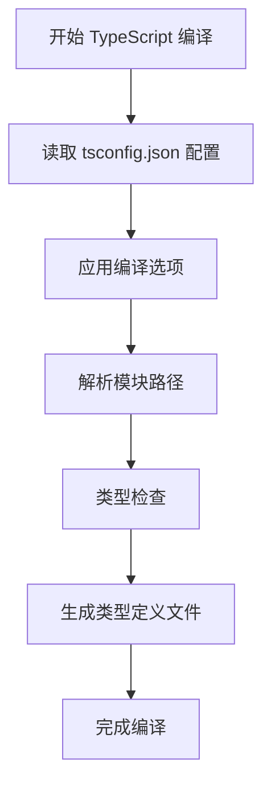
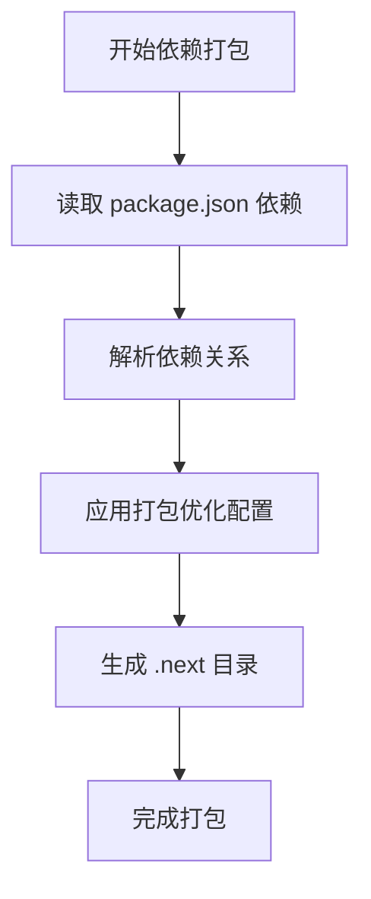
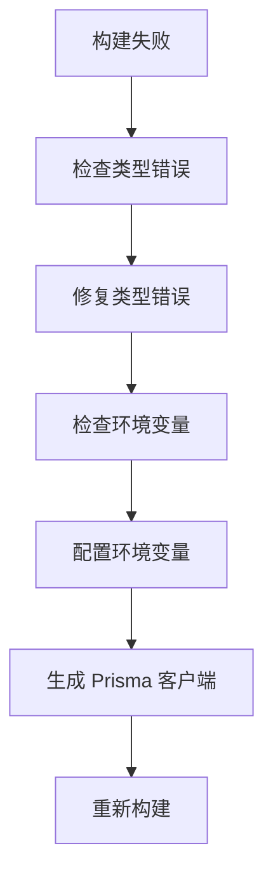
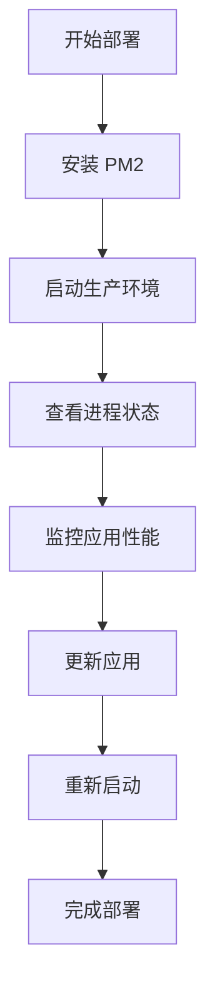

# 构建流程

<cite>
**本文档引用的文件**   
- [next.config.ts](file://next.config.ts)
- [package.json](file://package.json)
- [ecosystem.config.js](file://ecosystem.config.js)
- [tsconfig.json](file://tsconfig.json)
- [src\数字化作品互动展示平台 - 开发文档.md](file://src/数字化作品互动展示平台 - 开发文档.md)
</cite>

## 目录
1. [项目构建概述](#项目构建概述)
2. [核心构建配置](#核心构建配置)
3. [TypeScript 编译与模块解析](#typescript-编译与模块解析)
4. [依赖打包与优化](#依赖打包与优化)
5. [构建失败常见问题与解决方案](#构建失败常见问题与解决方案)
6. [部署衔接与 PM2 集成](#部署衔接与-pm2-集成)

## 项目构建概述

本项目采用 Next.js 框架进行构建，通过 `next build` 命令生成生产级优化资源。构建流程涵盖了从 TypeScript 编译、模块解析到依赖打包的完整生命周期。项目配置了静态生成（SSG）和服务器端渲染（SSR）策略，以优化页面加载性能和 SEO 效果。构建过程依赖于 `next.config.ts` 中的关键配置项，如输出目标、环境变量前缀、图片优化等。此外，项目集成了自定义 Webpack 和 Babel 配置，以支持特定的构建需求。构建脚本在 `package.json` 中定义，通过 `npm run build` 命令触发，确保生成的资源符合生产环境的要求。

**Section sources**
- [package.json](file://package.json#L1-L62)
- [src\数字化作品互动展示平台 - 开发文档.md](file://src/数字化作品互动展示平台 - 开发文档.md#L1-L1602)

## 核心构建配置

### next.config.ts 配置详解

`next.config.ts` 文件是项目构建的核心配置文件，定义了多项优化策略和构建行为。以下是关键配置项的详细说明：

- **性能优化配置**：通过 `experimental` 字段启用并发特性，优化打包过程。`serverComponentsExternalPackages` 配置项指定将 `bcryptjs`、`ali-oss` 和 `sharp` 等外部包排除在服务器组件之外，减少打包体积。`optimizePackageImports` 优化 `react`、`react-dom` 和 `@prisma/client` 的导入，提升加载速度。`isrMemoryCacheSize` 设置增量静态再生（ISR）的内存缓存大小为 50MB，提高缓存效率。

- **编译优化**：`compiler` 字段中的 `removeConsole` 配置在生产环境中移除 `console.log` 语句，但保留 `error` 和 `warn` 级别的日志，确保生产环境的代码简洁且不影响调试。

- **图片配置优化**：`images` 字段配置图片优化策略，包括禁用未优化图片、支持 WebP 和 AVIF 格式、定义设备尺寸和图片尺寸。`minimumCacheTTL` 设置图片缓存时间为 24 小时，`dangerouslyAllowSVG` 允许 SVG 图片上传，`contentSecurityPolicy` 定义内容安全策略，`remotePatterns` 允许所有远程图片源。

- **外部包配置**：`serverExternalPackages` 配置项指定 `bcryptjs`、`ali-oss` 和 `sharp` 为外部包，避免在服务器端打包这些依赖，减少构建时间和资源占用。

- **性能和缓存优化配置**：`headers` 函数返回一系列 HTTP 头信息，优化 API、静态资源和图片的缓存策略。例如，API 请求设置 `Access-Control-Allow-Origin` 和 `Access-Control-Allow-Methods`，静态资源设置 `Cache-Control` 为 `public, max-age=31536000, immutable`，图片设置 `Cache-Control` 为 `public, max-age=86400, s-maxage=86400`。

- **TypeScript 配置**：`typescript` 字段中的 `ignoreBuildErrors` 设置为 `false`，确保构建过程中 TypeScript 类型错误会被捕获并阻止构建成功。

- **ESLint 配置**：`eslint` 字段中的 `ignoreDuringBuilds` 设置为 `false`，确保构建过程中 ESLint 错误会被捕获并阻止构建成功。

**Diagram sources **
- [next.config.ts](file://next.config.ts#L2-L100)

**Section sources**
- [next.config.ts](file://next.config.ts#L2-L100)

## TypeScript 编译与模块解析

### TypeScript 编译配置

`tsconfig.json` 文件定义了 TypeScript 的编译选项，确保代码在构建过程中正确编译。以下是关键配置项的详细说明：

- **lib**：指定编译时包含的库文件，包括 `dom`、`dom.iterable` 和 `es6`，确保代码在浏览器环境中正常运行。
- **allowJs**：允许在项目中使用 JavaScript 文件，便于逐步迁移现有代码。
- **skipLibCheck**：跳过对库文件的类型检查，加快编译速度。
- **strict**：启用严格的类型检查，确保代码质量。
- **noEmit**：不生成输出文件，仅用于类型检查。
- **esModuleInterop**：启用 ES 模块互操作性，支持 `import` 和 `require` 的混合使用。
- **module**：指定模块系统为 `esnext`，支持最新的 ES 模块特性。
- **moduleResolution**：指定模块解析策略为 `bundler`，支持现代打包工具。
- **resolveJsonModule**：允许导入 JSON 文件。
- **isolatedModules**：确保每个文件可以独立编译，避免跨文件的类型检查。
- **jsx**：指定 JSX 转换为 `preserve`，保留 JSX 语法。
- **incremental**：启用增量编译，加快后续构建速度。
- **plugins**：指定使用 `next` 插件，支持 Next.js 特有的功能。
- **baseUrl**：指定基础路径为 `.`，支持路径别名。
- **paths**：定义路径别名 `@/*` 映射到 `./src/*`，简化模块导入。
- **target**：指定编译目标为 `ES2017`，确保代码在现代浏览器中运行。

### 模块解析

项目使用 `tsconfig.json` 中的 `paths` 配置项定义路径别名，简化模块导入。例如，`@/components/WorkCard` 可以直接导入 `src/components/WorkCard.tsx` 文件，无需使用相对路径。这种配置提高了代码的可读性和可维护性。

**Diagram sources **
- [tsconfig.json](file://tsconfig.json#L1-L42)

**Section sources**
- [tsconfig.json](file://tsconfig.json#L1-L42)

## 依赖打包与优化

### 依赖管理

项目依赖在 `package.json` 文件中定义，分为 `dependencies` 和 `devDependencies`。`dependencies` 包含生产环境必需的依赖，如 `next`、`react`、`react-dom`、`@prisma/client` 等。`devDependencies` 包含开发环境必需的依赖，如 `typescript`、`eslint`、`tailwindcss` 等。`package-lock.json` 文件记录了依赖的精确版本，确保构建的一致性。

### 打包优化

Next.js 自动优化依赖打包过程，通过 `next.config.ts` 中的 `optimizePackageImports` 配置项优化 `react`、`react-dom` 和 `@prisma/client` 的导入。此外，`serverExternalPackages` 配置项将 `bcryptjs`、`ali-oss` 和 `sharp` 等外部包排除在服务器组件之外，减少打包体积。构建过程中，Next.js 会生成 `.next` 目录，包含优化后的静态资源和服务器代码。

**Diagram sources **
- [package.json](file://package.json#L1-L62)
- [next.config.ts](file://next.config.ts#L2-L100)

**Section sources**
- [package.json](file://package.json#L1-L62)
- [next.config.ts](file://next.config.ts#L2-L100)

## 构建失败常见问题与解决方案

### 类型检查错误

**问题描述**：TypeScript 类型检查失败，导致构建中断。

**解决方案**：
1. 检查 `tsconfig.json` 中的 `strict` 配置项，确保启用严格的类型检查。
2. 使用 `tsc --noEmit` 命令进行类型检查，定位具体错误。
3. 修复类型错误后重新构建。

### 环境变量缺失

**问题描述**：构建过程中缺少必要的环境变量，导致配置失败。

**解决方案**：
1. 检查 `.env` 或 `.env.local` 文件，确保所有必要的环境变量已配置。
2. 使用 `dotenv` 模块加载环境变量，确保构建脚本能够访问。
3. 在 `next.config.ts` 中验证环境变量，如 `process.env.NODE_ENV` 和 `process.env.DATABASE_URL`。

### Prisma 客户端未生成

**问题描述**：Prisma 客户端未生成，导致数据库操作失败。

**解决方案**：
1. 运行 `npx prisma generate` 命令生成 Prisma 客户端。
2. 检查 `prisma/schema.prisma` 文件，确保模型定义正确。
3. 确保 `@prisma/client` 依赖已安装。

**Diagram sources **
- [tsconfig.json](file://tsconfig.json#L1-L42)
- [next.config.ts](file://next.config.ts#L2-L100)
- [package.json](file://package.json#L1-L62)

**Section sources**
- [tsconfig.json](file://tsconfig.json#L1-L42)
- [next.config.ts](file://next.config.ts#L2-L100)
- [package.json](file://package.json#L1-L62)

## 部署衔接与 PM2 集成

### PM2 配置

`ecosystem.config.js` 文件定义了 PM2 的部署配置，确保应用在生产环境中稳定运行。以下是关键配置项的详细说明：

- **应用配置**：`apps` 数组定义了多个应用实例，包括生产环境和开发环境。生产环境实例 `yunqi-platform` 使用 `npm start` 命令启动，配置了 4 个实例、集群模式、自动重启、内存限制等。开发环境实例 `yunqi-platform-dev` 使用 `npm run dev` 命令启动，配置了单个实例、自动重启、文件监听等。

- **环境变量**：`env` 和 `env_production` 字段定义了生产环境的环境变量，如 `NODE_ENV`、`PORT`、`UV_THREADPOOL_SIZE` 和 `NODE_OPTIONS`。`env_development` 字段定义了开发环境的环境变量。

- **日志配置**：`log_file`、`out_file` 和 `error_file` 字段定义了日志文件路径，`log_date_format` 定义了日志日期格式，`merge_logs` 合并日志，`log_type` 定义了日志类型为 JSON。

- **性能监控**：`pmx` 和 `monitoring` 字段启用 PM2 的性能监控功能，实时监控应用性能。

- **部署配置**：`deploy` 字段定义了部署脚本，`post-deploy` 脚本在部署后执行 `npm install`、`npm run build` 和 `pm2 reload ecosystem.config.js --env production`，确保应用更新后自动重启。

### 部署流程

1. 安装 PM2：`npm install -g pm2`
2. 启动生产环境：`pm2 start ecosystem.config.js --env production`
3. 启动开发环境：`pm2 start ecosystem.config.js --only yunqi-platform-dev`
4. 查看进程状态：`pm2 status`
5. 重启应用：`pm2 restart yunqi-platform`
6. 停止应用：`pm2 stop yunqi-platform`
7. 删除应用：`pm2 delete yunqi-platform`
8. 保存 PM2 配置：`pm2 save` 和 `pm2 startup`

**Diagram sources **
- [ecosystem.config.js](file://ecosystem.config.js#L1-L128)

**Section sources**
- [ecosystem.config.js](file://ecosystem.config.js#L1-L128)