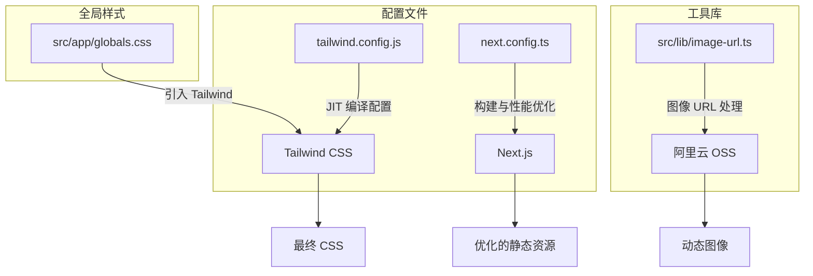
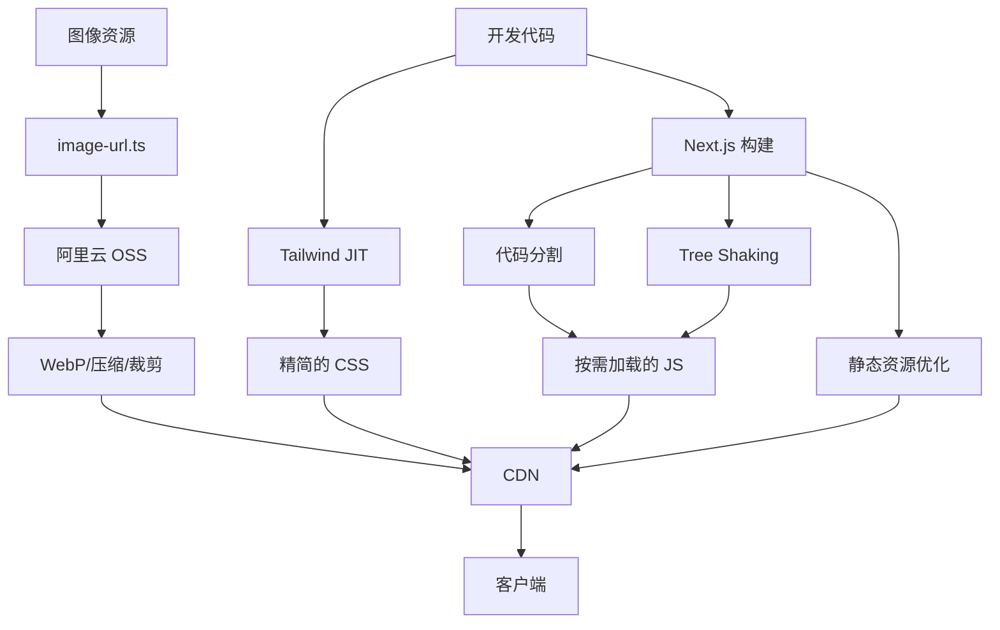
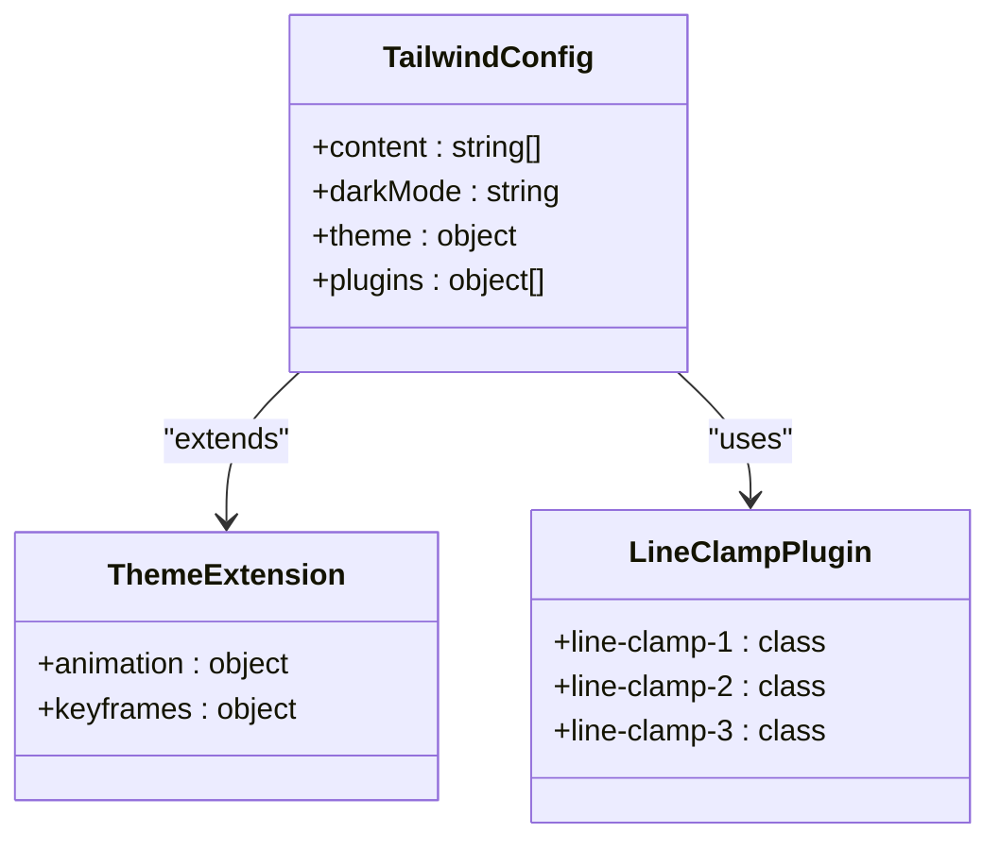
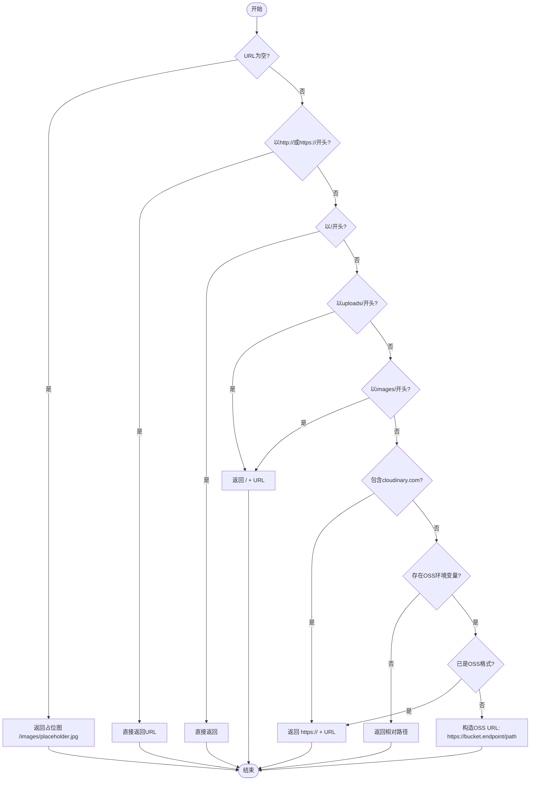
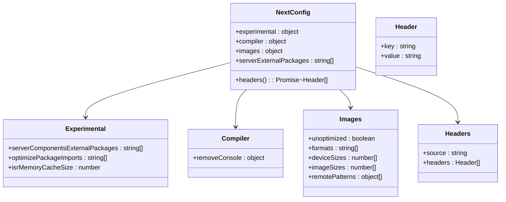

# 资源优化

<cite>
**本文档中引用的文件**  
- [tailwind.config.js](file://tailwind.config.js)
- [src/lib/image-url.ts](file://src/lib/image-url.ts)
- [next.config.ts](file://next.config.ts)
- [src/app/globals.css](file://src/app/globals.css)
</cite>

## 目录
1. [简介](#简介)
2. [项目结构](#项目结构)
3. [核心组件](#核心组件)
4. [架构概述](#架构概述)
5. [详细组件分析](#详细组件分析)
6. [依赖分析](#依赖分析)
7. [性能考虑](#性能考虑)
8. [故障排除指南](#故障排除指南)
9. [结论](#结论)
10. [附录](#附录)（如有必要）

## 简介
本文档详细阐述了“数字化作品互动展示平台”中的前端资源优化策略。重点涵盖 Tailwind CSS 的 JIT 编译机制、阿里云 OSS 图像处理、Next.js 的代码分割与 Tree Shaking、以及字体预加载、资源懒加载和 CDN 集成等最佳实践，旨在提升应用的加载速度和运行性能。

## 项目结构
项目采用标准的 Next.js 13+ App Router 结构，前端资源优化相关的核心配置和工具集中于 `tailwind.config.js`、`next.config.ts` 和 `src/lib/image-url.ts` 文件中。样式通过 `src/app/globals.css` 全局引入。



**Diagram sources**
- [tailwind.config.js](file://tailwind.config.js)
- [next.config.ts](file://next.config.ts)
- [src/lib/image-url.ts](file://src/lib/image-url.ts)
- [src/app/globals.css](file://src/app/globals.css)

**Section sources**
- [tailwind.config.js](file://tailwind.config.js)
- [next.config.ts](file://next.config.ts)
- [src/lib/image-url.ts](file://src/lib/image-url.ts)

## 核心组件
本节深入分析实现前端资源优化的核心组件，包括 Tailwind CSS 配置、图像处理工具和 Next.js 构建配置。

**Section sources**
- [tailwind.config.js](file://tailwind.config.js#L1-L25)
- [src/lib/image-url.ts](file://src/lib/image-url.ts#L1-L95)
- [next.config.ts](file://next.config.ts#L1-L102)

## 架构概述
系统通过多层次的优化策略协同工作：Tailwind CSS 的 JIT 模式按需生成样式，`image-url.ts` 工具函数动态处理图像，Next.js 的构建系统自动进行代码分割和 Tree Shaking，最终通过 CDN 分发优化后的静态资源。



**Diagram sources**
- [tailwind.config.js](file://tailwind.config.js)
- [next.config.ts](file://next.config.ts)
- [src/lib/image-url.ts](file://src/lib/image-url.ts)

## 详细组件分析
本节对每个关键优化组件进行深入分析。

### Tailwind CSS JIT 编译与配置
Tailwind CSS 采用即时（JIT）编译模式，极大减少了最终 CSS 文件的体积。它只生成在 `content` 字段指定的文件路径中实际使用的类。



**Diagram sources**
- [tailwind.config.js](file://tailwind.config.js#L1-L25)
- [src/app/globals.css](file://src/app/globals.css#L1-L583)

**Section sources**
- [tailwind.config.js](file://tailwind.config.js#L1-L25)
- [src/app/globals.css](file://src/app/globals.css#L1-L583)

### 图像优化方案
`src/lib/image-url.ts` 文件提供了一套完整的图像 URL 处理逻辑，特别针对阿里云 OSS 进行了优化。

#### 图像 URL 处理流程


**Diagram sources**
- [src/lib/image-url.ts](file://src/lib/image-url.ts#L2-L49)

**Section sources**
- [src/lib/image-url.ts](file://src/lib/image-url.ts#L1-L95)

### 代码分割与 Tree Shaking
Next.js 在构建时自动实现代码分割和 Tree Shaking，`next.config.ts` 中的配置进一步优化了这一过程。

#### Next.js 构建优化配置


**Diagram sources**
- [next.config.ts](file://next.config.ts#L2-L100)

**Section sources**
- [next.config.ts](file://next.config.ts#L1-L102)

## 依赖分析
前端资源优化功能依赖于多个核心包和配置文件的协同工作。

```mermaid
graph TD
A[tailwind.config.js] --> B[Tailwind CSS]
B --> C[@tailwindcss/line-clamp]
D[next.config.ts] --> E[Next.js]
E --> F[sharp]
E --> G[ali-oss]
H[src/lib/image-url.ts] --> I[Node.js 环境变量]
I --> J[NEXT_PUBLIC_ALI_OSS_ENDPOINT]
I --> K[NEXT_PUBLIC_ALI_OSS_BUCKET]
J --> H
K --> H
F --> E
G --> E
```

**Diagram sources**
- [tailwind.config.js](file://tailwind.config.js)
- [next.config.ts](file://next.config.ts)
- [src/lib/image-url.ts](file://src/lib/image-url.ts)

**Section sources**
- [tailwind.config.js](file://tailwind.config.js)
- [next.config.ts](file://next.config.ts)
- [src/lib/image-url.ts](file://src/lib/image-url.ts)

## 性能考虑
通过上述优化策略，应用在多个方面实现了性能提升：
- **CSS 体积**：Tailwind JIT 确保仅生成使用的类，避免了传统工具中庞大的未使用 CSS。
- **图像加载**：动态生成 WebP 格式和压缩图像，显著减少带宽消耗和加载时间。
- **页面加载**：代码分割确保用户只下载当前页面所需的 JavaScript。
- **缓存策略**：`next.config.ts` 中配置了合理的 `Cache-Control` 头，最大化利用浏览器和 CDN 缓存。

## 故障排除指南
当遇到资源优化相关问题时，请检查以下几点：
- **Tailwind 类不生效**：确认 `tailwind.config.js` 中的 `content` 路径是否正确覆盖了所有使用类的文件。
- **图像无法加载**：检查 `NEXT_PUBLIC_ALI_OSS_ENDPOINT` 和 `NEXT_PUBLIC_ALI_OSS_BUCKET` 环境变量是否正确设置。
- **构建体积过大**：检查 `next.config.ts` 中的 `optimizePackageImports` 是否包含了常用库。

**Section sources**
- [tailwind.config.js](file://tailwind.config.js#L1-L25)
- [src/lib/image-url.ts](file://src/lib/image-url.ts#L1-L95)
- [next.config.ts](file://next.config.ts#L1-L102)

## 结论
本文档全面介绍了“数字化作品互动展示平台”的前端资源优化策略。通过 Tailwind CSS JIT、自定义图像处理、Next.js 自动优化和最佳实践的结合，系统实现了高效的资源管理和卓越的用户体验。这些策略为应用的高性能和可扩展性奠定了坚实基础。

## 附录
无