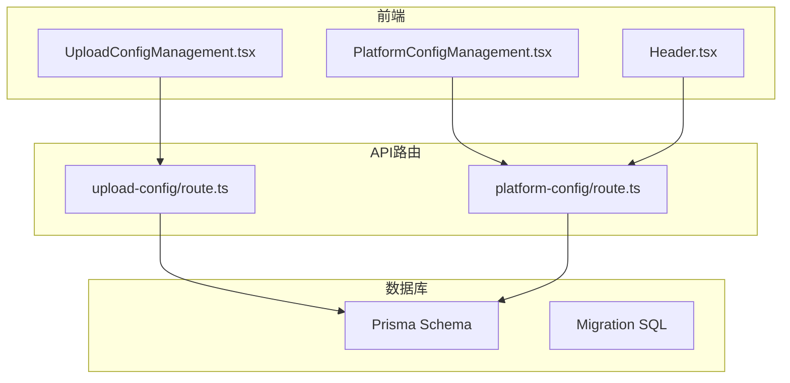
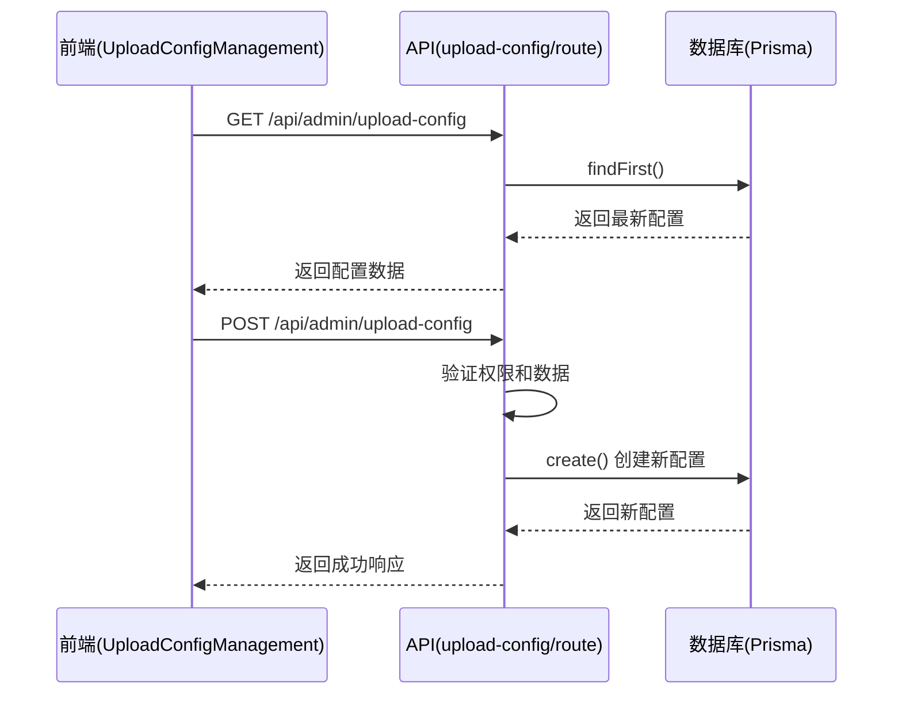
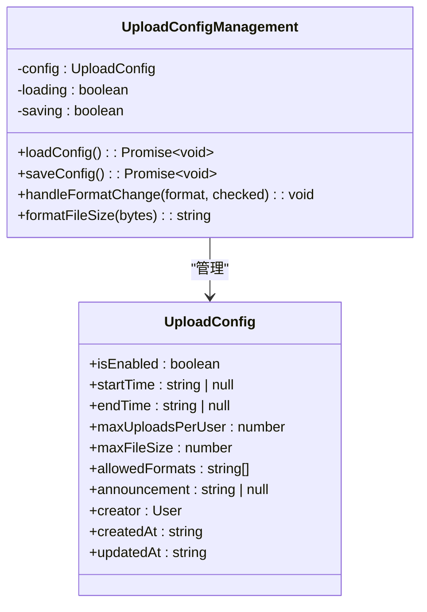
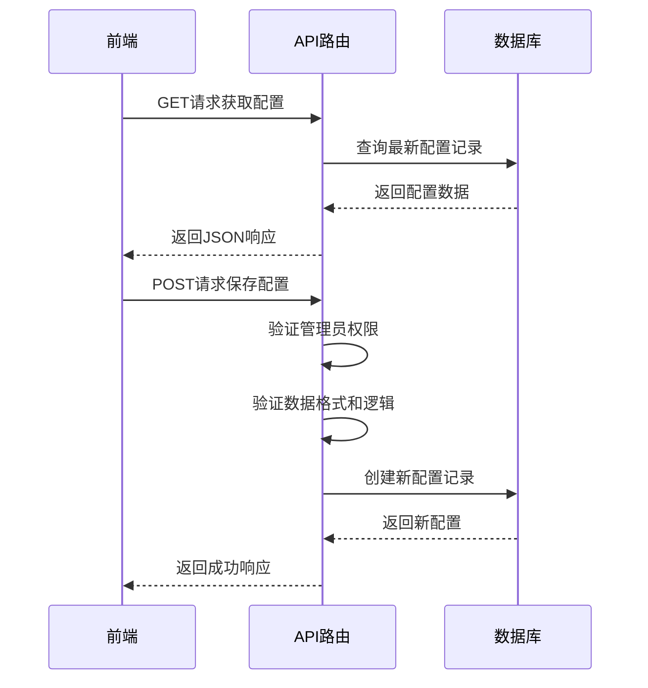
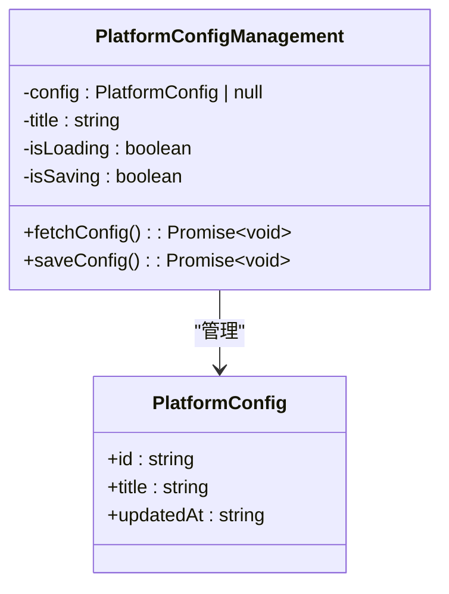
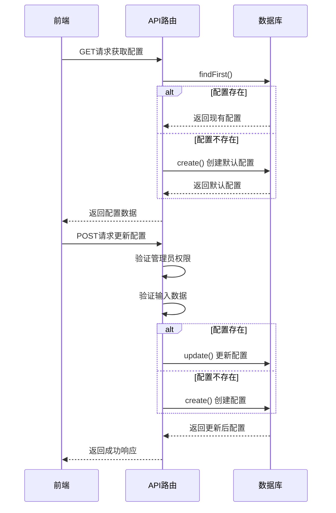
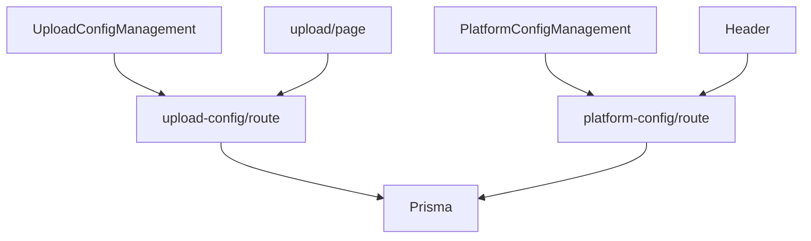

# 运行时配置

<cite>
**本文档引用的文件**   
- [UploadConfigManagement.tsx](file://src/components/admin/UploadConfigManagement.tsx)
- [upload-config/route.ts](file://src/app/api/admin/upload-config/route.ts)
- [platform-config/route.ts](file://src/app/api/platform-config/route.ts)
- [PlatformConfigManagement.tsx](file://src/components/admin/PlatformConfigManagement.tsx)
- [page.tsx](file://src/app/upload/page.tsx)
- [route.ts](file://src/app/api/upload/route.ts)
- [Header.tsx](file://src/components/Header.tsx)
- [migration.sql](file://prisma/migrations/20250905150839_add_platform_config/migration.sql)
</cite>

## 目录
1. [简介](#简介)
2. [项目结构](#项目结构)
3. [核心组件](#核心组件)
4. [架构概述](#架构概述)
5. [详细组件分析](#详细组件分析)
6. [依赖分析](#依赖分析)
7. [性能考虑](#性能考虑)
8. [故障排除指南](#故障排除指南)
9. [结论](#结论)

## 简介
本系统实现了运行时动态配置功能，允许管理员通过管理后台对上传限制和平台信息进行可视化配置。配置数据通过API持久化存储在数据库中，并在运行时被应用逻辑实时读取使用。系统支持配置的增删改查操作，且新配置可立即生效，无需重启服务。

## 项目结构
系统采用Next.js App Router架构，配置管理功能分布在前端组件、API路由和数据库迁移文件中。前端管理界面位于`src/components/admin/`目录下，API路由位于`src/app/api/`目录下，数据库模型通过Prisma进行管理。

**图示来源**
- [UploadConfigManagement.tsx](file://src/components/admin/UploadConfigManagement.tsx)
- [upload-config/route.ts](file://src/app/api/admin/upload-config/route.ts)
- [platform-config/route.ts](file://src/app/api/platform-config/route.ts)
- [Header.tsx](file://src/components/Header.tsx)

**本节来源**
- [src/components/admin/UploadConfigManagement.tsx](file://src/components/admin/UploadConfigManagement.tsx)
- [src/app/api/admin/upload-config/route.ts](file://src/app/api/admin/upload-config/route.ts)
- [prisma/migrations/](file://prisma/migrations/)

## 核心组件
系统的核心配置组件包括上传配置管理组件和平台配置管理组件，分别处理上传限制和平台基本信息的配置。这些组件通过API与后端交互，实现配置的持久化存储和实时读取。

**本节来源**
- [UploadConfigManagement.tsx](file://src/components/admin/UploadConfigManagement.tsx)
- [PlatformConfigManagement.tsx](file://src/components/admin/PlatformConfigManagement.tsx)

## 架构概述
系统采用前后端分离架构，配置管理功能通过RESTful API进行通信。前端组件负责用户界面展示和交互，API路由处理业务逻辑和数据验证，Prisma ORM负责数据库操作。配置数据存储在数据库中，运行时按需读取。

**图示来源**
- [UploadConfigManagement.tsx](file://src/components/admin/UploadConfigManagement.tsx)
- [upload-config/route.ts](file://src/app/api/admin/upload-config/route.ts)

## 详细组件分析

### 上传配置管理分析
上传配置管理组件提供了对上传功能的全面控制，包括功能开关、时间窗口、数量限制、文件大小和格式等配置项。

#### 上传配置管理组件

**图示来源**
- [UploadConfigManagement.tsx](file://src/components/admin/UploadConfigManagement.tsx#L10-L30)

#### 上传配置API流程

**图示来源**
- [upload-config/route.ts](file://src/app/api/admin/upload-config/route.ts#L40-L150)

**本节来源**
- [UploadConfigManagement.tsx](file://src/components/admin/UploadConfigManagement.tsx)
- [upload-config/route.ts](file://src/app/api/admin/upload-config/route.ts)

### 平台配置管理分析
平台配置管理组件负责管理平台的基本信息，如平台标题等，这些信息会在前端界面中动态显示。

#### 平台配置管理组件

**图示来源**
- [PlatformConfigManagement.tsx](file://src/components/admin/PlatformConfigManagement.tsx#L10-L15)

#### 平台配置API流程

**图示来源**
- [platform-config/route.ts](file://src/app/api/platform-config/route.ts#L44-L113)

**本节来源**
- [PlatformConfigManagement.tsx](file://src/components/admin/PlatformConfigManagement.tsx)
- [platform-config/route.ts](file://src/app/api/platform-config/route.ts)

## 依赖分析
系统各组件之间存在明确的依赖关系，前端组件依赖API路由，API路由依赖数据库模型。配置数据的读取和写入都通过Prisma ORM进行，确保了数据操作的一致性和安全性。

**图示来源**
- [UploadConfigManagement.tsx](file://src/components/admin/UploadConfigManagement.tsx)
- [upload-config/route.ts](file://src/app/api/admin/upload-config/route.ts)
- [platform-config/route.ts](file://src/app/api/platform-config/route.ts)
- [page.tsx](file://src/app/upload/page.tsx)
- [Header.tsx](file://src/components/Header.tsx)

**本节来源**
- [go.mod](file://package.json)
- [package.json](file://package.json)

## 性能考虑
系统在配置管理方面采用了简单的读取最新记录策略，没有实现缓存机制。每次需要配置数据时都会查询数据库，这在配置更新不频繁的场景下是可接受的。对于高并发场景，可以考虑引入Redis等缓存机制来提升性能。

## 故障排除指南
当配置功能出现问题时，可以按照以下步骤进行排查：
1. 检查管理员权限是否正确
2. 验证API路由是否正常工作
3. 检查数据库连接和表结构
4. 查看服务器日志中的错误信息
5. 确认前端组件与API的通信是否正常

**本节来源**
- [upload-config/route.ts](file://src/app/api/admin/upload-config/route.ts)
- [platform-config/route.ts](file://src/app/api/platform-config/route.ts)

## 结论
本系统实现了完整的运行时配置管理功能，通过前后端协作，实现了配置的可视化管理、持久化存储和实时生效。系统设计合理，代码结构清晰，易于维护和扩展。未来可以考虑增加配置缓存机制，进一步提升系统性能。