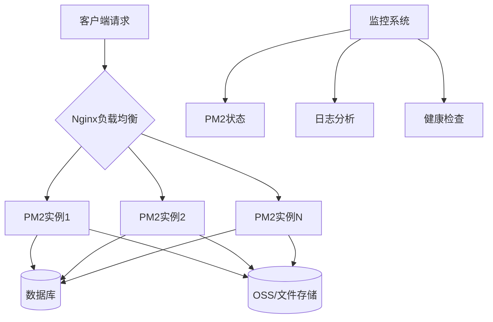

# 部署配置

<cite>
**本文档引用的文件**   
- [ecosystem.config.js](file://ecosystem.config.js)
- [next.config.ts](file://next.config.ts)
- [tailwind.config.js](file://tailwind.config.js)
- [middleware.ts](file://middleware.ts)
- [README.md](file://README.md)
</cite>

## 目录
1. [PM2进程管理配置](#pm2进程管理配置)  
2. [Next.js构建与优化配置](#nextjs构建与优化配置)  
3. [Tailwind CSS样式生成配置](#tailwind-css样式生成配置)  
4. [中间件路由拦截设置](#中间件路由拦截设置)  
5. [多环境部署场景适配](#多环境部署场景适配)  
6. [性能调优与监控集成](#性能调优与监控集成)  
7. [部署检查清单](#部署检查清单)

## PM2进程管理配置

`ecosystem.config.js` 文件定义了应用在生产环境下的进程管理策略，采用集群模式实现高可用与负载均衡。

### 应用名称与运行模式
- **应用名称**：`yunqi-platform`（生产环境）、`yunqi-platform-dev`（开发环境）
- **运行模式**：`cluster` 集群模式，通过 `exec_mode: 'cluster'` 启用，结合 `instances: 'max'` 实现多实例并行，充分利用服务器CPU核心资源。

### 环境变量注入
通过 `env` 和 `env_production` 字段注入关键环境变量：
- `NODE_ENV`: 环境标识
- `PORT`: 服务端口（生产3000，开发3001）
- `UV_THREADPOOL_SIZE`: 线程池大小（生产32，开发8）
- `DATABASE_POOL_MIN/MAX`: 数据库连接池配置
- `NODE_CLUSTER_SCHED_POLICY`: 负载调度策略（轮询）

**Section sources**
- [ecosystem.config.js](file://ecosystem.config.js#L1-L292)

### 日志管理
- **日志文件路径**：
  - 综合日志：`./logs/combined.log`
  - 输出日志：`./logs/out.log`
  - 错误日志：`./logs/error.log`
- **日志格式**：`json` 格式，时间戳格式为 `YYYY-MM-DD HH:mm:ss Z`
- **日志合并**：`merge_logs: true`，多实例日志合并输出

### 自动重启策略
- `autorestart: true`：进程异常退出后自动重启
- `max_memory_restart: '2G'`：单实例内存超过2GB时重启
- `min_uptime: '60s'`：最小运行时间，避免频繁重启
- `max_restarts: 10`：60秒内最多重启10次，防止雪崩
- `restart_delay: 3000`：每次重启间隔3秒

**Section sources**
- [ecosystem.config.js](file://ecosystem.config.js#L1-L292)

## Next.js构建与优化配置

`next.config.ts` 文件定义了构建时的优化策略和全局配置。

### 构建输出与环境适配
- **图片优化**：
  - 支持 WebP 和 AVIF 格式
  - 设备尺寸适配：`deviceSizes` 定义多分辨率支持
  - 远程图片域名白名单：支持所有 `http` 和 `https` 域名
- **外部依赖处理**：`serverExternalPackages` 明确声明 `bcryptjs` 和 `ali-oss` 不打包，提升构建效率

### 缓存与安全头配置
通过 `headers()` 异步函数注入HTTP响应头：
- **API路由**：CORS策略限定来源为 `https://yunqi.nfeyre.top`
- **静态资源**：强缓存1年，启用HSTS和内容类型保护
- **页面内容**：设置5分钟缓存，支持CDN分发
- **图片资源**：缓存30天

**Section sources**
- [next.config.ts](file://next.config.ts#L1-L69)

## Tailwind CSS样式生成配置

`tailwind.config.js` 定义了样式生成的扫描范围和自定义动画。

### 内容扫描路径
`content` 字段指定需要扫描的文件路径，确保类名不会被误删：
- `./src/pages/**/*.{js,ts,jsx,tsx,mdx}`
- `./src/components/**/*.{js,ts,jsx,tsx,mdx}`
- `./src/app/**/*.{js,ts,jsx,tsx,mdx}`

### 主题与动画扩展
- **暗色模式**：`darkMode: 'class'`，通过CSS类切换主题
- **自定义动画**：
  - `marquee`：30秒无限左移滚动
  - `marquee-reverse`：反向滚动
- **关键帧定义**：从 `translateX(0%)` 到 `translateX(-50%)` 实现无缝滚动

**Section sources**
- [tailwind.config.js](file://tailwind.config.js#L1-L26)

## 中间件路由拦截设置

`middleware.ts` 实现基于用户身份的访问控制。

### 路由匹配规则
`matcher` 定义拦截路径：
- `/admin/:path*`
- `/upload/:path*`
- `/auth/:path*`
- `/profile/:path*`

### 访问控制逻辑
- **认证页面**：已登录用户根据角色重定向（管理员→`/admin`，普通用户→`/`）
- **管理页面**：仅允许管理员访问，否则重定向至首页
- **个人中心**：未登录用户重定向至登录页
- **上传页面**：当前配置允许游客访问（注释状态）

**Section sources**
- [middleware.ts](file://middleware.ts#L1-L51)

## 多环境部署场景适配

### VPS部署
- 使用PM2管理进程，配置开机自启：
  ```bash
  pm2 startup
  pm2 save
  ```
- 系统级优化：
  - 调整文件描述符限制（`nofile 65536`）
  - 优化内核参数（`somaxconn=65535`）
- 部署脚本通过 `post-deploy` 自动执行构建

### 容器化部署
- 构建Docker镜像时，将PM2配置嵌入镜像
- 使用 `pm2-runtime` 启动应用，确保进程稳定性
- 日志挂载至宿主机或转发至日志系统

### Serverless部署
- 移除PM2配置，使用平台原生命令（如Vercel、Netlify）
- 调整 `next.config.ts` 适配Serverless环境
- 静态资源托管至CDN，API路由由Serverless函数处理

**Section sources**
- [ecosystem.config.js](file://ecosystem.config.js#L1-L292)
- [next.config.ts](file://next.config.ts#L1-L69)

## 性能调优与监控集成

### 内存与实例配置
- **8核16G服务器**：8实例，每实例分配1.75GB内存（`--max-old-space-size=1792`）
- **垃圾回收优化**：启用 `--optimize-for-size` 和 `--gc-interval=100`
- **进程优先级**：`nice: -5` 提升调度优先级

### 监控集成
- **PM2内置监控**：`pm2 monit` 实时查看CPU/内存
- **日志轮转**：安装 `pm2-logrotate`，设置单文件100MB，保留30份
- **健康检查**：通过 `/api/health` 接口集成外部监控系统



**Diagram sources**
- [ecosystem.config.js](file://ecosystem.config.js#L1-L292)

**Section sources**
- [ecosystem.config.js](file://ecosystem.config.js#L1-L292)

## 部署检查清单

| 检查项 | 状态 | 说明 |
|--------|------|------|
| PM2已全局安装 | ✅ | `npm install -g pm2` |
| 系统资源限制已调整 | ✅ | `limits.conf` 和 `sysctl.conf` |
| 环境变量已配置 | ✅ | `.env.local` 或系统环境变量 |
| 数据库连接正常 | ✅ | `npx prisma db push` |
| 构建成功 | ✅ | `npm run build` 无错误 |
| PM2配置已保存 | ✅ | `pm2 save` |
| 开机自启已设置 | ✅ | `pm2 startup` |
| 日志轮转已配置 | ✅ | `pm2 set pm2-logrotate:max_size 100M` |
| 健康检查接口可用 | ✅ | `GET /api/health` 返回200 |
| 中间件规则已验证 | ✅ | 访问 `/admin` 未登录应跳转 |

**Section sources**
- [ecosystem.config.js](file://ecosystem.config.js#L1-L292)
- [README.md](file://README.md#L1-L244)