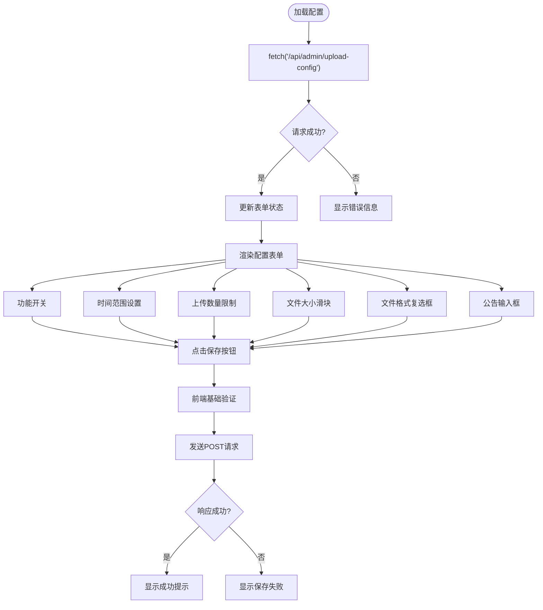

# 上传配置

<cite>
**本文档中引用的文件**  
- [upload-config/route.ts](file://src/app/api/admin/upload-config/route.ts)
- [UploadConfigManagement.tsx](file://src/components/admin/UploadConfigManagement.tsx)
- [work.d.ts](file://src/types/work.d.ts)
- [upload/route.ts](file://src/app/api/upload/route.ts)
- [page.tsx](file://src/app/upload/page.tsx)
- [works/route.ts](file://src/app/api/works/route.ts)
- [migration.sql](file://prisma/migrations/20250831084947_add_featured_field/migration.sql)
</cite>

## 目录
1. [简介](#简介)
2. [项目结构](#项目结构)
3. [核心组件](#核心组件)
4. [架构概述](#架构概述)
5. [详细组件分析](#详细组件分析)
6. [依赖分析](#依赖分析)
7. [性能考虑](#性能考虑)
8. [故障排除指南](#故障排除指南)
9. [结论](#结论)

## 简介
本系统实现了灵活且安全的上传配置管理机制，支持管理员通过管理后台动态设置上传限制，包括文件类型白名单、文件大小限制、上传时间窗口等。配置数据存储在数据库 `upload_configs` 表中，并通过 API 实时提供给前端和上传服务。系统采用 Zod 进行严格的请求体校验，确保数据完整性，并在上传时实时应用配置策略，无需重启服务即可生效。

## 项目结构
上传配置功能涉及多个模块，包括管理后台界面、API 接口、类型定义和数据库迁移。

**Diagram sources**
- [UploadConfigManagement.tsx](file://src/components/admin/UploadConfigManagement.tsx)
- [upload-config/route.ts](file://src/app/api/admin/upload-config/route.ts)
- [work.d.ts](file://src/types/work.d.ts)

**Section sources**
- [src](file://src)
- [prisma](file://prisma)

## 核心组件
系统通过 `upload_configs` 数据表存储配置，由管理界面 `UploadConfigManagement` 提供可视化操作，API `upload-config/route.ts` 提供读写接口，多个上传相关 API 在处理请求时动态获取并应用当前配置。

**Section sources**
- [upload-config/route.ts](file://src/app/api/admin/upload-config/route.ts#L1-L150)
- [UploadConfigManagement.tsx](file://src/components/admin/UploadConfigManagement.tsx#L1-L333)
- [migration.sql](file://prisma/migrations/20250831084947_add_featured_field/migration.sql#L93-L121)

## 架构概述
系统采用分层架构，前端管理界面通过 API 与后端交互，配置数据持久化存储于数据库。上传功能在运行时动态查询最新配置，实现策略的实时生效。

**Diagram sources**
- [upload-config/route.ts](file://src/app/api/admin/upload-config/route.ts#L1-L150)
- [upload/route.ts](file://src/app/api/upload/route.ts#L39-L76)

## 详细组件分析

### 上传配置管理界面分析
管理界面提供表单用于配置上传策略，包括功能开关、时间窗口、上传限制和文件格式等。

**Diagram sources**
- [UploadConfigManagement.tsx](file://src/components/admin/UploadConfigManagement.tsx#L1-L333)

**Section sources**
- [UploadConfigManagement.tsx](file://src/components/admin/UploadConfigManagement.tsx#L1-L333)

### 上传配置API分析
API 提供 GET 和 POST 接口，分别用于获取当前配置和创建新配置。使用 Zod 进行请求体校验，并包含时间逻辑验证。

**Diagram sources**
- [upload-config/route.ts](file://src/app/api/admin/upload-config/route.ts#L7-L150)
- [work.d.ts](file://src/types/work.d.ts#L52-L64)
- [migration.sql](file://prisma/migrations/20250831084947_add_featured_field/migration.sql#L93-L121)

**Section sources**
- [upload-config/route.ts](file://src/app/api/admin/upload-config/route.ts#L1-L150)

### 上传功能安全策略分析
上传相关 API 在处理请求前，首先获取当前上传配置，并据此执行一系列安全校验。

**Diagram sources**
- [upload/route.ts](file://src/app/api/upload/route.ts#L39-L76)
- [works/route.ts](file://src/app/api/works/route.ts#L130-L167)
- [page.tsx](file://src/app/upload/page.tsx#L115-L160)

**Section sources**
- [upload/route.ts](file://src/app/api/upload/route.ts#L1-L150)
- [works/route.ts](file://src/app/api/works/route.ts#L1-L200)
- [page.tsx](file://src/app/upload/page.tsx#L1-L300)

## 依赖分析
系统各组件间依赖关系清晰，前端组件依赖 API 接口，API 接口依赖数据库和类型定义。

**Diagram sources**
- [UploadConfigManagement.tsx](file://src/components/admin/UploadConfigManagement.tsx)
- [upload-config/route.ts](file://src/app/api/admin/upload-config/route.ts)
- [upload/route.ts](file://src/app/api/upload/route.ts)
- [works/route.ts](file://src/app/api/works/route.ts)
- [work.d.ts](file://src/types/work.d.ts)

**Section sources**
- [src](file://src)
- [prisma](file://prisma)

## 性能考虑
配置数据在每次上传时动态查询，虽然保证了实时性，但可能增加数据库负载。建议在高并发场景下引入缓存机制，如 Redis，缓存最新配置，设置合理的过期时间或通过事件驱动更新缓存，避免频繁数据库查询。

## 故障排除指南
常见问题包括配置未生效、上传被拒绝等。检查日志中的错误信息，确认配置是否已成功保存，检查时间设置是否正确，验证文件类型和大小是否符合当前配置。开发环境下可查看详细的 Zod 校验错误信息。

**Section sources**
- [upload-config/route.ts](file://src/app/api/admin/upload-config/route.ts#L131-L150)
- [upload/route.ts](file://src/app/api/upload/route.ts#L39-L76)

## 结论
该上传配置模块设计合理，实现了动态、安全的上传策略管理。通过数据库存储配置，API 提供接口，前端实现管理，多处应用实时校验，形成了完整的闭环。未来可考虑引入缓存优化性能，并增加配置版本管理功能。