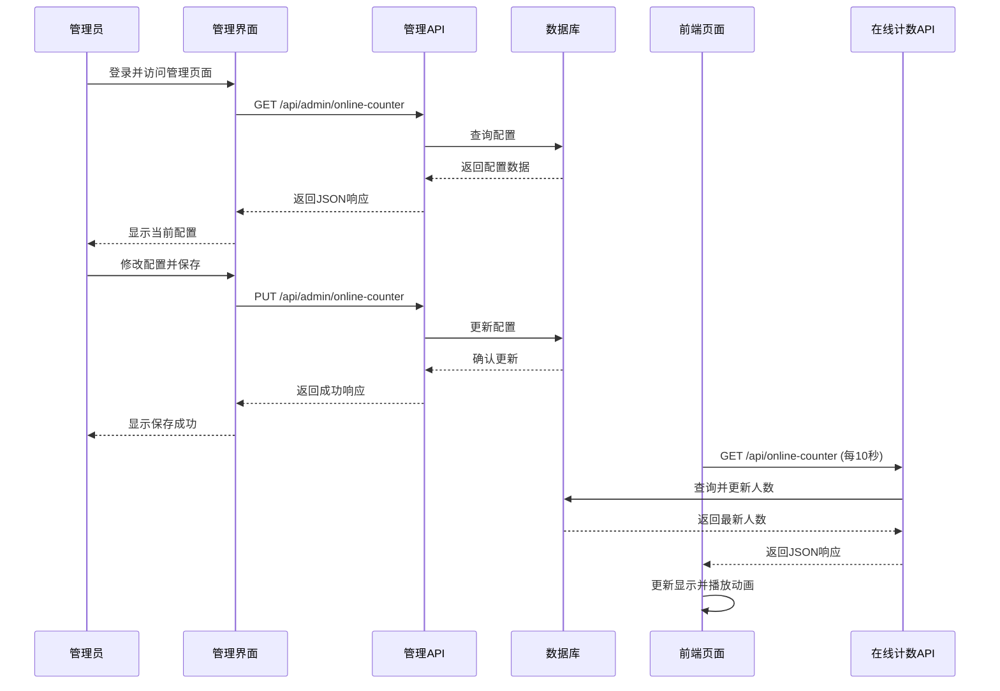
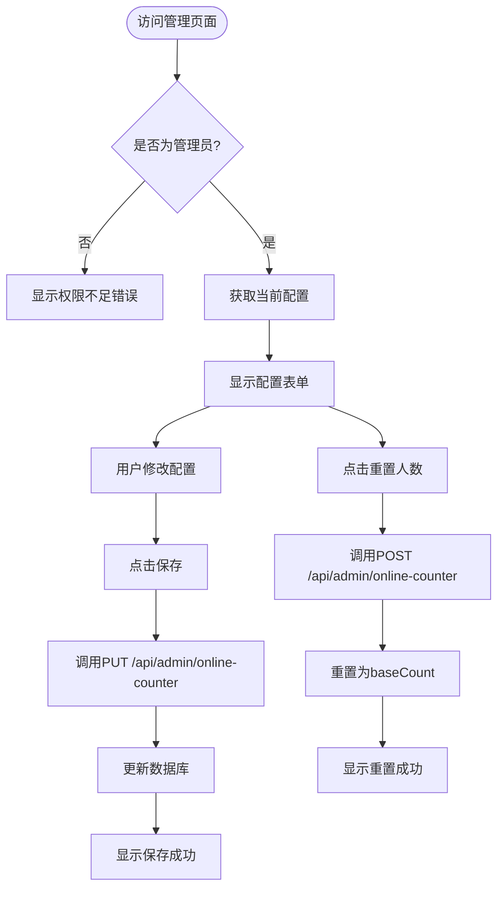
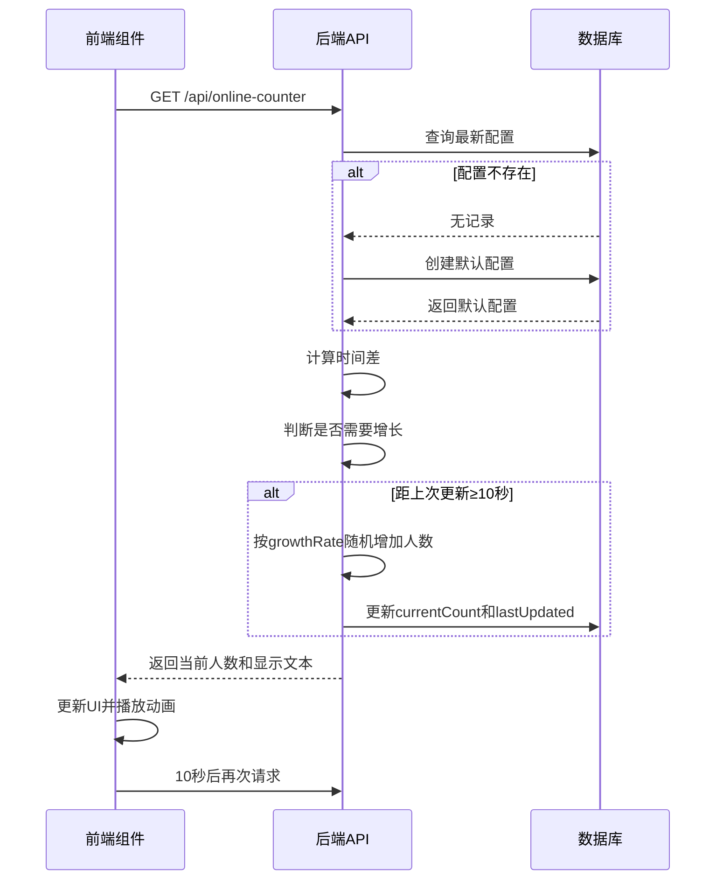
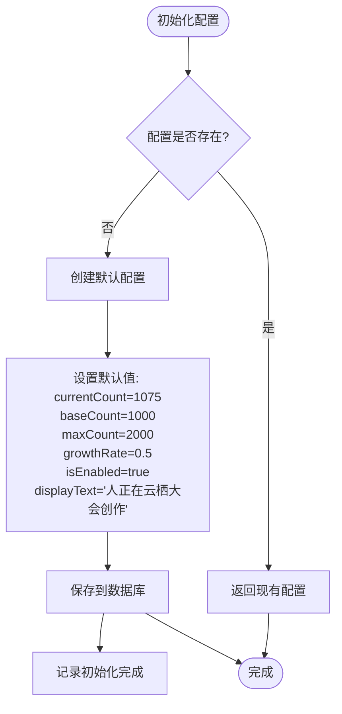

# 在线计数器配置

<cite>
**本文档引用的文件**
- [init-online-counter.ts](file://src/lib/init-online-counter.ts)
- [OnlineCounter.tsx](file://src/components/OnlineCounter.tsx)
- [online-counter\route.ts](file://src/app/api/online-counter/route.ts)
- [OnlineCounterManagement.tsx](file://src/components/admin/OnlineCounterManagement.tsx)
- [admin\online-counter\route.ts](file://src/app/api/admin/online-counter/route.ts)
- [migration.sql](file://prisma/migrations/20250905143157_add_online_counter_config/migration.sql)
</cite>

## 目录
1. [简介](#简介)
2. [项目结构](#项目结构)
3. [核心组件](#核心组件)
4. [架构概述](#架构概述)
5. [详细组件分析](#详细组件分析)
6. [依赖分析](#依赖分析)
7. [性能考虑](#性能考虑)
8. [故障排除指南](#故障排除指南)
9. [结论](#结论)

## 简介
本文档全面解析在线计数器配置系统，涵盖计数器刷新频率、显示样式、计数精度等可配置参数。说明管理员如何通过专用界面调整这些设置，以及配置数据的存储与读取机制。阐述前后端协作流程，包括后端API如何根据配置返回当前在线用户数，前端组件如何按配置的刷新频率发起轮询请求。分析初始化逻辑对配置的依赖，并讨论高频轮询带来的性能影响及优化建议。

## 项目结构
在线计数器功能分布在多个目录中，主要包括API路由、前端组件、管理界面和数据库迁移文件。系统采用分层架构，前端组件与后端API分离，通过HTTP接口通信。

```mermaid
graph TB
subgraph "前端"
OC[OnlineCounter.tsx]
OCM[OnlineCounterManagement.tsx]
end
subgraph "后端"
AOC[/api/online-counter\route.ts]
AAOC[/api/admin/online-counter\route.ts]
end
subgraph "数据层"
DB[(online_counter_configs)]
MIG[migration.sql]
end
OC --> AOC
OCM --> AAOC
AOC --> DB
AAOC --> DB
MIG --> DB
```

**Diagram sources**
- [OnlineCounter.tsx](file://src/components/OnlineCounter.tsx)
- [online-counter\route.ts](file://src/app/api/online-counter/route.ts)
- [admin\online-counter\route.ts](file://src/app/api/admin/online-counter/route.ts)
- [migration.sql](file://prisma/migrations/20250905143157_add_online_counter_config/migration.sql)

**Section sources**
- [project_structure](file://project_structure)

## 核心组件
本系统的核心组件包括前端显示组件、后端数据接口、管理员配置界面和数据库配置表。这些组件协同工作，实现动态在线人数展示功能。

**Section sources**
- [OnlineCounter.tsx](file://src/components/OnlineCounter.tsx#L15-L157)
- [online-counter\route.ts](file://src/app/api/online-counter/route.ts#L0-L188)
- [OnlineCounterManagement.tsx](file://src/components/admin/OnlineCounterManagement.tsx#L5-L16)

## 架构概述
系统采用典型的前后端分离架构。前端通过定时轮询获取最新在线人数，后端根据配置自动计算并更新人数。管理员可通过专用界面调整各项参数。



**Diagram sources**
- [admin\online-counter\route.ts](file://src/app/api/admin/online-counter/route.ts#L0-L175)
- [online-counter\route.ts](file://src/app/api/online-counter/route.ts#L0-L188)
- [OnlineCounterManagement.tsx](file://src/components/admin/OnlineCounterManagement.tsx#L0-L323)

## 详细组件分析

### 配置参数分析
系统提供多个可配置参数，允许管理员灵活调整在线计数器的行为。

| 参数 | 类型 | 默认值 | 描述 |
|------|------|--------|------|
| currentCount | number | 1075 | 当前显示的人数 |
| baseCount | number | 1000 | 重置时的基础人数 |
| maxCount | number | 2000 | 人数增长的上限 |
| growthRate | number | 0.5 | 每10秒最大随机增长人数 |
| isEnabled | boolean | true | 是否启用在线计数器显示 |
| displayText | string | 人正在云栖大会创作 | 显示在数字后的文本 |

**Section sources**
- [OnlineCounterManagement.tsx](file://src/components/admin/OnlineCounterManagement.tsx#L5-L16)
- [migration.sql](file://prisma/migrations/20250905143157_add_online_counter_config/migration.sql#L0-L18)

### 管理界面分析
管理员通过专用界面调整在线计数器配置，界面提供表单输入、状态显示和操作按钮。



**Diagram sources**
- [OnlineCounterManagement.tsx](file://src/components/admin/OnlineCounterManagement.tsx#L0-L323)
- [admin\online-counter\route.ts](file://src/app/api/admin/online-counter/route.ts#L0-L175)

**Section sources**
- [OnlineCounterManagement.tsx](file://src/components/admin/OnlineCounterManagement.tsx#L0-L323)

### 前后端协作机制
前后端通过标准化API接口协作，实现在线人数的动态更新和显示。



**Diagram sources**
- [online-counter\route.ts](file://src/app/api/online-counter/route.ts#L0-L188)
- [OnlineCounter.tsx](file://src/components/OnlineCounter.tsx#L15-L157)

**Section sources**
- [online-counter\route.ts](file://src/app/api/online-counter/route.ts#L0-L188)
- [OnlineCounter.tsx](file://src/components/OnlineCounter.tsx#L15-L157)

### 初始化逻辑分析
系统在首次运行时自动初始化在线计数器配置，确保功能可用。



**Diagram sources**
- [init-online-counter.ts](file://src/lib/init-online-counter.ts#L6-L34)

**Section sources**
- [init-online-counter.ts](file://src/lib/init-online-counter.ts#L6-L34)

## 依赖分析
系统各组件之间存在明确的依赖关系，确保功能的完整性和一致性。

```mermaid
graph TD
A[init-online-counter.ts] --> B[online_counter_configs]
C[OnlineCounter.tsx] --> D[/api/online-counter]
D --> B
E[OnlineCounterManagement.tsx] --> F[/api/admin/online-counter]
F --> B
G[数据库迁移] --> B
H[API路由] --> I[Prisma客户端]
I --> J[数据库]
```

**Diagram sources**
- [init-online-counter.ts](file://src/lib/init-online-counter.ts)
- [OnlineCounter.tsx](file://src/components/OnlineCounter.tsx)
- [online-counter\route.ts](file://src/app/api/online-counter/route.ts)
- [admin\online-counter\route.ts](file://src/app/api/admin/online-counter/route.ts)
- [migration.sql](file://prisma/migrations/20250905143157_add_online_counter_config/migration.sql)

**Section sources**
- [init-online-counter.ts](file://src/lib/init-online-counter.ts)
- [OnlineCounter.tsx](file://src/components/OnlineCounter.tsx)
- [online-counter\route.ts](file://src/app/api/online-counter/route.ts)

## 性能考虑
系统设计时考虑了性能因素，但仍存在优化空间。

### 轮询频率影响
当前设置为每10秒轮询一次，这种频率对服务器压力较小。但如果用户量大幅增加，可能需要优化。

**潜在问题：**
- 高并发下数据库查询压力
- 频繁的写操作影响数据库性能
- 网络带宽消耗

**优化建议：**
1. 实现缓存机制，减少数据库直接访问
2. 使用WebSocket替代轮询，降低请求频率
3. 增加请求节流，避免恶意高频请求
4. 对非活跃用户减少更新频率

**Section sources**
- [OnlineCounter.tsx](file://src/components/OnlineCounter.tsx#L15-L157)
- [online-counter\route.ts](file://src/app/api/online-counter/route.ts#L0-L188)

## 故障排除指南
常见问题及解决方案：

1. **计数器不更新**
   - 检查前端轮询是否正常（查看浏览器开发者工具网络标签）
   - 确认后端API能否正常访问
   - 检查数据库连接是否正常

2. **配置无法保存**
   - 确认用户具有管理员权限
   - 检查请求数据格式是否符合验证规则
   - 查看服务器日志是否有验证错误

3. **人数增长异常**
   - 检查growthRate配置值是否合理
   - 确认服务器时间是否准确
   - 检查是否有多个实例同时更新导致冲突

**Section sources**
- [online-counter\route.ts](file://src/app/api/online-counter/route.ts#L0-L188)
- [admin\online-counter\route.ts](file://src/app/api/admin/online-counter/route.ts#L0-L175)

## 结论
在线计数器配置系统提供了一套完整的解决方案，允许管理员灵活调整显示参数。系统通过前后端协作实现动态人数展示，具有良好的可维护性和扩展性。建议未来考虑引入WebSocket等技术进一步优化性能。