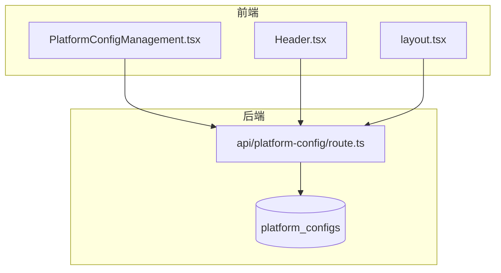
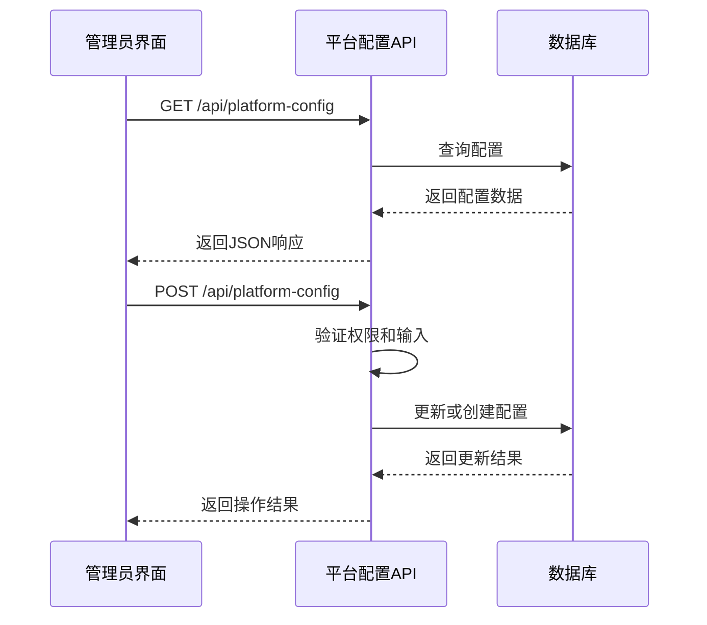
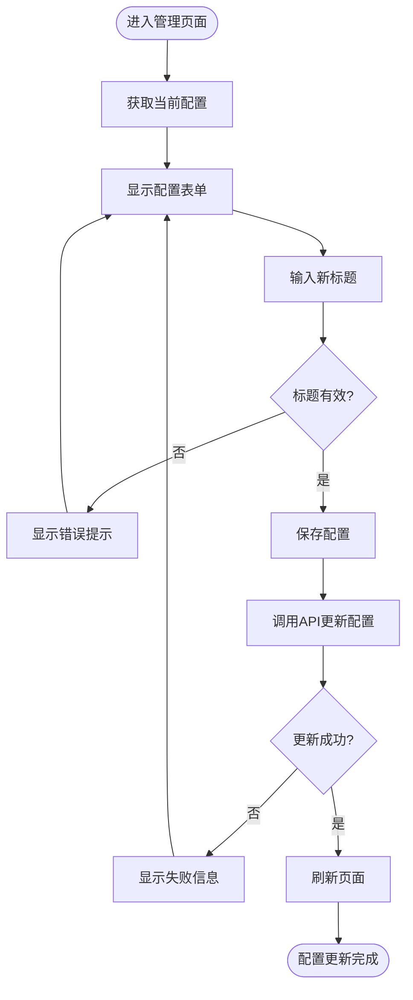
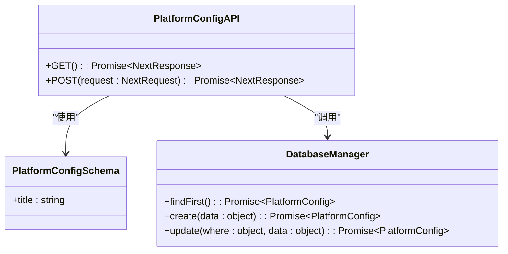
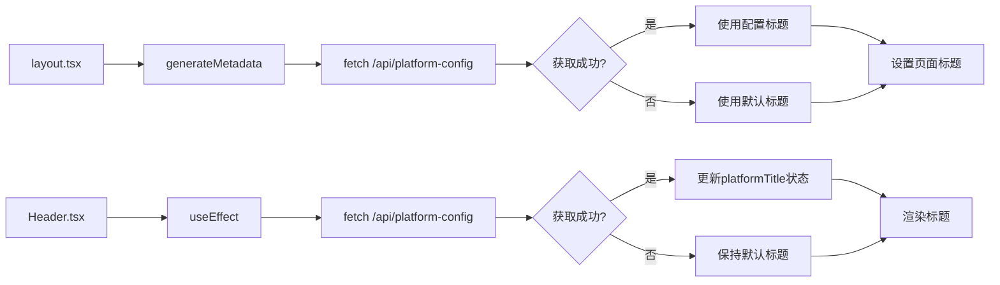
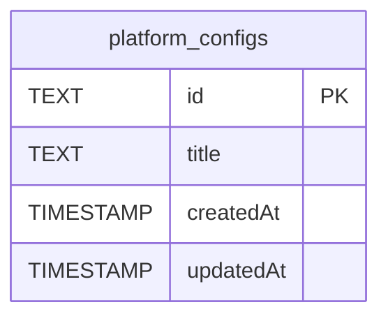

# 平台配置

<cite>
**本文档中引用的文件**  
- [PlatformConfigManagement.tsx](file://src/components/admin/PlatformConfigManagement.tsx)
- [route.ts](file://src/app/api/platform-config/route.ts)
- [Header.tsx](file://src/components/Header.tsx)
- [layout.tsx](file://src/app/layout.tsx)
- [migration.sql](file://prisma/migrations/20250905150839_add_platform_config/migration.sql)
</cite>

## 目录
1. [简介](#简介)
2. [项目结构](#项目结构)
3. [核心组件](#核心组件)
4. [架构概述](#架构概述)
5. [详细组件分析](#详细组件分析)
6. [依赖分析](#依赖分析)
7. [性能考虑](#性能考虑)
8. [故障排除指南](#故障排除指南)
9. [结论](#结论)

## 简介
本文档详细说明了平台配置项的设计与实现，涵盖站点名称、标语、功能开关（如是否开启点赞、评论）、SEO设置等可动态调整的参数。描述了这些配置如何通过管理员界面进行可视化编辑，后端API如何验证和持久化到数据库。分析前端如何在应用初始化时或通过API按需加载平台配置，并在Header、Meta标签等位置动态渲染。强调配置项的默认值机制、数据类型约束（布尔值、字符串等）以及防止XSS的安全过滤措施。结合代码展示配置消费的具体位置，如`layout.tsx`中对站点名称的引用。

## 项目结构
平台配置功能分布在多个目录中，主要包括API路由、管理界面组件、头部组件和布局文件。数据库迁移文件定义了配置表结构，确保数据持久化的一致性。

**Diagram sources**
- [PlatformConfigManagement.tsx](file://src/components/admin/PlatformConfigManagement.tsx#L1-L143)
- [route.ts](file://src/app/api/platform-config/route.ts#L1-L113)
- [Header.tsx](file://src/components/Header.tsx#L1-L118)
- [layout.tsx](file://src/app/layout.tsx#L1-L84)
- [migration.sql](file://prisma/migrations/20250905150839_add_platform_config/migration.sql#L1-L9)

**Section sources**
- [PlatformConfigManagement.tsx](file://src/components/admin/PlatformConfigManagement.tsx#L1-L143)
- [route.ts](file://src/app/api/platform-config/route.ts#L1-L113)

## 核心组件
平台配置的核心组件包括管理界面`PlatformConfigManagement.tsx`、API处理逻辑`route.ts`、头部渲染组件`Header.tsx`以及布局文件`layout.tsx`。这些组件协同工作，实现配置的可视化编辑、后端验证、数据库持久化及前端动态渲染。

**Section sources**
- [PlatformConfigManagement.tsx](file://src/components/admin/PlatformConfigManagement.tsx#L1-L143)
- [route.ts](file://src/app/api/platform-config/route.ts#L1-L113)
- [Header.tsx](file://src/components/Header.tsx#L1-L118)
- [layout.tsx](file://src/app/layout.tsx#L1-L84)

## 架构概述
平台配置系统采用前后端分离架构，前端通过REST API与后端交互。管理员在管理界面修改配置后，前端发送POST请求至`/api/platform-config`，后端验证权限和输入数据后更新数据库。前端在页面初始化时通过GET请求获取最新配置，并在Header和Meta标签中动态渲染。

**Diagram sources**
- [route.ts](file://src/app/api/platform-config/route.ts#L1-L113)
- [PlatformConfigManagement.tsx](file://src/components/admin/PlatformConfigManagement.tsx#L1-L143)

## 详细组件分析

### 平台配置管理界面分析
管理界面提供表单供管理员编辑平台主标题，支持实时字符数统计和输入验证。保存操作触发API调用，成功后刷新页面以确保前端显示最新配置。

**Diagram sources**
- [PlatformConfigManagement.tsx](file://src/components/admin/PlatformConfigManagement.tsx#L1-L143)

**Section sources**
- [PlatformConfigManagement.tsx](file://src/components/admin/PlatformConfigManagement.tsx#L1-L143)

### 后端API处理分析
API路由处理GET和POST请求。GET请求返回当前配置，若无配置则创建默认配置。POST请求验证管理员权限和输入数据，更新数据库并返回结果。使用Zod进行输入验证，确保数据完整性。

**Diagram sources**
- [route.ts](file://src/app/api/platform-config/route.ts#L1-L113)

**Section sources**
- [route.ts](file://src/app/api/platform-config/route.ts#L1-L113)

### 前端配置消费分析
前端在`Header.tsx`和`layout.tsx`中消费平台配置。`Header.tsx`通过useEffect获取配置并更新状态，`layout.tsx`在generateMetadata中动态生成页面标题，优先使用平台配置的标题。

**Diagram sources**
- [layout.tsx](file://src/app/layout.tsx#L1-L84)
- [Header.tsx](file://src/components/Header.tsx#L1-L118)

**Section sources**
- [layout.tsx](file://src/app/layout.tsx#L1-L84)
- [Header.tsx](file://src/components/Header.tsx#L1-L118)

## 依赖分析
平台配置功能依赖于Next.js的API路由、Prisma ORM、Zod验证库和NextAuth.js认证系统。数据库表`platform_configs`通过Prisma迁移文件定义，确保结构一致性。

**Diagram sources**
- [migration.sql](file://prisma/migrations/20250905150839_add_platform_config/migration.sql#L1-L9)

**Section sources**
- [migration.sql](file://prisma/migrations/20250905150839_add_platform_config/migration.sql#L1-L9)

## 性能考虑
平台配置的获取采用`cache: 'no-store'`策略，确保每次都能获取最新配置，避免缓存导致的配置延迟。数据库查询通过Prisma优化，确保高效读写。

## 故障排除指南
- **配置无法保存**：检查管理员权限是否正确，确保session存在且角色为ADMIN。
- **标题未更新**：确认前端是否正确处理API响应，必要时手动刷新页面。
- **默认标题未显示**：检查`generateMetadata`函数中的错误处理逻辑，确保兜底标题生效。

**Section sources**
- [route.ts](file://src/app/api/platform-config/route.ts#L1-L113)
- [layout.tsx](file://src/app/layout.tsx#L1-L84)

## 结论
平台配置系统实现了灵活的动态参数管理，通过直观的管理界面、严格的后端验证和高效的前端渲染，确保了配置的可维护性和安全性。未来可扩展更多配置项，如SEO设置、功能开关等，进一步提升平台的可配置性。