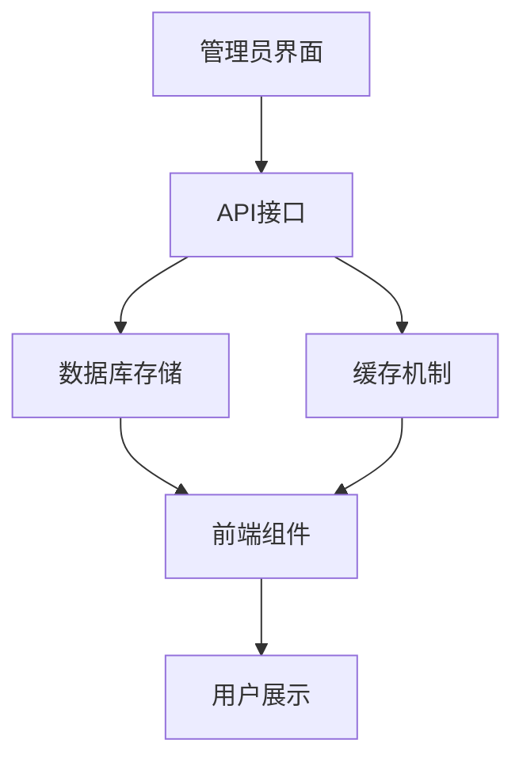
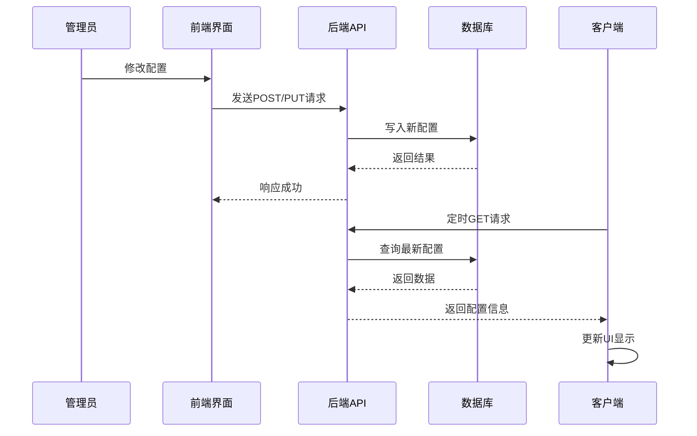
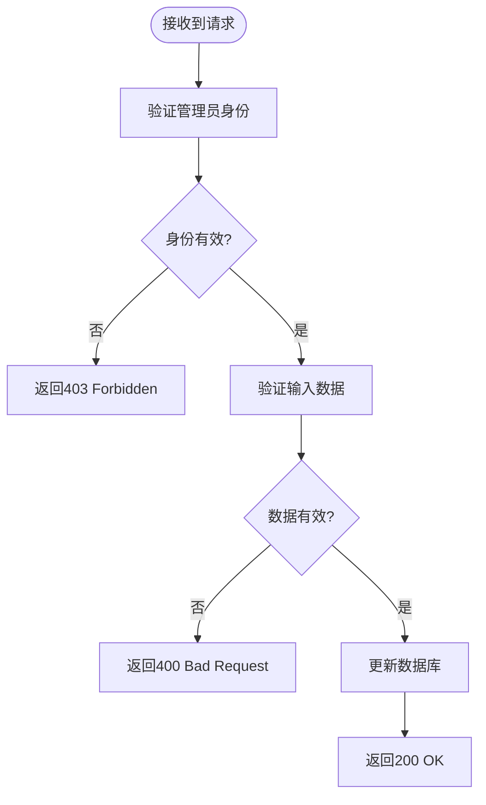

# 配置系统

<cite>
**本文档中引用的文件**  
- [upload-config/route.ts](file://src/app/api/admin/upload-config/route.ts)
- [platform-config/route.ts](file://src/app/api/platform-config/route.ts)
- [online-counter/route.ts](file://src/app/api/online-counter/route.ts)
- [admin/online-counter/route.ts](file://src/app/api/admin/online-counter/route.ts)
- [UploadConfigManagement.tsx](file://src/components/admin/UploadConfigManagement.tsx)
- [PlatformConfigManagement.tsx](file://src/components/admin/PlatformConfigManagement.tsx)
- [OnlineCounterManagement.tsx](file://src/components/admin/OnlineCounterManagement.tsx)
- [OnlineCounter.tsx](file://src/components/OnlineCounter.tsx)
- [Header.tsx](file://src/components/Header.tsx)
- [migration.sql](file://prisma/migrations/20250905143157_add_online_counter_config/migration.sql)
- [migration.sql](file://prisma/migrations/20250905150839_add_platform_config/migration.sql)
- [work.d.ts](file://src/types/work.d.ts)
- [prisma.ts](file://src/lib/prisma.ts)
</cite>

## 目录
1. [引言](#引言)
2. [配置系统架构](#配置系统架构)
3. [核心配置模块](#核心配置模块)
4. [配置变更传播机制](#配置变更传播机制)
5. [数据库设计与存储](#数据库设计与存储)
6. [安全性与权限控制](#安全性与权限控制)
7. [前端集成与动态更新](#前端集成与动态更新)
8. [错误处理与容错机制](#错误处理与容错机制)
9. [总结](#总结)

## 引言
本系统采用集中式可配置设计，支持管理员通过界面动态调整平台行为。配置涵盖上传策略、平台信息、在线计数器等关键参数，所有配置均通过API修改、数据库持久化，并在运行时被前后端实时读取使用。系统设计强调灵活性、安全性和高可用性。

## 配置系统架构
系统采用分层配置管理架构，包含管理界面、API接口、数据库存储和客户端消费四个层级。管理员通过React组件发起配置变更，后端API处理请求并更新数据库，前端组件定期拉取最新配置实现动态响应。



**Diagram sources**  
- [UploadConfigManagement.tsx](file://src/components/admin/UploadConfigManagement.tsx)
- [platform-config/route.ts](file://src/app/api/platform-config/route.ts)
- [prisma.ts](file://src/lib/prisma.ts)

## 核心配置模块

### 上传配置管理
管理用户上传作品的行为规则，包括功能开关、时间窗口、数量限制、文件大小及格式等。管理员可通过`UploadConfigManagement`组件进行可视化配置。

**Section sources**  
- [UploadConfigManagement.tsx](file://src/components/admin/UploadConfigManagement.tsx)
- [upload-config/route.ts](file://src/app/api/admin/upload-config/route.ts)

### 平台配置管理
维护平台全局信息，如站点名称。通过`PlatformConfigManagement`组件提供简洁的标题编辑界面，保存后自动刷新页面以确保全局一致性。

**Section sources**  
- [PlatformConfigManagement.tsx](file://src/components/admin/PlatformConfigManagement.tsx)
- [platform-config/route.ts](file://src/app/api/platform-config/route.ts)

### 在线计数器配置
控制首页动态显示的在线人数效果，包括当前人数、增长速率、最大值、显示文本及启用状态。支持手动重置功能，用于恢复基础人数。

**Section sources**  
- [OnlineCounterManagement.tsx](file://src/components/admin/OnlineCounterManagement.tsx)
- [admin/online-counter/route.ts](file://src/app/api/admin/online-counter/route.ts)

## 配置变更传播机制
配置变更遵循“API更新 → 数据库存储 → 客户端应用”的传播路径。系统未使用显式缓存层，而是依赖数据库作为唯一数据源，前端通过定时轮询获取最新状态。



**Diagram sources**  
- [upload-config/route.ts](file://src/app/api/admin/upload-config/route.ts)
- [online-counter/route.ts](file://src/app/api/online-counter/route.ts)
- [OnlineCounter.tsx](file://src/components/OnlineCounter.tsx)

## 数据库设计与存储
所有配置均存储于独立的数据表中，由Prisma ORM管理。系统通过数据库迁移脚本确保结构一致性。

### 数据表结构
| 表名 | 字段 | 类型 | 默认值 | 说明 |
|------|------|------|--------|------|
| `upload_configs` | isEnabled | Boolean | false | 上传功能开关 |
| | maxFileSize | Integer | 10485760 | 最大文件大小（字节） |
| | allowedFormats | String[] | ['jpg','jpeg','png','gif'] | 允许格式 |
| | maxUploadsPerUser | Integer | 1 | 每用户最大上传数 |
| | startTime/endTime | DateTime | null | 上传时间窗口 |
| `platform_configs` | title | String | 'Qoder和通义灵码 AI Coding 作品秀' | 平台主标题 |
| `online_counter_configs` | currentCount | Integer | 1075 | 当前显示人数 |
| | baseCount | Integer | 1000 | 基础人数（重置值） |
| | maxCount | Integer | 2000 | 最大人数上限 |
| | growthRate | Float | 0.5 | 每10秒最大增长数 |
| | isEnabled | Boolean | true | 计数器启用状态 |
| | displayText | String | '人正在云栖大会创作' | 显示后缀文本 |

**Diagram sources**  
- [migration.sql](file://prisma/migrations/20250905143157_add_online_counter_config/migration.sql)
- [migration.sql](file://prisma/migrations/20250905150839_add_platform_config/migration.sql)

## 安全性与权限控制
系统实施严格的权限验证机制，防止非法修改配置。

### 权限验证流程


- 所有管理类API均调用`getServerSession(authOptions)`验证用户会话
- 仅`role === 'ADMIN'`的用户可修改配置
- 使用Zod进行输入验证，防止非法数据注入
- 时间类字段进行逻辑校验（如开始时间早于结束时间）

**Section sources**  
- [upload-config/route.ts](file://src/app/api/admin/upload-config/route.ts#L35-L45)
- [platform-config/route.ts](file://src/app/api/platform-config/route.ts#L38-L42)
- [admin/online-counter/route.ts](file://src/app/api/admin/online-counter/route.ts#L15-L25)

## 前端集成与动态更新
前端组件通过HTTP请求与后端交互，实现配置的动态加载与展示。

### 在线计数器工作流程
```mermaid
flowchart TD
A[组件挂载] --> B[首次获取配置]
B --> C[显示初始人数]
C --> D[启动定时器(10s)]
D --> E[再次获取配置]
E --> F{人数变化?}
F --> |是| G[执行滚动动画]
F --> |否| H[保持当前显示]
G --> I[更新显示人数]
H --> J[等待下次轮询]
I --> J
```

- `OnlineCounter`组件每10秒自动拉取最新数据
- 使用`requestAnimationFrame`实现平滑数字滚动动画
- `Header`组件集成计数器，实现全局展示
- 平台标题通过异步加载实现动态更新

**Diagram sources**  
- [OnlineCounter.tsx](file://src/components/OnlineCounter.tsx#L85-L115)
- [Header.tsx](file://src/components/Header.tsx#L21-L45)

## 错误处理与容错机制
系统具备完善的错误处理能力，确保在异常情况下仍能提供基本服务。

### 容错策略
- **数据库无配置时**：自动创建默认配置并返回
- **API请求失败时**：前端保持原有状态，不中断用户体验
- **输入验证失败时**：返回详细错误信息，指导管理员修正
- **网络异常时**：前端显示加载状态，避免空白界面

例如，在获取在线人数时，若数据库操作失败，系统将返回预设的默认值，保证前端展示不中断。

**Section sources**  
- [online-counter/route.ts](file://src/app/api/online-counter/route.ts#L150-L188)
- [upload-config/route.ts](file://src/app/api/admin/upload-config/route.ts#L120-L150)

## 总结
本配置系统实现了高度的灵活性与安全性，通过标准化的CRUD接口、严格的权限控制和健壮的容错机制，支持管理员安全地动态调整平台行为。所有配置变更均可实时生效，无需重启服务，极大提升了运维效率。未来可引入Redis缓存进一步提升读取性能，并增加配置版本历史功能。