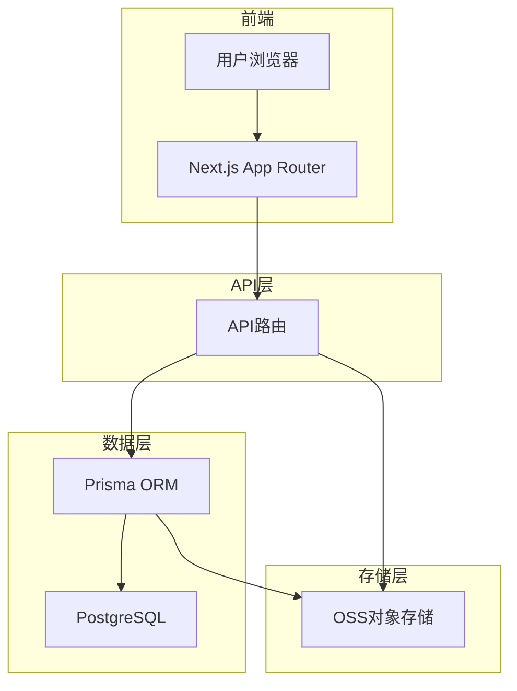
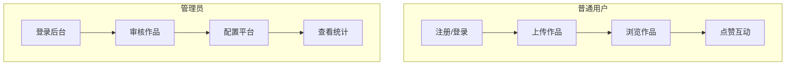
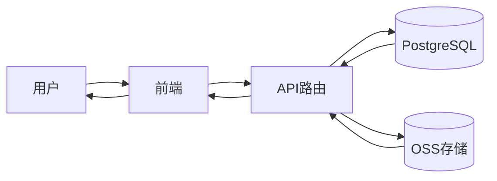

# 项目概述

<cite>
**本文档引用文件**  
- [README.md](file://README.md)
- [page.tsx](file://src/app/page.tsx)
- [admin/page.tsx](file://src/app/admin/page.tsx)
- [api/works/route.ts](file://src/app/api/works/route.ts)
- [api/upload/route.ts](file://src/app/api/upload/route.ts)
- [api/admin/works/route.ts](file://src/app/api/admin/works/route.ts)
- [api/works/[id]/like/route.ts](file://src/app/api/works/[id]/like/route.ts)
- [api/works/[id]/view/route.ts](file://src/app/api/works/[id]/view/route.ts)
- [api/admin/works/[id]/approve/route.ts](file://src/app/api/admin/works/[id]/approve/route.ts)
- [api/admin/works/[id]/reject/route.ts](file://src/app/api/admin/works/[id]/reject/route.ts)
- [prisma/schema.prisma](file://prisma/schema.prisma)
- [lib/prisma.ts](file://src/lib/prisma.ts)
- [lib/oss.ts](file://src/lib/oss.ts)
- [lib/auth.ts](file://src/lib/auth.ts)
</cite>

## 目录
1. [项目简介](#项目简介)
2. [核心功能](#核心功能)
3. [系统架构](#系统架构)
4. [用户角色与工作流](#用户角色与工作流)
5. [数据流与系统上下文](#数据流与系统上下文)
6. [项目愿景与价值](#项目愿景与价值)

## 项目简介

yunqi平台是一个基于Next.js 15构建的全栈式数字化作品互动展示平台，旨在为AI创作作品提供一个集上传、展示、互动与管理于一体的综合性展示空间。平台采用现代化技术栈，支持用户上传AI生成的艺术作品，并通过点赞、浏览统计等互动机制增强社区参与感。系统具备完善的后台管理功能，管理员可对作品进行审核、配置平台参数，确保内容质量与平台运营效率。

平台采用App Router架构，结合Next.js API路由实现前后端一体化开发，利用Prisma ORM与PostgreSQL数据库实现高效的数据持久化管理。前端采用响应式设计，支持明暗主题切换，适配多端设备访问。

**Section sources**
- [README.md](file://README.md#L1-L244)

## 核心功能

yunqi平台提供以下核心功能：

- **作品展示**：支持图片类AI创作作品的上传与展示，采用无限滚动加载提升用户体验。
- **用户系统**：基于NextAuth.js实现邮箱密码认证的注册与登录机制，支持用户个人资料管理。
- **互动功能**：用户可对作品进行点赞与浏览，系统自动统计互动数据。
- **作品审核**：管理员可对用户上传的作品进行审核（通过/拒绝），确保内容合规。
- **动态配置**：支持管理员配置上传开关、时间窗口、文件格式与大小限制等参数。
- **实时统计**：集成在线人数模拟功能，增强平台活跃氛围。
- **主题切换**：支持明暗主题切换，提升用户视觉体验。

**Section sources**
- [README.md](file://README.md#L6-L45)

## 系统架构

yunqi平台采用分层架构设计，各组件协同工作，确保系统稳定高效运行。

### 前端层（App Router）
前端基于Next.js 15的App Router构建，采用React 18与TypeScript开发，结合Tailwind CSS实现现代化UI。主要页面包括：
- 首页（`page.tsx`）：展示最新与热门作品
- 上传页（`upload/page.tsx`）：用户提交作品
- 个人中心（`profile/page.tsx`）
- 管理后台（`admin/page.tsx`）：管理员操作界面

### API路由层
API路由处理所有前后端交互请求，关键接口包括：
- `POST /api/upload`：接收文件并上传至OSS
- `POST /api/works`：创建作品记录（待审核）
- `GET /api/works`：获取作品列表
- `POST /api/works/[id]/like`：处理点赞请求
- `POST /api/works/[id]/view`：记录浏览行为
- 管理员专用接口（`/api/admin/**`）：审核、配置、统计等

### 数据访问层
- **Prisma ORM**：作为数据库访问层，统一管理与PostgreSQL的交互。
- **Prisma Client**：由`prisma.ts`初始化，提供类型安全的数据库操作接口。
- **数据库模式**：定义`User`、`Work`、`UploadConfig`、`OnlineCounterConfig`等核心模型。

### 存储层
- **OSS对象存储**：通过`oss.ts`封装阿里云OSS SDK，实现文件的上传、删除、签名URL生成等操作。
- **PostgreSQL数据库**：持久化存储用户、作品、配置等结构化数据。

**Diagram sources**
- [page.tsx](file://src/app/page.tsx#L1-L387)
- [api/works/route.ts](file://src/app/api/works/route.ts#L1-L207)
- [api/upload/route.ts](file://src/app/api/upload/route.ts#L1-L115)
- [prisma/schema.prisma](file://prisma/schema.prisma#L1-L169)
- [lib/prisma.ts](file://src/lib/prisma.ts#L1-L20)
- [lib/oss.ts](file://src/lib/oss.ts#L1-L303)

**Section sources**
- [README.md](file://README.md#L50-L80)
- [prisma/schema.prisma](file://prisma/schema.prisma#L1-L169)

## 用户角色与工作流

### 普通用户工作流
1. **注册登录**：访问`/auth/register`注册，通过邮箱密码登录。
2. **上传作品**：进入`/upload`页面，填写作品信息并上传图片。
3. **互动浏览**：在首页浏览作品，点击作品查看详情，进行点赞操作。

### 管理员工作流
1. **登录管理后台**：访问`/admin`，系统验证用户角色为`ADMIN`。
2. **审核作品**：在管理后台查看待审核作品，执行通过或拒绝操作。
3. **配置平台**：设置上传规则、在线人数显示参数等。

**Diagram sources**
- [admin/page.tsx](file://src/app/admin/page.tsx#L1-L48)
- [api/admin/works/route.ts](file://src/app/api/admin/works/route.ts#L1-L201)
- [api/admin/works/[id]/approve/route.ts](file://src/app/api/admin/works/[id]/approve/route.ts#L1-L76)
- [api/admin/works/[id]/reject/route.ts](file://src/app/api/admin/works/[id]/reject/route.ts#L1-L95)

**Section sources**
- [README.md](file://README.md#L150-L180)
- [admin/page.tsx](file://src/app/admin/page.tsx#L1-L48)

## 数据流与系统上下文

系统上下文图展示了平台各组件间的数据流向：

**数据流说明**：
1. 用户上传文件时，前端调用`/api/upload`，文件先上传至OSS，返回URL。
2. 前端使用OSS返回的URL调用`/api/works`创建作品记录，数据存入PostgreSQL。
3. 用户浏览作品时，前端从`/api/works`获取作品列表，图片通过OSS直链加载。
4. 用户点赞时，前端调用`/api/works/[id]/like`，数据库更新点赞数。
5. 管理员审核时，调用`/api/admin/works/[id]/approve`，更新作品状态。

**Diagram sources**
- [api/upload/route.ts](file://src/app/api/upload/route.ts#L1-L115)
- [api/works/route.ts](file://src/app/api/works/route.ts#L1-L207)
- [api/works/[id]/like/route.ts](file://src/app/api/works/[id]/like/route.ts#L1-L65)
- [api/works/[id]/view/route.ts](file://src/app/api/works/[id]/view/route.ts#L1-L62)
- [lib/oss.ts](file://src/lib/oss.ts#L1-L303)

## 项目愿景与价值

### 项目愿景
打造一个开放、活跃的AI创作作品展示社区，连接创作者与观众，促进AI艺术的交流与传播。

### 目标用户群体
- AI艺术创作者
- 数字艺术爱好者
- 技术社区成员
- 展览活动组织者

### 关键业务价值
- **降低展示门槛**：提供简单易用的作品上传与展示功能。
- **增强互动体验**：通过点赞、浏览等机制提升用户参与度。
- **保障内容质量**：管理员审核机制确保平台内容合规。
- **灵活运营配置**：动态配置功能支持活动化运营。

平台已部署上线，可通过[README.md](file://README.md)中的链接查看实际效果。

**Section sources**
- [README.md](file://README.md#L1-L244)